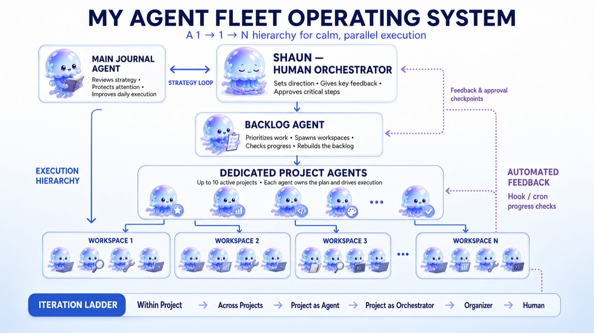
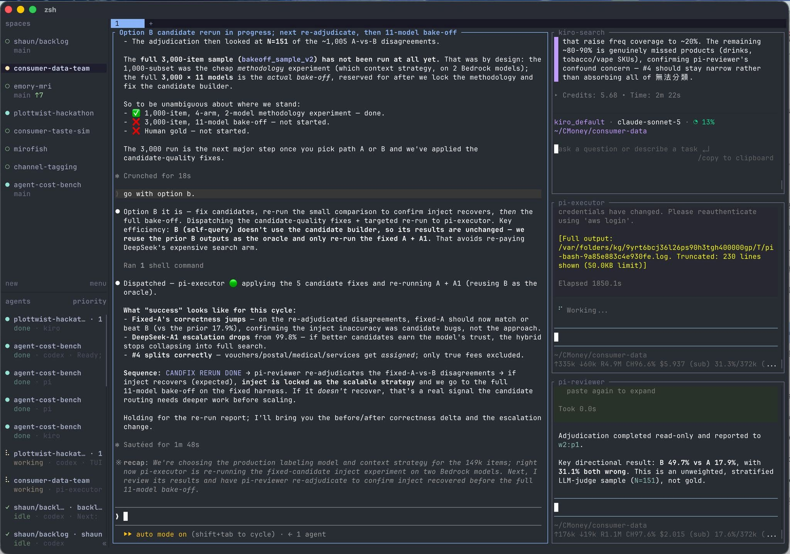

# 案例:herdr 上的 1→1→N Agent Fleet

> 一個真實世界的多 agent coding fleet 實作案例,說明「別人怎麼把一堆 agent 組成一套能自己跑的工作流」。
> 改寫自一篇 2026-07 的公開分享,已抽掉個人/公司細節,只留可複用的實作模式。
> 想知道怎麼判斷/比較文中的工具 → 見[多 Agent 工具:怎麼看、怎麼比](./multi-agent-tools-landscape.md);我自己的實測戰報 → [我的實測 + 工作流](./my-agent-workflow.md)。

---

## 一句話

> 同時開約 10 個 project、每個底下 spawn 4–6 個 agent 輪流跑;人退到「主管」位置,只給關鍵 feedback 與核可,事情在注意力後面自己逐步完成。

這不是一個工具,是**用登記簿裡的零件組出來的成品**——底層靠 herdr(手)擺進程,上層用「日記 + backlog」兩個 agent 當腦,靠共享 backlog 與終端 pane 當路。

---

## 整體架構(1 → 1 → N)



分三層授權:

| 層 | 角色 | 做什麼 |
| --- | --- | --- |
| 頂:策略 | **日記主 Agent**(Journal) | 陪人 review 大方向對不對、注意力有沒有放對地方、當天執行哪裡能優化 |
| 頂:調度 | **Backlog Agent** | 排今天該做什麼、召喚新 workspace、檢查各 workspace 進度、重整回 backlog |
| 中:執行 | **各專案專屬 Agent** | 每個 project 一個,自己 own 整個計畫框架、驅動執行(最多約 10 個並行) |
| 底:工人 | **Workspace 內 4–6 個 agent** | 各 workspace 裡真正動手的 agent |

**關鍵設計:人不寫每個專案的 prompt。** 各專案的專屬 agent 自己 handle 計畫框架,人只在關鍵步驟給 feedback 與核可——像主管對負責人,不是 micromanage 員工。

**回饋迴路**(圖右):hook / cron 定時檢查各 workspace 進度、自動整理回 backlog;人在「花錢 / 發布 / 破壞性操作」等關卡才介入核可。

---

## 實際跑起來的樣子



一個 workspace 內三個 agent 接力:

```
search(找資料/查證) → executor(執行) → reviewer(審查)
```

每個 pane 是一個獨立 agent,狀態(working / done / idle)在 herdr 儀表板一眼可見;斷線後 SSH 重連,terminal 可以掛在筆電角落跑到天荒地老。**這條 search → executor → reviewer 就是登記簿裡「完整編排器」那類工具的典型 pipeline**,只是這裡用 herdr + 手工 agent 組出來,而非單一框架。

---

## 用了哪些零件(對照登記簿)

| 能力 | 這個 fleet 怎麼補 | 登記簿裡的同類 |
| --- | --- | --- |
| 🛠️ 手(擺進程) | **herdr**:PTY pane + 狀態儀表板 + SSH reattach;取代先前的 cmux(session 易掉、要手動復活) | herdr / workmux / container-use |
| 🧠 腦(拆任務) | 手搭的「日記 + backlog + 專案 agent」三層,而非現成編排框架 | native subagent / CAO / oh-my-openagent |
| 🛣️ 路(傳訊息) | 共享 backlog 當協調底板;Telegram 當人機升級通道;pane 間人工接力 | Backlog.md / 5dive / openab |
| ⚙️ 模型策略 | **Mix and Match**:把最貴/最強的模型省下來用在值得的地方,日常 build 用便宜穩定的模型 | — |

> 換工具的動機值得記:從 cmux 換到 herdr,不是因為功能多,是因為 **session 存活性**——cmux 隔久了 session loss 要手動一個個復活,阻力太大;herdr 掛著不掉。選「手」層工具時,存活性/reattach 比花俏功能重要。

---

## 背後的工作流哲學

**迭代階梯(iteration ladder)**——從低抽象到高抽象:

```
專案內迭代 → 專案間迭代 → 專案作為 agent → 專案作為 orchestrator → organizer → 人自己的迭代
```

重點不是「產出變快」,是 **AI 讓「同時多頻道」產出成為可能**:原本佔一整段專注時間的事,被拆成每個任務裡的細小步驟(只吃極短專注),再平行處理。人從「執行者」變成「看流水麵線的人」——看到麵線夾起來吃掉就好,長任務跑著時甚至能抽空做別的。

---

## 可以偷走的重點

1. **1 → 1 → N 授權**:別讓總控 agent 寫所有 prompt(脫褲子放屁);讓各專案的專屬 agent 自己 own 框架,人只做關鍵核可。
2. **兩個 meta-agent**:一個管「方向對不對」(日記/策略),一個管「今天做什麼、進度到哪」(backlog)。把「調度」跟「反思」拆開。
3. **自動進度回收**:hook/cron 定時掃各 workspace、整理回 backlog,人不必輪詢。
4. **手層選存活性**:掛得住、斷線接得回,比 UI 花俏重要。
5. **模型 Mix and Match**:貴模型留給值得的地方,日常用便宜穩的。
6. **人只在高風險關卡介入**:花錢 / 發布 / 破壞性操作才要人核可,其餘讓它跑。

---

> ⚠️ 這是**單一案例**,不是最佳實務。它靠大量手工組裝(herdr + 自搭 agent),換成登記簿裡的完整編排器(如 CAO)可以少很多手工、多一層可觀測,代價是綁框架 + 架 server。要不要照抄取決於你的需求——先讀[怎麼看、怎麼比](./multi-agent-tools-landscape.md)再決定。
