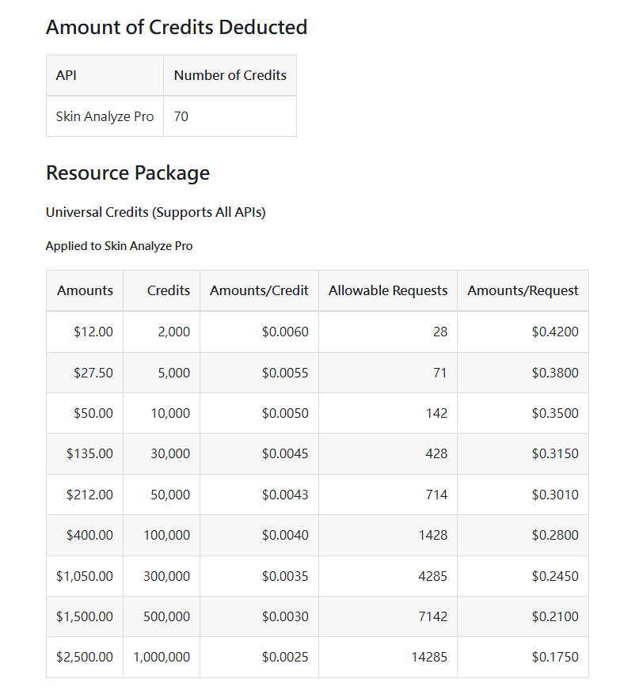
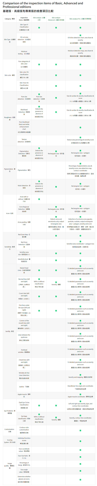
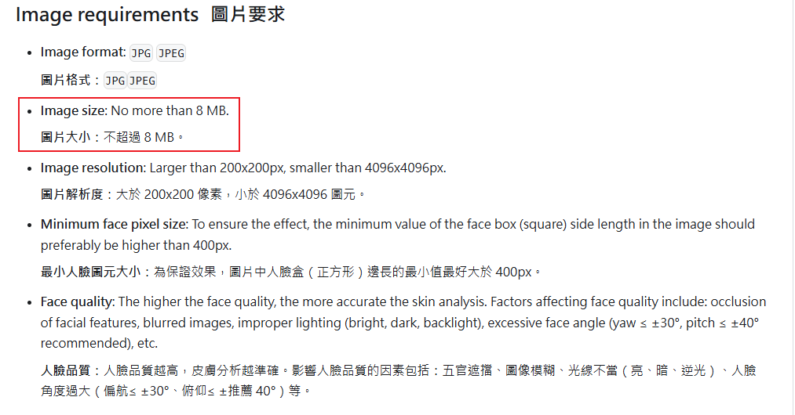
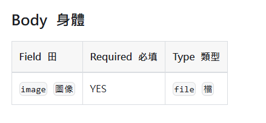
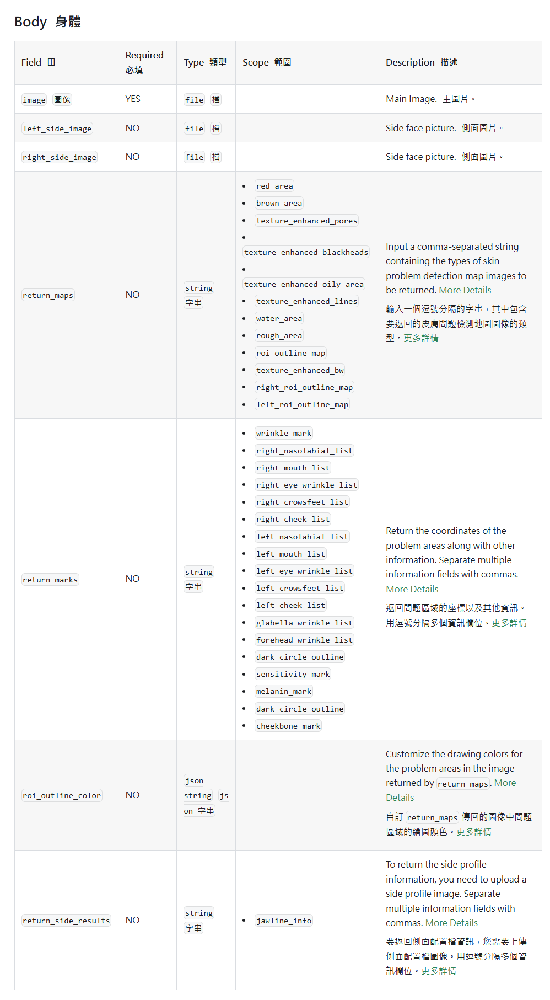

# Skin Analyze API
###### tags: `#work`

> ## [範例: pro專業版](https://www.ailabtools.com/portrait-skin-analysis-professional-example)

## 1. 價格: 12美金-2000點
- ### basic: 每次15點
- ### Advanced: 每次30點
- ### pro: 每次70點

## 2. 功能簡介
- ### [basic : 詳細內容參考 Business Response Fields](https://www.ailabtools.com/doc/ai-portrait/analysis/skin-analysis/api)
  
- ### [advanced : 詳細內容參考 Business Response Fields](https://www.ailabtools.com/doc/ai-portrait/analysis/skin-analysis-advanced/api)
  
- ### [pro : 詳細內容參考 Business Response Fields](https://www.ailabtools.com/doc/ai-portrait/analysis/skin-analysis-pro/api)
  

## 3. 檢查項目(差異)

## 4. 上傳圖片(限制)
- ### basic
  
- ### advanced
  
- ### pro
  

## 5. 輸入參數(差別)
- ### basic
  

- ### advanced
  

- ### pro
  

## 檢驗項目 vs 評分標準
   