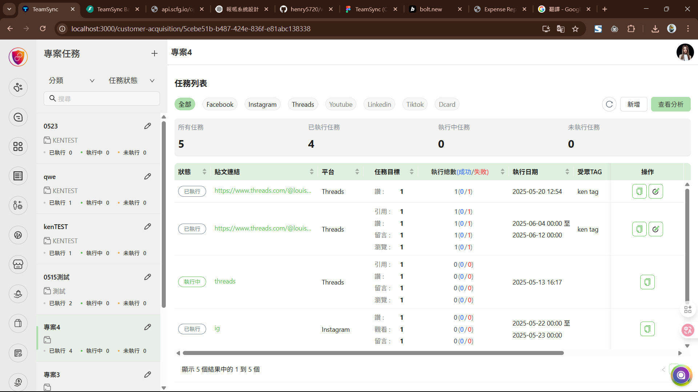
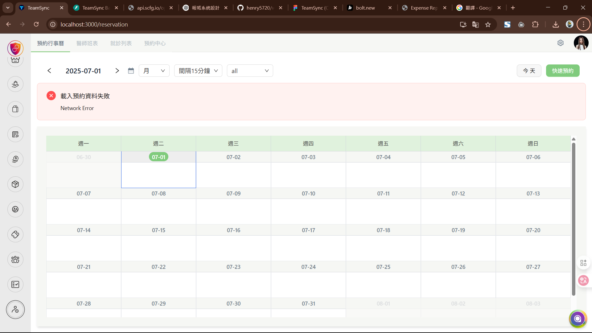
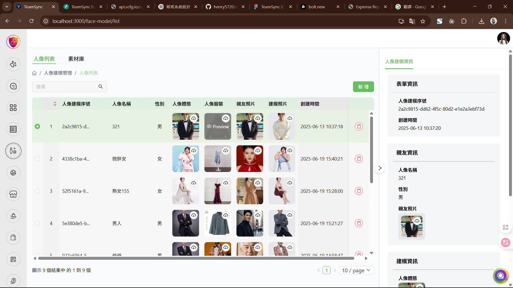

# 報帳模組 (TS)

> 用於發票上傳、OCR 識別、報帳管理與報表匯出的整合模組

## 功能概述

本模組提供完整的報帳流程管理，包含：
- 📤 發票上傳功能
- 🔍 OCR 自動識別發票資訊
- ✏️ 報帳資料編輯與管理
- 📊 報表匯出功能

## 使用情境流程

### 線上操作環境demo
建議使用手機版操作：[線上展示環境, 僅參考流程](https://zp1v56uxy8rdx5ypatb0ockcb9tr6a-oci3--5173--6e337437.local-credentialless.webcontainer-api.io/)

### 操作步驟
1. **發票上傳**
   - 支援多種格式發票圖片上傳
   
2. **OCR 識別**
   - 自動讀取支出證明單所需欄位
   - 符合數辰創藝格式要求
   
3. **資料編輯**
   - 修改 OCR 識別結果
   - 驗證並儲存至後端
   
4. **報表匯出**
   - 匯出 Excel 報表
   - 支援多種報表格式

## UI 介面設計 (未定: 依使用情境選取, 或是可以切換?)

### 模式一：專案管理模式
適用於以專案為單位的報帳管理

**特色：**
- 左側邊欄顯示專案列表（每次報帳建立一個專案）
- 主要內容區域使用表格呈現報帳詳細資訊

### 模式二：日期管理模式
適用於以時間為單位的報帳管理

**特色：**
- 主要內容區域使用日曆檢視
- 右側邊欄顯示單筆報帳詳細資訊

> **注意：** UI 模式尚未確定，將根據實際使用情境決定或提供可切換選項，並保持與現有設計系統的一致性。

## 進階功能

### 金額處理
- **幣別轉換**：支援多種幣別自動換算
- **匯率更新**：即時匯率資料同步

### 資料分析
- **專案分析**：依專案別統計支出
- **價格分析**：支出趨勢與分佈分析
- **時間分析**：依時間區間統計報表

### 其他功能
- 批次處理功能
- 自動備份機制
- 稽核軌跡記錄

## 技術規格

- **前端框架**：TypeScript
- **後端整合**：支援 RESTful API
- **檔案處理**：支援多種圖片格式
- **匯出格式**：Excel、PDF、CSV

---

*最後更新：2024*
