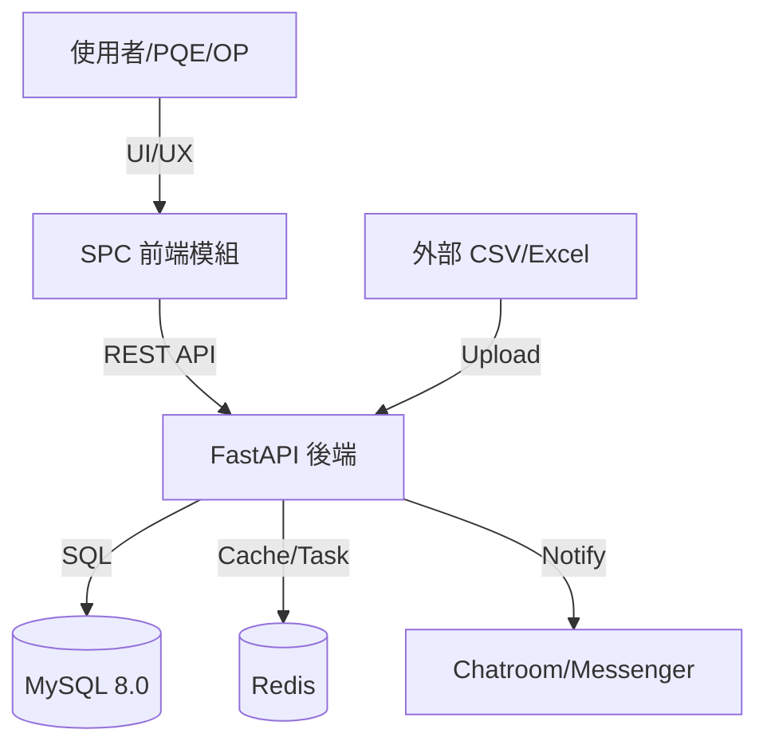

# 01 軟體需求規格書 (SRS) - SPC 系統全範疇規範

## 1. 系統願景與架構圖
本系統旨在建構一個全方位、可擴展的統計製程管制中心。

## 1.1 技術棧明細

### 後端技術棧
| 層級 | 技術 | 版本 |
| :--- | :--- | :--- |
| Framework | FastAPI | 0.100+ |
| ORM | SQLAlchemy | 1.4+ |
| Database | MySQL | 8.0+ |
| Cache | Redis | 6.0+ |
| Migration | Alembic | - |

### 前端技術棧
| 層級 | 技術 | 版本 |
| :--- | :--- | :--- |
| Framework | React | 18.x |
| State | Zustand | - |
| HTTP | Axios | - |
| Charts | Canvas / Recharts | - |
| Table | 自定義 Virtual Scroll | - |

---

## 2. 辭庫管理全模組需求 (Master Data Requirements)
系統必須提供以下辭庫管理功能，作為管制計畫的引用基準：

- **產品資料 (Products)**: 支援料號 (Part Number) 的 CRUD 與批量匯入。需儲存品名、客戶資訊及規格型號。
- **檢測站別 (Stations)**: 支援樹狀組織結構。每個計畫必須關聯至一個特定站點，以便進行站點間的良率對比。
- **群組設定 (Entity Groups)**: 允許將多個層別（如：A、B、C 三台機台）打包為一個邏輯群組，用於快速篩選。
- **量測單位 (Measurement Units)**: 標準化物理單位字典（mm, kg, μm）。需設定預設的小數位數 (Digits)。
- **等級基準 (Grade Standards)**: 定義 Cpk 燈號規則（例如：Cpk > 1.33 為綠色 A 級）。
- **檢驗標準 (Inspection Standards)**: **[UI 預留]** 關聯至 SOP 文件或 AQL 抽樣計畫，目前僅需儲存鏈結。
- **檔案群組 (File Groups)**: 提供虛擬資料夾結構，用於分類管理大量的管制計畫檔案。

## 2.1 辭庫 Table 結構彙整

### 2.1.1 基礎辭庫表
| Table 名稱 | 模型類別 | 用途說明 | 主要欄位 |
| :--- | :--- | :--- | :--- |
| `tenants` | Tenant | 多租戶隔離 | id, name, code |
| `stations` | Station | 檢測站別 | id, name, external_id, parent_id |
| `measurement_units` | MeasurementUnit | 量測單位 | id, name, symbol, digits |
| `quality_standards` | QualityStandard | 檢驗標準 | id, name, target, tolerance, unit_id |
| `rank_labels` | RankLabel | 等級基準 | id, name, target (cp/ca/cpk), lower_bound, color |

### 2.1.2 產品與 QC Plan 表
| Table 名稱 | 模型類別 | 用途說明 | 主要欄位 |
| :--- | :--- | :--- | :--- |
| `product_layouts` | ProductLayout | 產品版面配置 | id, tenant_id, name |
| `product_layout_columns` | ProductLayoutColumn | 版面欄位定義 | id, layout_id, key, label, order |
| `product_entities` | ProductEntity | 產品資料筆 | id, layout_id, values (JSON) |
| `qc_plan_layouts` | QCPlanLayout | QC Plan 版面配置 | id, tenant_id, name |
| `qc_plan_layout_columns` | QCPlanLayoutColumn | QC Plan 欄位定義 | id, layout_id, key, label, order |
| `qc_plan_groups` | QCPlanGroup | QC Plan 群組 | id, layout_id, name |
| `qc_plan_group_columns` | QCPlanGroupColumn | 群組欄位值 | id, group_id, values (JSON) |

### 2.1.3 SPC 實體表
| Table 名稱 | 模型類別 | 用途說明 | 主要欄位 |
| :--- | :--- | :--- | :--- |
| `spc_entity_groups` | SPCEntityGroup | SPC 實體群組 | id, name, type (category/defect/...) |
| `spc_entities` | SPCEntity | SPC 實體項目 | id, group_id, name, blob_id |

### 2.1.4 檔案儲存表
| Table 名稱 | 模型類別 | 用途說明 | 主要欄位 |
| :--- | :--- | :--- | :--- |
| `blobs` | Blob | 檔案儲存 | id, content_type, url, size, filename |

---

## 3. 管制計畫模組需求 (Quantitative CCM Requirements)

### 3.1 核心 Table 結構

| Table 名稱 | 模型類別 | 用途說明 | 主要欄位 |
| :--- | :--- | :--- | :--- |
| `quant_ccms` | QuantitativeCCM | 管制計畫主表 | id, name, part_number, batch_number, spec, station, category_information, department_id |
| `quant_ccm_entities` | QuantitativeCCMEntity | 管制項目 | id, ccm_id, order, characteristic_name, measurement_unit |
| `quant_ccm_chart_settings` | QuantitativeCCMChartSetting | 管制圖設定 | id, entity_id, chart_type, subgroup_size |
| `quant_ccm_chart_limits` | QuantitativeCCMChartLimit | 管制界限 | id, setting_id, ucl/lcl/cl (含管理值/警戒值) |
| `quant_ccm_sampling_settings` | QuantitativeCCMSamplingSetting | 抽樣設定 | id, entity_id, num_of_samples, num_of_digits, frequency |
| `quant_ccm_alert_settings` | QuantitativeCCMAlertSetting | 警報設定 | id, entity_id, ca_upper_limit, cp_upper_limit, cpk_lower_limit, alert_upper_limit, alert_lower_limit |
| `quant_nelson_rules_settings` | QuantNelsonRulesSetting | Nelson Rules 設定 | id, ccm_id, nelson_rules_1~8 |
| `quant_ccm_entity_samples` | QuantitativeCCMEntitySample | 樣本資料 | id, entity_id, idx, samples (CSV), operator_name |
| `quant_ccm_sample_alerts` | QuantitativeCCMSampleAlert | 樣本警報 | id, entity_id, sample_id, alert_type, rule_number, description |
| `quant_ccm_import_presets` | ImportPreset | 匯入預設設定 | id, tenant_id, name, naming_keys, station_id, chatroom_id, table_id, default_ucl/cl/lcl |
| `spc_user_permissions` | SPCUserPermission | SPC 角色權限 | id, tenant_id, user_id, role |

> **權限模型與部門隔離**：定量 CCM 具 4 種 SPC 角色（`system_admin`、`quality_staff`、`line_operator` 具寫入權限；`viewer` 唯讀，亦為預設）並實施**部門級資料隔離**——CCM 與匯入預設綁定建立者的 `department_id`，一般使用者僅能存取自己部門資料。詳見 [08 API 規格文件](./08_API_規格與用法說明.md) 第二部分。
>
> **`category_information` 型別差異**：建立 CCM（`CreateQuantitativeCCMPayload`）時為**物件**（鍵值對，如 `{"線別":"A線"}`）；而 all-in-one 匯入（`AllInOnePayload`）時為 **CategoryInfo 陣列**（含 `key`/`value`/`order`/`naming`）。兩者結構不同，對接時務必區分。

### 3.2 管制圖類型與子組大小

| Chart Type | 識別值 | 子組大小 (n) | 適用情境 | Sigma 計算公式 |
| :--- | :--- | :--- | :--- | :--- |
| **X̄-MR** | `x_bar_mr` | n = 1 | 單件量測、昂貴產品 | σ = MR̄ / d₂(2) |
| **X̄-R** | `x_bar_r` | 2 ≤ n ≤ 10 | 小批量生產 | σ = R̄ / d₂(n) |
| **X̄-S** | `x_bar_s` | n > 10 | 大批量生產 | σ = S̄ / c₄(n) |

### 3.3 Capacity 指數需求

| 指數 | 公式 | 用途 | 短期/長期 |
| :--- | :--- | :--- | :--- |
| **Cp** | (USL - LSL) / 6σ | 潛在能力 | 短期 (σ_within) |
| **Ca** | (X̄ - M) / ((USL-LSL)/2) | 準確度 | 短期 |
| **Cpk** | min(CPU, CPL) | 實際能力 | 短期 (σ_within) |
| **Pp** | (USL - LSL) / 6σ_overall | 績效 | 長期 (σ_overall) |
| **Ppk** | min(PPU, PPL) | 實際績效 | 長期 (σ_overall) |

---

## 4. API 端點彙整 (按 Router 分類)

### 4.1 公開端點
| Method | Path | 說明 |
| :--- | :--- | :--- |
| GET | `/` | 根路由，導向 FastAPI docs |
| GET | `/health` | 健康檢查 (DB + Redis) |
| GET | `/docs` | 自定義 Swagger UI |

### 4.2 私有端點 (需 Bearer Token)
| Router | Path | 說明 |
| :--- | :--- | :--- |
| **Auth** | `/private/auth/**` | 認證相關 |
| **Product** | `/private/product/**` | 產品 CRUD + 批量 |
| **SPC Entity** | `/private/spc_entity/**` | SPC 實體與群組 |
| **Station** | `/private/station/**` | 站別 CRUD |
| **Unit** | `/private/unit/**` | 量測單位 CRUD |
| **Rank Label** | `/private/rank_label/**` | 等級基準 CRUD |
| **Standard** | `/private/standard/**` | 檢驗標準 CRUD |
| **QC Plan** | `/private/qc_plan/**` | QC Plan CRUD |

### 4.3 定量 CCM 端點 (Base Path: `/private/ccm/quantitative`)

> 資源為**巢狀路徑**（非扁平），以下 Path 皆相對於 Base Path；完整端點、參數與範例詳見 [08 API 規格文件](./08_API_規格與用法說明.md)。

| Method | Path（相對 Base） | 說明 |
| :--- | :--- | :--- |
| GET/POST/PUT/DELETE | `/` · `/{ccm_id}` · `/count` | 管制計畫 CRUD 與計數 |
| GET/POST/PUT/DELETE | `/{ccm_id}/entities` · `/{ccm_id}/entities/{entity_id}` | 管制項目 CRUD |
| PUT/POST | `/{ccm_id}/entities/reorder` · `/swap-order` · `/with-settings` | 排序 / 一次建立含設定 |
| GET/POST/PUT/DELETE | `/{ccm_id}/entities/{entity_id}/chart-settings`（含 `.../{setting_id}/limits`） | 管制圖設定與界限 |
| GET/POST/PUT/DELETE | `/{ccm_id}/entities/{entity_id}/sampling-settings` | 抽樣設定 |
| GET/POST/PUT/DELETE | `/{ccm_id}/entities/{entity_id}/alert-settings` | 警報設定 |
| GET/POST/PUT/DELETE | `/{ccm_id}/entities/{entity_id}/samples`（含 `/samples/bulk`、`/samples/count`、`/samples/category-values`） | 樣本資料 CRUD / 批量 |
| GET | `/{ccm_id}/entities/{entity_id}/samples/capability`（含 `/count`、`/recommended-limits`） | 能力分析（依篩選集計算 Cp/Cpk/Pp/Ppk） |
| GET | `/{ccm_id}/entities/{entity_id}/sample-alerts`（含 `/count`） | 樣本警報查詢（僅讀） |
| GET/POST/PUT/DELETE | `/{ccm_id}/nelson-rules` · `/{ccm_id}/nelson-rules/{setting_id}` | Nelson Rules 設定 |
| POST/GET | `/all-in-one` · `/all-in-one/{task_id}` · `/all-in-one/compare` | 一鍵匯入（非同步） / 比對預覽 |
| GET | `/{ccm_id}/export` · `/{ccm_id}/export/v2`（Entity 層亦有 `.../export`、`.../export/v2`） | Excel 匯出（v1 / v2） |
| GET/POST/PUT/DELETE | `/import-presets` · `/import-presets/{preset_id}` | 匯入預設設定 |
| GET/PUT/DELETE | `/permissions` · `/permissions/me` · `/permissions/{user_id}` | SPC 角色權限 |

---

## 5. 分析工具需求 (Analysis Tooling Requirements)
- **多維度層化分析**: 支援按辭庫定義的維度（如機台、操作員）進行數據分組對比。
- **趨勢監控面板**: 即時展示各計畫的 Cpk 波動。
- **異常原因統計 (Pareto)**: 自動統計異常原因出現頻率，協助定位製程瓶頸。
- **預測性維護 (Trend Prediction)**: **[開發中/UI 僅展示]** 基於線性回歸或移動平均預估未來點位走勢。

## 6. 功能開發狀態表
| 模組 | 功能名稱 | 狀態 | 備註 |
| :--- | :--- | :--- | :--- |
| **辭庫** | 產品/站台/單位 | 已完成 | 支援批量同步 |
| **辭庫** | 等級基準設定 | 已完成 | 支援自定義燈號顏色 |
| **辭庫** | 檢驗標準關聯 | **UI 預留** | 僅前端 UI 框架，邏輯待對接 |
| **分析** | 管制圖基本功能 | 已完成 | 支援 8 大尼爾森規則 |
| **分析** | 趨勢預測面板 | **UI 預留** | 僅前端 UI 佔位，後端算法開發中 |
| **檔案** | 檔案群組管理 | 已完成 | 支援多級虛擬目錄 |

---

## 7. 非功能需求 (Non-functional Requirements)
- **資料治理**: `characteristic_name`、`station`、`part_number`、`batch_number` 等**字串欄位**長度上限為 128 字元；小數位數需符合單位辭庫（或抽樣設定 `num_of_digits`）。樣本值本身為數值/字串陣列，不受 128 字元限制。
- **效能**: 大量批量匯入（all-in-one）採**非同步任務**處理——提交後回傳 `202 Accepted` 與 `task_id`，由呼叫端輪詢 `GET /all-in-one/{task_id}` 取得進度與結果，而非同步阻塞至完成。
- **安全性**: 所有辭庫異動需記錄稽核日誌 (Audit Log)。

## 8. 統計常數表 (AIAG 標準)

### 8.1 d₂ 常數表 (用於 X̄-R 圖)
| n | 2 | 3 | 4 | 5 | 6 | 7 | 8 | 9 | 10 |
| :--- | :--- | :--- | :--- | :--- | :--- | :--- | :--- | :--- | :--- |
| **d₂** | 1.128 | 1.693 | 2.059 | 2.326 | 2.534 | 2.704 | 2.847 | 2.970 | 3.078 |
| n | 11 | 12 | 13 | 14 | 15 | 16 | 17 | 18 | 19 | 20 |
| **d₂** | 3.173 | 3.258 | 3.336 | 3.407 | 3.472 | 3.532 | 3.588 | 3.640 | 3.689 | 3.735 |
| n | 21 | 22 | 23 | 24 | 25 | >25 |
| **d₂** | 3.778 | 3.819 | 3.858 | 3.895 | 3.931 | 依 AIAG 標準表查表（d₂ 隨 n 緩增，無簡易封閉式） |

> 註：X̄-R 圖後端子組大小限制為 2 ≤ n ≤ 10；n > 10 改用 X̄-S 圖（以 c₄ 計算），故上表 n > 10 的 d₂ 值一般不會用於 X̄-R。

### 8.2 c₄ 常數表 (用於 X̄-S 圖)
| n | 2 | 3 | 4 | 5 | 6 | 7 | 8 | 9 | 10 |
| :--- | :--- | :--- | :--- | :--- | :--- | :--- | :--- | :--- | :--- |
| **c₄** | 0.7979 | 0.8862 | 0.9213 | 0.9400 | 0.9515 | 0.9594 | 0.9650 | 0.9693 | 0.9727 |
| n | 11 | 12 | 13 | 14 | 15 | 16 | 17 | 18 | 19 | 20 |
| **c₄** | 0.9754 | 0.9776 | 0.9794 | 0.9810 | 0.9823 | 0.9835 | 0.9845 | 0.9854 | 0.9862 |
| n | 21 | 22 | 23 | 24 | 25 | >25 |
| **c₄** | 0.9876 | 0.9882 | 0.9887 | 0.9892 | 0.9896 | 4(n-1)/(4n-3) |
