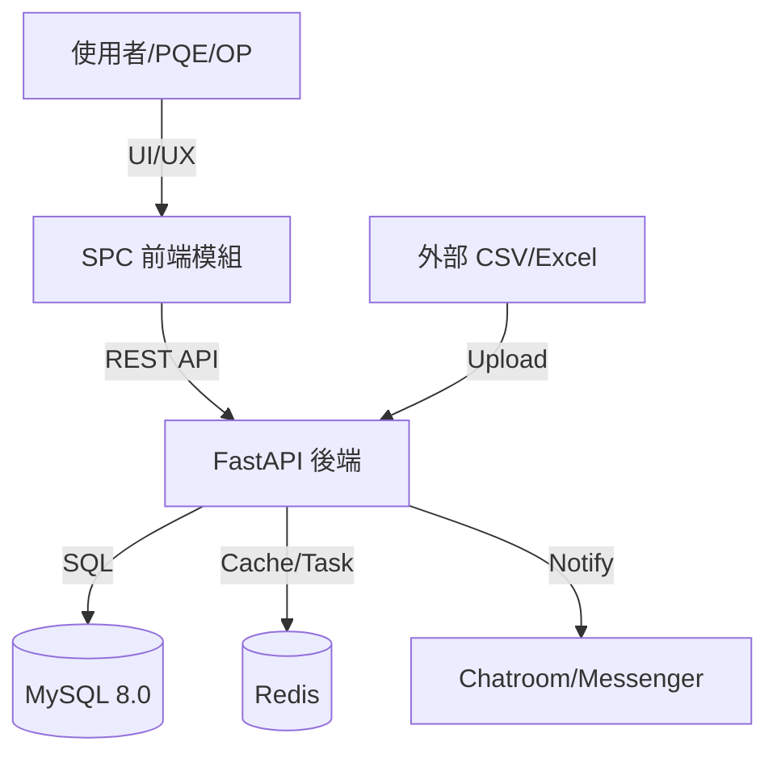

# 01 軟體需求規格書 (SRS) - SPC 系統全範疇規範 (詳細版)

## 1. 系統願景與架構圖
本系統旨在建構一個全方位、可擴展的統計製程管制中心。

## 2. 辭庫管理全模組需求 (Master Data Requirements)
系統必須提供以下辭庫管理功能，作為管制計畫的引用基準：

- **產品資料 (Products)**: 支援料號 (Part Number) 的 CRUD 與批量匯入。需儲存品名、客戶資訊及規格型號。
- **檢測站別 (Stations)**: 支援樹狀組織結構。每個計畫必須關聯至一個特定站點，以便進行站點間的良率對比。
- **群組設定 (Entity Groups)**: 允許將多個層別（如：A、B、C 三台機台）打包為一個邏輯群組，用於快速篩選。
- **量測單位 (Measurement Units)**: 標準化物理單位字典（mm, kg, μm）。需設定預設的小數位數 (Digits)。
- **等級基準 (Grade Standards)**: 定義 Cpk 燈號規則（例如：Cpk > 1.33 為綠色 A 級）。
- **檢驗標準 (Inspection Standards)**: **[UI 預留]** 關聯至 SOP 文件或 AQL 抽樣計畫，目前僅需儲存鏈結。
- **檔案群組 (File Groups)**: 提供虛擬資料夾結構，用於分類管理大量的管制計畫檔案。

## 3. 分析工具需求 (Analysis Tooling Requirements)
- **多維度層化分析**: 支援按辭庫定義的維度（如機台、操作員）進行數據分組對比。
- **趨勢監控面板**: 即時展示各計畫的 Cpk 波動。
- **異常原因統計 (Pareto)**: 自動統計異常原因出現頻率，協助定位製程瓶頸。
- **預測性維護 (Trend Prediction)**: **[開發中/UI 僅展示]** 基於線性回歸或移動平均預估未來點位走勢。

## 4. 功能開發狀態表
| 模組 | 功能名稱 | 狀態 | 備註 |
| :--- | :--- | :--- | :--- |
| **辭庫** | 產品/站台/單位 | 已完成 | 支援批量同步 |
| **辭庫** | 等級基準設定 | 已完成 | 支援自定義燈號顏色 |
| **辭庫** | 檢驗標準關聯 | **UI 預留** | 僅前端 UI 框架，邏輯待對接 |
| **分析** | 管制圖基本功能 | 已完成 | 支援 8 大尼爾森規則 |
| **分析** | 趨勢預測面板 | **UI 預留** | 僅前端 UI 佔位，後端算法開發中 |
| **檔案** | 檔案群組管理 | 已完成 | 支援多級虛擬目錄 |

---

## 5. 非功能需求 (Non-functional Requirements)
- **資料治理**: 樣本數據長度限制為 128 字元，小數位數需符合單位辭庫設定。
- **效能**: 10,000 筆批量匯入任務需在 30 秒內完成解析並入庫。
- **安全性**: 所有辭庫異動需記錄稽核日誌 (Audit Log)。
