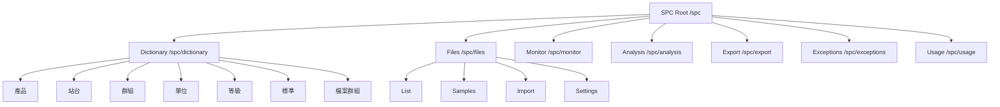
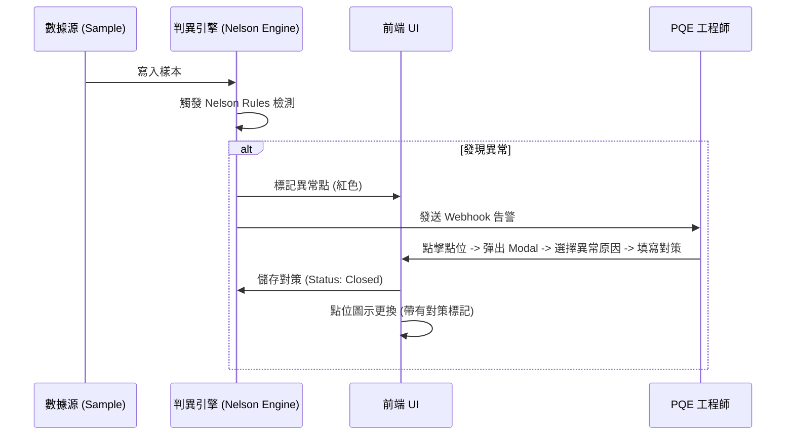
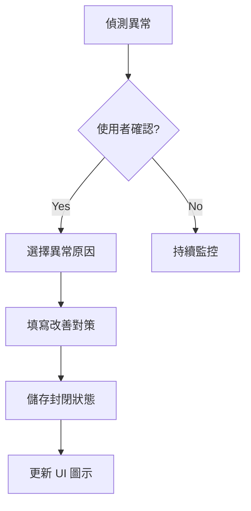

# 02 功能規格書 (FSD) - SPC 操作流程與組件規範 (詳細版)

## 1. 辭庫管理模組詳解 (Master Data UI/UX)

### 1.1 產品與站台 (Products & Stations)
- **交互**: 提供 Search-as-you-type 搜尋功能。支援 CSV 批量上傳產品清單。
- **規則**: 刪除站點時，若已有計畫關聯，系統應提示「無法刪除，請先移除相關計畫」。

### 1.2 量測單位與等級基準 (Units & Ranks)
- **單位設定**: 使用者可自定義單位的「顯示名稱」與「精度（小數點後幾位）」。
- **等級判定**: 提供色塊選擇器與數值滑桿。設定變更後，全系統 Cpk 看板應即時套用新燈號。

### 1.3 檔案群組 (File Groups)
- **目錄樹**: 支援 Drag-and-Drop 檔案移動。
- **權限**: 資料夾可設定「僅 PQE 可見」或「全公開」。

---

## 1.4 前端頁面路由架構



### 1.5 前端頁面元件清單

| 路由 | 頁面元件 | 功能說明 |
| :--- | :--- | :--- |
| `/spc` | Navigate | 重新導向至 `/spc/dictionary` |
| `/spc/dictionary` | DictionaryPage | 辭庫總覽頁面 |
| `/spc/dictionary/product` | ProductListPage | 產品列表管理 |
| `/spc/dictionary/product/bulk-add` | ProductBulkAddPage | 產品批量新增 |
| `/spc/dictionary/station` | StationListPage | 站台列表管理 |
| `/spc/dictionary/group` | GroupListPage | 群組列表管理 |
| `/spc/dictionary/unit` | UnitListPage | 單位列表管理 |
| `/spc/dictionary/level` | LevelListPage | 等級基準管理 |
| `/spc/dictionary/standard` | StandardListPage | 檢驗標準管理 |
| `/spc/dictionary/file-group` | FileGroupListPage | 檔案群組管理 |
| `/spc/files/measurement-value` | Measurement-value files | 量測值檔案列表 |
| `/spc/files/measurement-value/samples` | SamplesPage | 樣本資料檢視/編輯 |
| `/spc/files/measurement-value/import` | ImportPage | Excel/CSV 匯入 |
| `/spc/files/measurement-value/settings` | SettingsPage | 檔案設定 |
| `/spc/analysis` | AnalysisPage | SPC 分析工具 |
| `/spc/export` | ExportPage | 匯出報表 |
| `/spc/exceptions` | ExceptionsPage | 異常彙總 |
| `/spc/usage` | UsagePage | 使用紀錄 |
| `/spc/monitor` | MonitorPage | 即時監控看板 |

---

## 2. 分析工具交互規範 (Analysis Tools)

### 2.1 層化分析 (Stratification)
- **操作流**: 
  1. 使用者在側邊欄勾選特定辭庫維度（如：機台 #1, 機台 #2）。
  2. 點擊「執行層化」。
  3. **預期結果**: 管制圖以「疊圖」形式呈現，兩條曲線分別代表不同機台的變異狀況。

### 2.2 異常閉環流程 (Alert Closure)


---

## 2.3 前端 API Hooks 結構

### 2.3.1 資料取得 Hooks
| Hook |用途 |
| :--- | :--- |
| `useSPCFileData` | 檔案 + 樣本資料 |
| `useFileList` | 檔案列表（過濾） |
| `useFileListLazy` | 延遲載入檔案列表 |
| `useFileListHybrid` | 混合模式載入 |
| `useSPCFileGroupData` | 檔案群組資料 |
| `useSPCProductData` | 產品資料 |
| `useSPCStationData` | 站台資料 |
| `useSPCUnitData` | 單位資料 |
| `useSPCSamplesData` | 樣本資料 |
| `useSPCSamplesInfiniteData` | 無限滾動樣本 |
| `useSPCGroupListData` | 群組列表 |
| `useSPCPlanData` | 計畫資料 |
| `useSPCLevelData` | 等級資料 |
| `useSPCNelsonRulesData` | Nelson Rules 資料 |
| `useSPCDictionarySidebar` | 辭庫側邊欄 |
| `useSPCFieldManagement` | 欄位管理 |
| `useSPCFileGroupFieldManagement` | 檔案群組欄位管理 |
| `useFetchPlanDetail` | 取得計畫詳情 |
| `useStratificationData` | 層化資料 |
| `useAnalysisData` | 分析資料 |
| `useRecommendedLimits` | 推薦限制 |
| `useSimpleFormatImportData` | 簡易格式匯入資料 |

### 2.3.2 匯入 Hooks
| Hook | 用途 |
| :--- | :--- |
| `useImportV2` | 新版匯入 |
| `useExistingPlansForImport` | 現有計畫匯入 |
| `useResolveImportDictionary` | 匯入辭庫解析 |

### 2.3.3 資料表 Hooks
| Hook | 用途 |
| :--- | :--- |
| `useSPCPivotTable` | 樞紐分析表 |
| `useSPCStatistics` | 統計資料 |
| `useSPCExcelIO` | Excel 匯入/匯出 |

---

## 2.4 Zustand Store 狀態管理

### 2.4.1 useFileStore 結構
**路徑**: `stores/useFileStore.js`

| 狀態欄位 | 類型 | 說明 |
| :--- | :--- | :--- |
| `settings` | Object | 檔案設定 (id, name, part_number, batch_number, spec, station, category_information, controlItems, testRuleConfig) |
| `selectedControlItemId` | String | 目前選取的管制項目 ID |
| `isDirty` | Boolean | 未儲存變更標記 |
| `nextTempId` | Number | 暫時 ID 產生器 |

| 動作 | 說明 |
| :--- | :--- |
| `setFileBasicInfo(info)` | 設定基本檔案資訊 |
| `addControlItem(name)` | 新增管制項目 |
| `updateControlItem(id, updates)` | 更新管制項目 |
| `deleteControlItem(id)` | 刪除管制項目 |
| `reorderControlItems(from, to)` | 重新排序管制項目 |
| `setCategories(dimensions)` | 設定維度類別 |
| `setSelectedControlItemId(id)` | 選取管制項目 |
| `reset()` | 完全重設 |
| `resetSettings()` | 重設設定 |
| `loadFileDataToStore(fileId)` | 從 API 載入資料 |

---

## 2.5 常數定義

### 2.5.1 檔案類型
```javascript
FILE_TYPES = {
  MEASUREMENT_VALUE: 'measurement-value',
  COUNT_VALUE: 'count-value',
  MERGED: 'merged'
}
```

### 2.5.2 辭庫類型
```javascript
DICTIONARY_TYPES = {
  PRODUCT: 'product',
  STATION: 'station',
  GROUP: 'group',
  UNIT: 'unit',
  LEVEL: 'level',
  STANDARD: 'standard',
  FILE_GROUP: 'fileGroup'
}
```

### 2.5.3 管制圖類型
```javascript
CONTROL_CHART_TYPES = {
  X_BAR_MR: { value: 'x_bar_mr', label: 'X̄-MR', subgroupRange: { min: 1, max: 1 } },
  X_BAR_R: { value: 'x_bar_r', label: 'X̄-R', subgroupRange: { min: 2, max: 10 } },
  X_BAR_S: { value: 'x_bar_s', label: 'X̄-S', subgroupRange: { min: 11, max: Infinity } }
}
```

---

## 3. UI 佔位功能定義 (UI-only / Pending)

### 3.1 趨勢預測與建模
- **UI 現狀**: 提供「未來趨勢預估」開關。
- **交互限制**: 點擊後僅顯示模擬曲線，並彈出「AI 模組串接中」之提示。

### 3.2 檢驗標準文檔
- **UI 現狀**: 顯示文件清單。
- **交互限制**: 目前點擊僅能下載，無法進行線上預覽與版本比對（預留為 Phase 3）。

---

## 4. UI 性能與響應規範
- **虛擬列表 (Virtual Scroll)**: 樣本列表在萬筆數據下必須採用虛擬滾動，確保 FPS > 50。
- **即時驗證**: 規格設定時 (UCL/LSL)，輸入框應即時檢驗「USL 必須大於 LSL」。

---

## 5. 分析頁面元件明細

### 5.1 分析頁面元件
| 元件 | 路徑 | 說明 |
| :--- | :--- | :--- |
| `AnalysisPage` | `pages/analysis/AnalysisPage.jsx` | 分析主頁面 |
| `AnalysisSidebar` | `pages/analysis/components/AnalysisSidebar.jsx` | 分析側邊欄 |
| `StatisticsSummary` | `pages/analysis/components/StatisticsSummary.jsx` | 統計摘要 |
| `DatasetBlock` | `pages/analysis/components/DatasetBlock.jsx` | 資料集區塊 |
| `ControlChartsSection` | `pages/analysis/components/ControlChartsSection.jsx` | 管制圖區塊 |
| `DataTableSection` | `pages/analysis/components/DataTableSection.jsx` | 資料表區塊 |
| `StratificationBarChart` | `pages/analysis/components/StratificationBarChart.jsx` | 層化長條圖 |

### 5.2 圖表建構器
| 檔案 | 圖表類型 |
| :--- | :--- |
| `controlChart.js` | 管制圖 |
| `histogram.js` | 直方圖 |
| `boxPlot.js` | 箱線圖 |
| `scatter.js` | 散佈圖 |
| `stratification.js` | 層化圖 |

### 5.3 共用組件
| 組件 | 路徑 |
| :--- | :--- |
| `SPCLayout` | `components/layout/SPCLayout.jsx` |
| `SPCPageLayout` | `components/layout/SPCPageLayout.jsx` |
| `SPCPageLayoutWithMenu` | `components/layout/SPCPageLayoutWithMenu.jsx` |
| `SPCFieldSettings` | `components/sidebar/SPCFieldSettings.jsx` |
| `SPCDictionaryForm` | `components/sidebar/SPCDictionaryForm.jsx` |
| `SPCDetailView` | `components/sidebar/SPCDetailView.jsx` |
| `SPCLevelForm` | `components/sidebar/SPCLevelForm.jsx` |
| `SPCFilesTab` | `components/tabs/SPCFilesTab.jsx` |
| `SPCDictionaryTab` | `components/tabs/SPCDictionaryTab.jsx` |
| `SPCMonitorTab` | `components/tabs/SPCMonitorTab.jsx` |
| `SPCAnalysisTab` | `components/tabs/SPCAnalysisTab.jsx` |
| `SPCExportTab` | `components/tabs/SPCExportTab.jsx` |
| `SPCExceptionsTab` | `components/tabs/SPCExceptionsTab.jsx` |
| `SPCUsageTab` | `components/tabs/SPCUsageTab.jsx` |
| `DataTable` | `components/DataTable/DataTable.jsx` |
| `DataTableContent` | `components/DataTable/components/DataTableContent.jsx` |
| `DataTableSummary` | `components/DataTable/components/DataTableSummary.jsx` |
| `DataTableActions` | `components/DataTable/components/DataTableActions.jsx` |
| `ControlChart` | `components/ControlChart.jsx` |
| `ChartLimitBlock` | `components/ChartLimitBlock.jsx` |
| `SPCGroupSelect` | `components/SPCGroupSelect.jsx` |
| `SPCItemSelect` | `components/SPCItemSelect.jsx` |
| `SPCUnitSelect` | `components/SPCUnitSelect.jsx` |
| `InfoCard` | `components/InfoCard.jsx` |
| `SPCEmptyState` | `components/SPCEmptyState.jsx` |
| `SPCTabNav` | `components/SPCTabNav.jsx` |
| `DraggableItemList` | `components/DraggableItemList.jsx` |
| `InlineConfirmShell` | `components/InlineConfirmShell.jsx` |
| `DictionarySelect` | `components/DictionarySelect.jsx` |
| `AddNewValueModal` | `components/AddNewValueModal.jsx` |
| `AddNewUnitModal` | `components/AddNewUnitModal.jsx` |

---

## 6. 異常原因統計功能 (Pareto)

### 6.1 取樣警报 Hook
```javascript
// 異常原因統計查詢範例
const { data: alerts } = useSPCSampleAlerts({
  entityId: selectedEntityId,
  groupBy: 'reason'  // 按原因分組
});
```

### 6.2 警报類型
| alert_type | 說明 |
| :--- | :--- |
| `nelson_rule` | Nelson Rules 偵測異常 |
| `alarm_limit` | 超過管制界限 |

### 6.3 異常關閉流程

