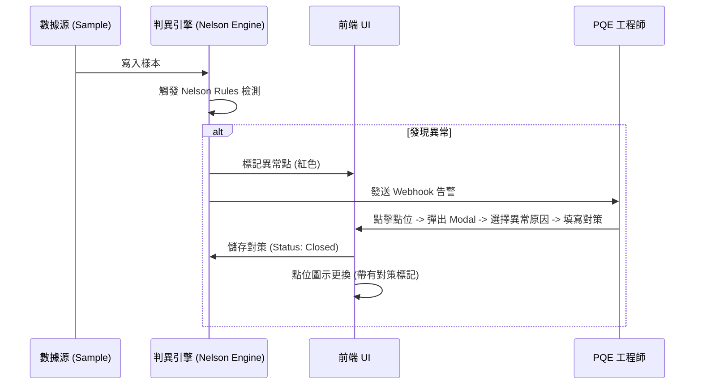

# 02 功能規格書 (FSD) - SPC 操作流程與組件規範 (詳細版)

## 1. 辭庫管理模組詳解 (Master Data UI/UX)

### 1.1 產品與站台 (Products & Stations)
- **交互**: 提供 Search-as-you-type 搜尋功能。支援 CSV 批量上傳產品清單。
- **規則**: 刪除站點時，若已有計畫關聯，系統應提示「無法刪除，請先移除相關計畫」。

### 1.2 量測單位與等級基準 (Units & Ranks)
- **單位設定**: 使用者可自定義單位的「顯示名稱」與「精度（小數點後幾位）」。
- **等級判定**: 提供色塊選擇器與數值滑桿。設定變更後，全系統 Cpk 看板應即時套用新燈號。

### 1.3 檔案群組 (File Groups)
- **目錄樹**: 支援 Drag-and-Drop 檔案移動。
- **權限**: 資料夾可設定「僅 PQE 可見」或「全公開」。

---

## 2. 分析工具交互規範 (Analysis Tools)

### 2.1 層化分析 (Stratification)
- **操作流**: 
  1. 使用者在側邊欄勾選特定辭庫維度（如：機台 #1, 機台 #2）。
  2. 點擊「執行層化」。
  3. **預期結果**: 管制圖以「疊圖」形式呈現，兩條曲線分別代表不同機台的變異狀況。

### 2.2 異常閉環流程 (Alert Closure)

---

## 3. UI 佔位功能定義 (UI-only / Pending)

### 3.1 趨勢預測與建模
- **UI 現狀**: 提供「未來趨勢預估」開關。
- **交互限制**: 點擊後僅顯示模擬曲線，並彈出「AI 模組串接中」之提示。

### 3.2 檢驗標準文檔
- **UI 現狀**: 顯示文件清單。
- **交互限制**: 目前點擊僅能下載，無法進行線上預覽與版本比對（預留為 Phase 3）。

---

## 4. UI 性能與響應規範
- **虛擬列表 (Virtual Scroll)**: 樣本列表在萬筆數據下必須採用虛擬滾動，確保 FPS > 50。
- **即時驗證**: 規格設定時 (UCL/LSL)，輸入框應即時檢驗「USL 必須大於 LSL」。
