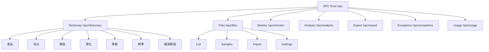
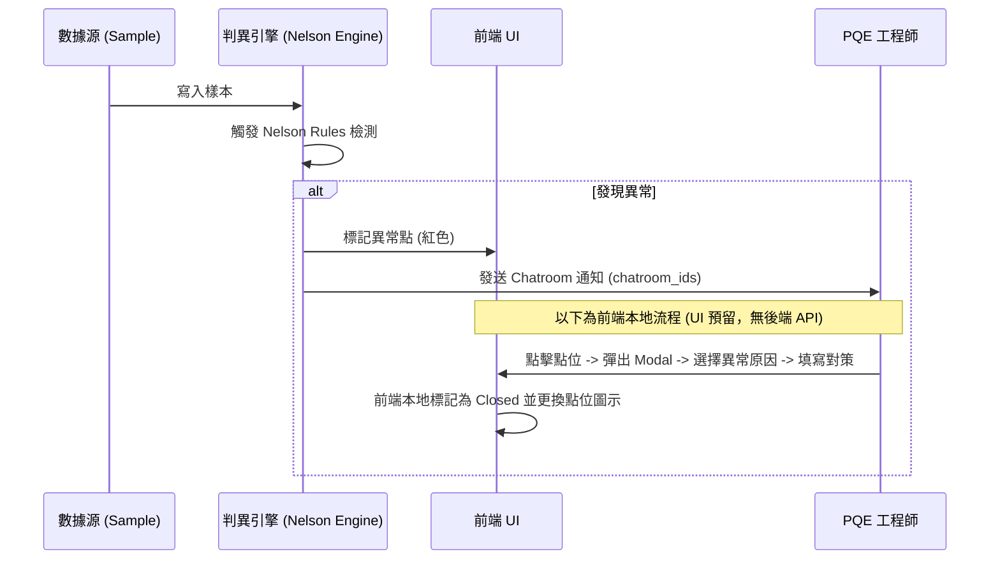
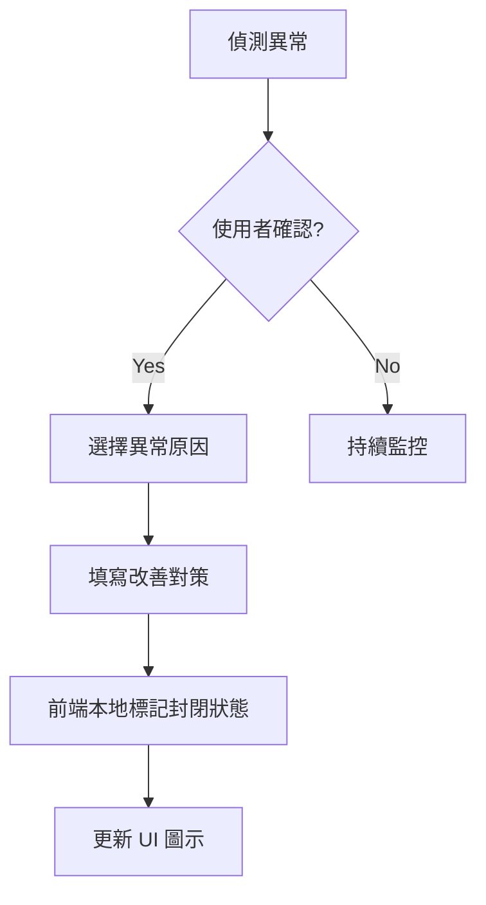

# 02 功能規格書 (FSD) - SPC 操作流程與組件規範

## 1. 辭庫管理模組詳解 (Master Data UI/UX)

### 1.1 產品與站台 (Products & Stations)
- **交互**: 提供 Search-as-you-type 搜尋功能。支援 CSV 批量上傳產品清單。
- **規則**: 刪除站點時，若已有計畫關聯，系統應提示「無法刪除，請先移除相關計畫」。

### 1.2 量測單位與等級基準 (Units & Ranks)
- **單位設定**: 使用者可自定義單位的「顯示名稱」與「精度（小數點後幾位）」。
- **等級判定**: 提供色塊選擇器與數值滑桿。設定變更後，全系統 Cpk 看板應即時套用新燈號。

### 1.3 檔案群組 (File Groups)
- **目錄樹**: 支援 Drag-and-Drop 檔案移動。
- **權限**: 資料夾可設定「僅 PQE 可見」或「全公開」。

---

## 1.4 前端頁面路由架構

### 1.5 前端頁面路由與功能

| 路由 | 功能說明 |
| :--- | :--- |
| `/spc` | 重新導向至辭庫總覽 |
| `/spc/dictionary` | 辭庫總覽頁面 |
| `/spc/dictionary/product` | 產品列表管理 |
| `/spc/dictionary/product/bulk-add` | 產品批量新增 |
| `/spc/dictionary/station` | 站台列表管理 |
| `/spc/dictionary/group` | 群組列表管理 |
| `/spc/dictionary/unit` | 單位列表管理 |
| `/spc/dictionary/level` | 等級基準管理 |
| `/spc/dictionary/standard` | 檢驗標準管理 |
| `/spc/dictionary/file-group` | 檔案群組管理 |
| `/spc/files/measurement-value` | 量測值檔案列表 |
| `/spc/files/measurement-value/samples` | 樣本資料檢視/編輯 |
| `/spc/files/measurement-value/import` | Excel/CSV 匯入 |
| `/spc/files/measurement-value/settings` | 檔案設定 |
| `/spc/analysis` | SPC 分析工具 |
| `/spc/export` | 匯出報表 |
| `/spc/exceptions` | 異常彙總 |
| `/spc/usage` | 使用紀錄 |
| `/spc/monitor` | 即時監控看板 |

---

## 2. 分析工具交互規範 (Analysis Tools)

### 2.1 層化分析 (Stratification)
- **操作流**: 
  1. 使用者在側邊欄勾選特定辭庫維度（如：機台 #1, 機台 #2）。
  2. 點擊「執行層化」。
  3. **預期結果**: 管制圖以「疊圖」形式呈現，兩條曲線分別代表不同機台的變異狀況。

### 2.2 異常閉環流程 (Alert Closure)

> **⚠️ [部分 UI 預留]**：後端 sample-alerts 端點目前**僅提供查詢**（`GET .../sample-alerts` 與 `.../sample-alerts/count`），**無**關閉/確認（close/ack）端點，警報物件亦**無** `reason`／`status`／對策 等欄位。下圖中「選擇異常原因 → 填寫對策 → Status: Closed」為**前端本地狀態流程**，尚無後端 API 支撐。

---

## 2.3 前端資料存取與載入機制

前端以 React 搭配資料取得層（data-fetching）向後端 REST API 讀寫資料，並以快取與分頁機制支撐大量樣本的效能。功能上分為三類：

- **資料讀取**：載入計畫（含管制項目與各項設定）、辭庫資料（產品、站台、單位、群組、等級、檢驗標準）、檔案與樣本清單，以及分析所需的層化資料、統計摘要與能力分析的建議界限。
  - **列表載入策略**：檔案/樣本清單支援「過濾查詢」、「延遲載入」與「混合模式」；大量樣本採**無限滾動**分批取回，避免一次載入全部資料。
- **匯入流程**：支援新版匯入流程、對應到既有計畫的匯入，以及匯入時的辭庫（層別/單位等）解析與比對。
- **資料表運算**：提供樞紐分析、統計彙總，以及 Excel 匯入/匯出的前端處理。

> 上述皆為前端呼叫 §4.3 / [08 API 規格文件](./08_API_規格與用法說明.md) 所列端點後的資料組裝與呈現，客戶端對接時以 API 為準。

---

## 2.4 前端狀態管理機制

檔案編輯頁採用 Zustand 作為**前端本地狀態**（client-side state），在使用者按下儲存前於瀏覽器暫存草稿，減少往返請求。管理的內容與行為包含：

- **檔案基本設定**：名稱、料號、批號、規格、站別、層別資訊等（對應建立/更新 CCM 的欄位）。
- **管制項目編輯**：新增、更新、刪除、重新排序管制項目，並可設定層別維度與目前選取的項目。
- **未儲存變更追蹤**：以「dirty」標記提示尚未儲存的變更；新建立但未落庫的項目使用臨時識別碼，儲存後再由後端配發正式 ID。
- **載入與重設**：可從 API 載入既有檔案資料至本地狀態，或完全重設/重設設定。

---

## 2.5 常數定義

### 2.5.1 檔案類型

| 值 | 說明 |
| :--- | :--- |
| `measurement-value` | 計量值檔案（本文件對接對象） |
| `count-value` | 計數值檔案 |
| `merged` | 合併檔案 |

### 2.5.2 辭庫類型

| 值 | 說明 |
| :--- | :--- |
| `product` | 產品 |
| `station` | 站台 |
| `group` | 群組 |
| `unit` | 單位 |
| `level` | 等級 |
| `standard` | 檢驗標準 |
| `fileGroup` | 檔案群組 |

### 2.5.3 管制圖類型

| 值 | 標籤 | 子組大小 (n) |
| :--- | :--- | :--- |
| `x_bar_mr` | X̄-MR | n = 1 |
| `x_bar_r` | X̄-R | 2 ≤ n ≤ 10 |
| `x_bar_s` | X̄-S | n > 10 |

> 與 [09 JSON 格式規範](./09_JSON_格式規範.md) 的 `chart_type` 列舉一致。

---

## 3. UI 佔位功能定義 (UI-only / Pending)

### 3.1 趨勢預測與建模
- **UI 現狀**: 提供「未來趨勢預估」開關。
- **交互限制**: 點擊後僅顯示模擬曲線，並彈出「AI 模組串接中」之提示。

### 3.2 檢驗標準文檔
- **UI 現狀**: 顯示文件清單。
- **交互限制**: 目前點擊僅能下載，無法進行線上預覽與版本比對（預留為 Phase 3）。

---

## 4. UI 性能與響應規範
- **虛擬列表 (Virtual Scroll)**: 樣本列表在萬筆數據下必須採用虛擬滾動，確保 FPS > 50。
- **即時驗證**: 規格設定時 (UCL/LSL)，輸入框應即時檢驗「USL 必須大於 LSL」。

---

## 5. 分析頁面功能組成

### 5.1 分析頁面版面

分析頁面由以下功能區塊組成：

- **分析側邊欄**：選擇計畫、管制項目與層別維度，設定分析條件。
- **統計摘要**：顯示樣本數、平均值、標準差與能力指標（Cp/Cpk/Pp/Ppk）等彙總。
- **資料集區塊**：呈現目前分析所使用的樣本集與篩選條件。
- **管制圖區塊**：繪製 X̄-MR / X̄-R / X̄-S 管制圖，並標記異常點。
- **資料表區塊**：以表格檢視樣本明細，支援虛擬滾動。
- **層化長條圖**：以長條圖比較不同層別（如機台、班別）的變異或指標差異。

### 5.2 圖表類型

分析與監控頁面提供的圖表類型：管制圖、直方圖、箱線圖、散佈圖、層化圖。管制圖採 Canvas 繪製以支撐大量點位的效能。

### 5.3 共用 UI 能力

跨頁面共用的介面能力包含：頁面版面與分頁導覽、辭庫/單位/項目/群組的下拉選擇器、管制界限設定區塊、欄位設定與表單、可拖曳排序清單、行內確認、新增值/單位彈窗、資料表（含彙總與操作列）、空狀態與資訊卡等。

---

## 6. 異常原因統計功能 (Pareto)

### 6.1 取樣警報查詢

警報查詢由後端 sample-alerts 端點提供，僅支援**分頁**（`offset`/`limit`/`order`）與依 `alert_type`（`nelson_rule` / `alarm_limit`，不帶則回全部）過濾；**不提供** `groupBy` / `reason` 之類的分組參數。

因此 Pareto 原因統計採用「前端彙整」機制：取回警報後，前端依 `alert_type`、`rule_number`（Nelson 法則編號）與 `description` 自行分組與計次，再繪製長條圖。

### 6.2 警报類型
| alert_type | 說明 |
| :--- | :--- |
| `nelson_rule` | Nelson Rules 偵測異常 |
| `alarm_limit` | 超過管制界限 |

### 6.3 異常關閉流程 [UI 預留]

> **⚠️ [UI 預留]**：後端目前無警報關閉/確認端點，警報物件亦無原因/對策/狀態欄位。下列「選擇原因 → 填寫對策 → 儲存封閉狀態」為**前端本地流程**，尚無後端 API 支撐（詳見 §2.2 說明）。

