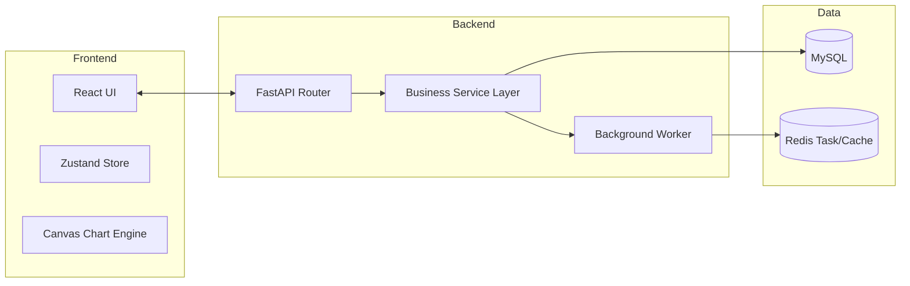
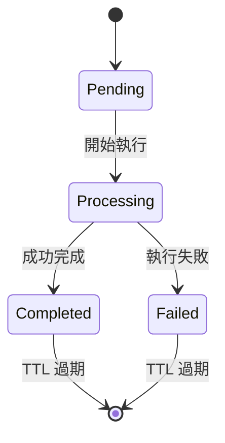
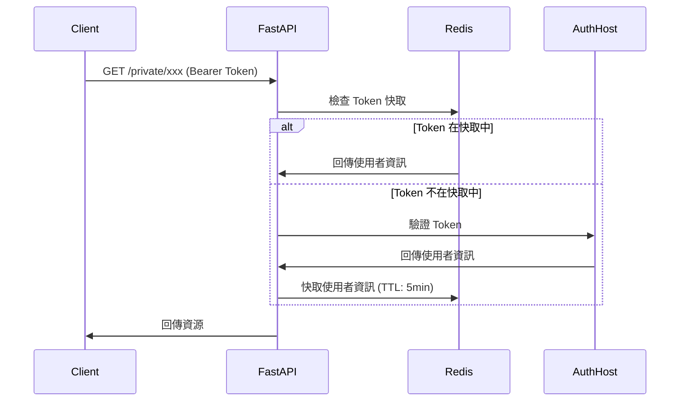

# 03 系統設計文件 (SDD) - SPC 系統架構與實體關聯 (詳細版)

## 1. 系統組件架構圖


---

## 1.1 後端目錄結構

```
/src/
├── server.py                  # FastAPI 應用程式入口
├── crud/                     # CRUD 操作層
│   ├── blob.py              # 檔案操作
│   ├── product_layout.py     # 產品版面 CRUD
│   ├── qc_plan_layout.py   # QC Plan 版面 CRUD
│   └── tenant.py           # 租戶管理
├── database/                 # 資料庫層
│   ├── database.py          # SQLAlchemy 引擎、Session、Config
│   └── models/             # SQLAlchemy 模型
│       ├── base.py         # Base 類、關聯表
│       ├── blobs.py        # 檔案儲存模型
│       ├── measurement_unit.py
│       ├── plan.py        # QC Plan 版面和群組
│       ├── products.py     # 產品版面和實體
│       ├── quant_ccm.py   # 定量 CCM (管制圖)
│       ├── ranks.py      # 等級標籤
│       ├── spc_entities.py # SPC 實體群組和實體
│       ├── standards.py   # 品質標準
│       ├── station.py    # 站點模型
│       └── tenant.py    # 租戶模型
├── dependencies/              # FastAPI 依賴
│   ├── auth.py           # 認證/授權
│   └── basic.py         # DB 和 Redis 依賴
├── routers/                 # API 端點
│   ├── server.py        # Router 聚合器
│   ├── db/             # 資料庫管理路由
│   ├── private/        # 受保護路由
│   │   ├── server.py  # Private Router 聚合器
│   │   ├── auth/     # 認證端點
│   │   ├── measurement_unit/
│   │   ├── product/
│   │   ├── qc_plan/
│   │   ├── quant_ccm/ # CCM 11 個子路由
│   │   ├── rank_label/
│   │   ├── spc_entity/
│   │   ├── standard/
│   │   └── station/
│   ├── public/        # 公開路由 (空)
│   └── root/         # 管理路由 (空)
├── schemas/                 # Pydantic 模型
│   ├── basic.py       # 共用 Schema (Token, NumOfData, TSUserInfo)
│   ├── enums.py     # 列舉定義
│   ├── base/       # 回應 Schema (Info models)
│   └── payload/    # 請求 Payload Schema
├── services/                # 業務邏輯
│   └── ccm_excel_builder.py # Excel 匯出
└── utils/                  # 工具
    ├── capability.py  # SPC 能力計算
    ├── credentials.py # Token/Password 工具
    ├── handler.py   # 錯誤處理
    ├── s3.py      # S3 儲存工具
    ├── swagger.py  # 自定義 Swagger UI
    └── utils.py   # 日誌、通知
```

---

## 2. 辭庫與業務實體關係 (ERD Concepts)

### 2.1 辭庫管理實體 (Master Data)
- **`products`**: 儲存產品料號、名稱。與 `quant_ccms` 1:N 關聯。
- **`stations`**: 儲存站台層級 (id, parent_id)。與 `quant_ccms` 1:N 關聯。
- **`spc_entities` & `spc_entity_groups`**: 實���層別標籤字典。
- **`ranks`**: 儲存等級判定閾值 (Value, Color)。

### 2.2 核心業務實體
- **`quant_ccms`**: 管制計畫主表。透過 JSON 欄位引用 `spc_entities`。
- **`quant_ccm_entity_samples`**: 樣本數據表。
    - **優化**: 對 `idx` 與 `quant_ccm_entity_id` 建立複合唯一索引。

### 2.3 完整 ERD 關聯圖


---

## 3. 背景任務與任務狀態機

### 3.1 Redis 任務狀態定義
目前僅 **all-in-one 批量匯入** 採用非同步任務（回傳 `202 Accepted` + 輪詢）；層化分析與能力分析皆為同步端點，不經 Redis 任務管理。
- **Key**: `all_in_one_task:{tenant_id}:{task_id}`
- **Status**: `pending` -> `processing` -> `completed` | `failed`
- **TTL**: 每次寫入均以 `SETEX` 設定 3600 秒，供前端輪詢 `GET /all-in-one/{task_id}`。

### 3.2 任務流程圖


---

## 4. 安全性與租戶隔離

### 4.1 認證流程
> **重點**：SPC 系統本身不簽發 token。使用者持 TeamSync 簽發的 Bearer Token（效期預設 15 分鐘）呼叫 SPC；SPC 透過 `GET {AUTH_HOST}/private/user/me` 向 AuthHost 驗證，並將使用者資訊快取於 Redis（key: `auth:token:{token}`，TTL 5 分鐘）。



### 4.2 API Key 驗證
| Header | 用途 | 角色 |
| :--- | :--- | :--- |
| `X-ADMIN-TOKEN` | 管理 API | Admin |
| `X-SUPER-ADMIN-TOKEN` | 超級管理 API | Super Admin |

### 4.3 租戶與部門隔離實作
- **Middleware**: 應用層唯一註冊的 middleware 是 `CORSMiddleware`（無自訂 TenantMiddleware）。
- **隔離邏輯**: 各資料表帶有 `tenant_id` / `department_id` 欄位（見 `models/quant_ccm.py`），認證時由 `TSUserInfo.obtain_tenant_id()` 解析租戶，查詢時於各 CRUD/router 顯式過濾（非自動 SQL 攔截）。
- **SPC 權限模型**: 另有使用者層級的 SPC 角色與部門級資料隔離，透過 `/permissions`、`/permissions/me` 端點管理，欄位包含 `SPCPermissionRole`、`can_manage_permissions`、`can_read_all_departments`。

### 4.4 環境變數配置

| 變數 | 用途 | 範例 |
| :--- | :--- | :--- |
| `DB_HOST` | MySQL 主機 | `localhost` |
| `DB_PORT` | MySQL 連接埠 | `3306` |
| `DB_USER` | MySQL 使用者 | `root` |
| `DB_PASS` | MySQL 密碼 | `password` |
| `DB_NAME` | 資料庫名稱 | `spc_db` |
| `REDIS_HOST` | Redis 主機 | `localhost` |
| `REDIS_PORT` | Redis 連接埠 | `6379` |
| `AUTH_HOST` | 認證服務主機 | `https://auth.example.com` |

---

## 5. 資料庫連線池配置

### 5.1 SQLAlchemy 連線参数
```python
# 實際預設值（皆可由環境變數覆寫）
pool_size = 20          # DB_POOL_SIZE，最小連線數
max_overflow = 30       # DB_MAX_OVERFLOW，最大溢出連線數
pool_recycle = 600      # DB_POOL_RECYCLE，連線回收秒數（在 RDS idle 關閉前回收）
```

### 5.2 連線池監控
- **健康檢查**: `/health` 端點僅執行 `SELECT 1` 與 `redis.ping()` 驗證 DB／Redis 連線，成功回 `{"status": "ok"}`，失敗回 503。**不會**自動建立資料庫。
- **資料庫初始化**: `create_database_if_not_exists()` 於模組載入時及 `/db` 管理路由執行，與 `/health` 無關。

---

## 6. Excel 匯出服務

### 6.1 ccm_excel_builder.py 功能
`build_ccm_workbook()` 產生包含以下區塊的 Excel 檔案：

| 區塊 | 內容 |
| :--- | :--- |
| **Block A** | Compact header (CCM 資訊 + 管制界限) |
| **Block B** | 樣本資料表 (橫向/縱向) |
| **Block C** | 管制圖 (X̄ 和 R/MR/S) |
| **Block D** | 能力分析 |

### 6.2 匯出 Hook
```javascript
// 前端呼叫範例
const { data: excelBlob } = useSPCExcelIO({
  entityId: selectedEntityId,
  format: 'xlsx'
});
```

---

## 7. 通知系統

### 7.1 Webhook 通知
```mermaid
flowchart TD
    A[Nelson Rules 偵測異常] --> B{有設定 Chatroom?}
    B -->|Yes| C[呼叫 notify_chatroom()]
    C --> D[發送 Webhook 到 Chatroom]
    B -->|No| E[略過]
```

### 7.2 通知觸發條件
- **Nelson Rule 觸發**: 任何一條規則偵測到異常
- **警報條件**: 超過設定的 Ca/Cp/Cpk 閾值

### 7.3 notify_chatroom() 規格
`notify_chatroom` 僅接受 `title` / `content`，透過 HTTP POST 到 `{AUTH_HOST}/root/notify/{chatroom_id}?dry_run=false`（帶 `X-ADMIN-TOKEN` header）發送通知。告警內容（規則編號、料號、批號等）由上游 `_send_nelson_violation_notification()` 組裝成 `title`/`content` 後再呼叫此函式。

```python
def notify_chatroom(chatroom_id: str, title: str, content: str):
    """POST 到 {AUTH_HOST}/root/notify/{chatroom_id}，回傳是否成功 (status 200)"""
```
