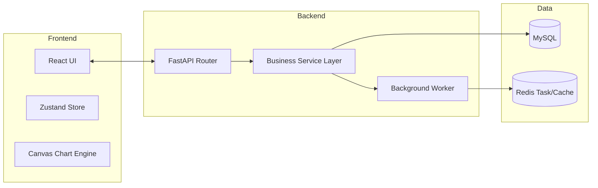
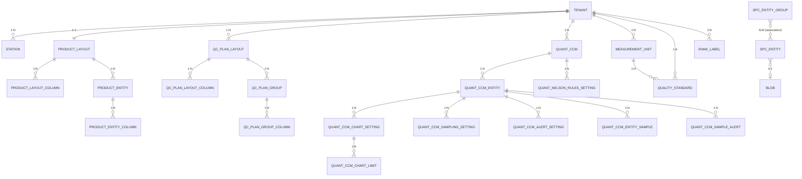
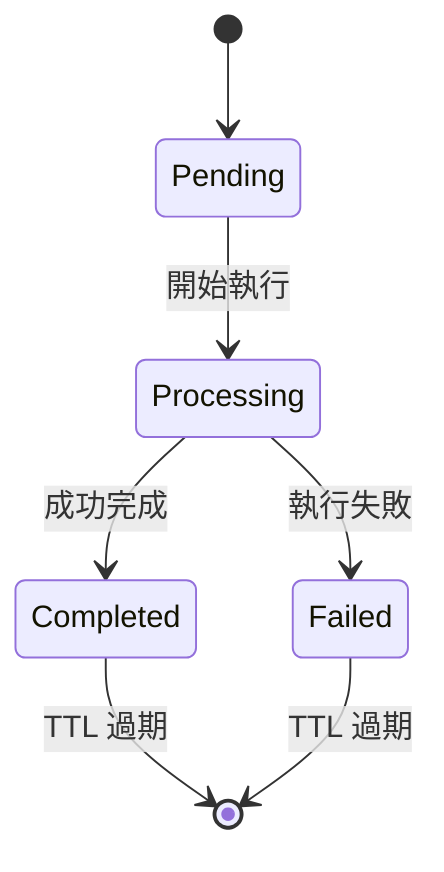
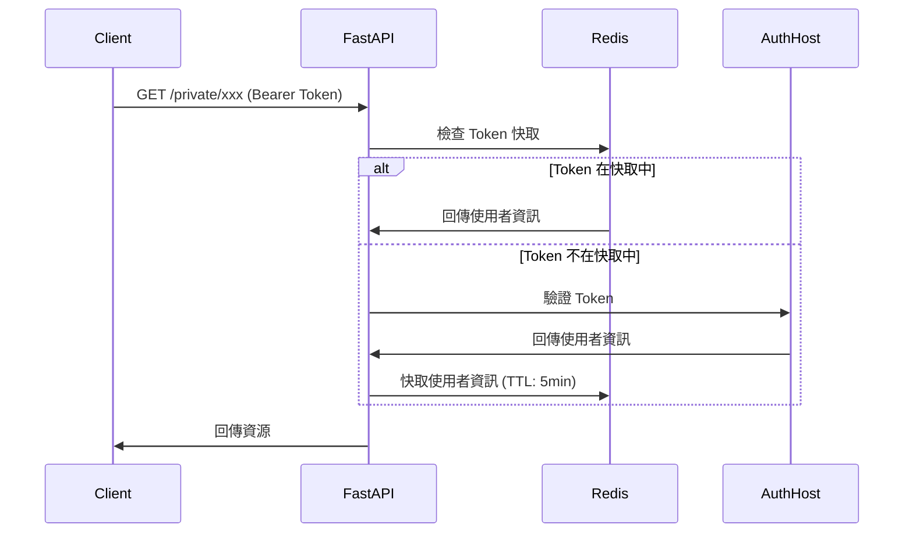
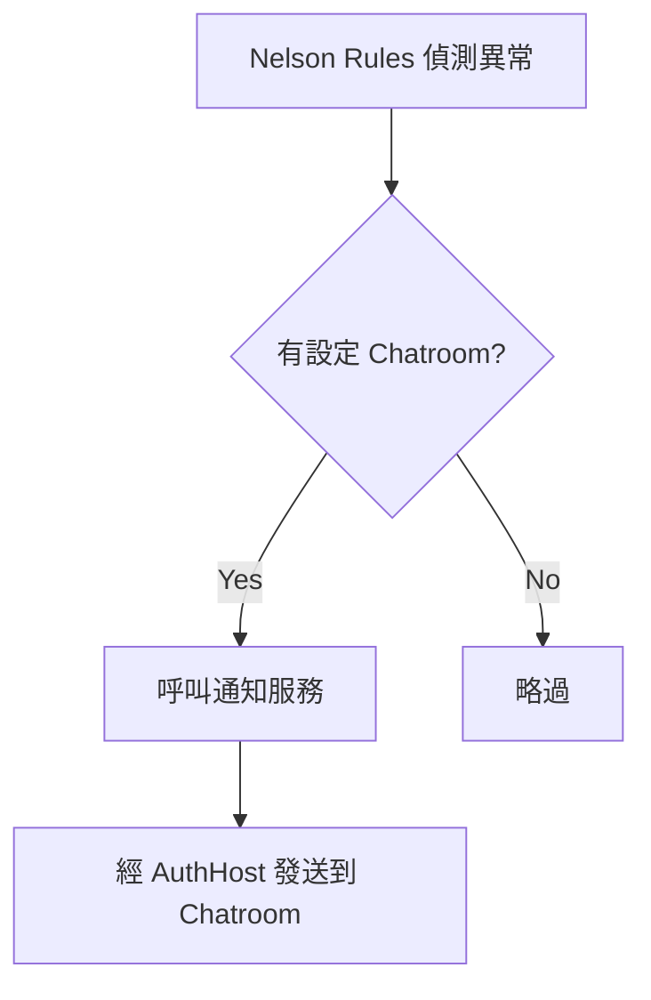

# 03 系統設計文件 (SDD) - SPC 系統架構與實體關聯

## 1. 系統組件架構圖

---

## 1.1 後端分層架構

後端採分層設計，各層職責如下：

| 層 | 職責 |
| :--- | :--- |
| **API 路由層** | 對外端點。分為受保護路由（`/private`，需 Bearer Token）、管理路由（`/db`、`/root`，以管理權杖授權）；定量管制（Quantitative CCM）為主要業務路由群。 |
| **業務邏輯層** | CCM、管制圖、能力分析、Excel 匯出等領域邏輯。 |
| **資料存取層 (CRUD)** | 產品版面、QC Plan 版面、計畫物件、租戶等實體的存取。 |
| **資料模型層** | 資料庫實體與關聯定義（產品、站台、SPC 實體、定量 CCM、品質標準、量測單位、等級標籤、租戶等）。 |
| **依賴與工具層** | 認證/授權、DB 與 Redis 連線、能力指標計算、憑證處理、錯誤處理、物件儲存、日誌與通知。 |
| **Schema 層** | 請求 Payload 與回應模型（對應 OpenAPI 定義）。 |

---

## 2. 辭庫與業務實體關係 (ERD Concepts)

### 2.1 辭庫管理實體 (Master Data)
- **`products`**: 儲存產品料號、名稱。與 `quant_ccms` 1:N 關聯。
- **`stations`**: 儲存站台層級 (id, parent_id)。與 `quant_ccms` 1:N 關聯。
- **`spc_entities` & `spc_entity_groups`**: 實體層別標籤字典。
- **`ranks`**: 儲存等級判定閾值 (Value, Color)。

### 2.2 核心業務實體
- **`quant_ccms`**: 管制計畫主表。透過 JSON 欄位引用 `spc_entities`。
- **`quant_ccm_entity_samples`**: 樣本數據表。
    - **優化**: 對 `idx` 與 `quant_ccm_entity_id` 建立複合唯一索引。

### 2.3 完整 ERD 關聯圖

---

## 3. 背景任務與任務狀態機

### 3.1 Redis 任務狀態定義
目前僅 **all-in-one 批量匯入** 採用非同步任務（回傳 `202 Accepted` + 輪詢）；層化分析與能力分析皆為同步端點，不經 Redis 任務管理。
- **Key**: `all_in_one_task:{tenant_id}:{task_id}`
- **Status**: `pending` -> `processing` -> `completed` | `failed`
- **TTL**: 每次寫入均以 `SETEX` 設定 3600 秒，供前端輪詢 `GET /all-in-one/{task_id}`。

### 3.2 任務流程圖

---

## 4. 安全性與租戶隔離

### 4.1 認證流程
> **重點**：SPC 系統本身不簽發 token。使用者持 TeamSync 簽發的 Bearer Token（效期預設 15 分鐘）呼叫 SPC；SPC 透過 `GET {AUTH_HOST}/private/user/me` 向 AuthHost 驗證，並將使用者資訊快取於 Redis（key: `auth:token:{token}`，TTL 5 分鐘）。

### 4.2 API Key 驗證
| Header | 用途 | 角色 |
| :--- | :--- | :--- |
| `X-ADMIN-TOKEN` | 管理 API | Admin |
| `X-SUPER-ADMIN-TOKEN` | 超級管理 API | Super Admin |

### 4.3 租戶與部門隔離實作
- **Middleware**: 應用層唯一註冊的 middleware 是 `CORSMiddleware`（無自訂 TenantMiddleware）。
- **隔離邏輯**: 各資料表帶有 `tenant_id` / `department_id` 欄位；認證通過後由使用者資訊解析出所屬租戶，查詢時於各業務端點顯式過濾（非自動 SQL 攔截）。
- **SPC 權限模型**: 另有使用者層級的 SPC 角色與部門級資料隔離，透過 `/permissions`、`/permissions/me` 端點管理，欄位包含 `SPCPermissionRole`、`can_manage_permissions`、`can_read_all_departments`。

### 4.4 環境變數配置

| 變數 | 用途 | 範例 |
| :--- | :--- | :--- |
| `DB_HOST` | MySQL 主機 | `localhost` |
| `DB_PORT` | MySQL 連接埠 | `3306` |
| `DB_USER` | MySQL 使用者 | `root` |
| `DB_PASS` | MySQL 密碼 | `password` |
| `DB_NAME` | 資料庫名稱 | `spc_db` |
| `REDIS_HOST` | Redis 主機 | `localhost` |
| `REDIS_PORT` | Redis 連接埠 | `6379` |
| `AUTH_HOST` | 認證服務主機 | `https://auth.example.com` |

---

## 5. 資料庫連線池配置

### 5.1 連線池參數
系統以 SQLAlchemy 連線池管理 MySQL 連線，預設值如下（皆可由環境變數覆寫）：

| 參數 | 預設值 | 環境變數 | 說明 |
| :--- | :--- | :--- | :--- |
| 連線池大小 | 20 | `DB_POOL_SIZE` | 常駐連線數 |
| 最大溢出 | 30 | `DB_MAX_OVERFLOW` | 尖峰額外可開連線數 |
| 連線回收秒數 | 600 | `DB_POOL_RECYCLE` | 在 RDS idle 關閉連線前主動回收 |

### 5.2 連線池監控
- **健康檢查**: `/health` 端點僅執行 `SELECT 1` 與 `redis.ping()` 驗證 DB／Redis 連線，成功回 `{"status": "ok"}`，失敗回 503。**不會**自動建立資料庫。
- **資料庫初始化**: 資料庫「不存在則建立」的動作在服務啟動時與 `/db` 管理路由執行，與 `/health` 無關。

---

## 6. Excel 匯出服務

### 6.1 匯出內容
後端 Excel 匯出服務會產生包含以下區塊的活頁簿：

| 區塊 | 內容 |
| :--- | :--- |
| **Block A** | Compact header (CCM 資訊 + 管制界限) |
| **Block B** | 樣本資料表 (橫向/縱向) |
| **Block C** | 管制圖 (X̄ 和 R/MR/S) |
| **Block D** | 能力分析 |

### 6.2 匯出方式
匯出以 HTTP GET 端點提供，可依 CCM 或單一 Entity 匯出，並支援日期區間與層別過濾：

- `GET /{ccm_id}/export`、`GET /{ccm_id}/export/v2`（整份 CCM）
- `GET /{ccm_id}/entities/{entity_id}/export`、`.../export/v2`（單一管制項目）

回應為 Excel 檔案串流（xlsx）。

---

## 7. 通知系統

### 7.1 通知流程

### 7.2 通知觸發條件
- **Nelson Rule 觸發**: 任何一條規則偵測到異常
- **警報條件**: 超過設定的 Ca/Cp/Cpk 閾值

### 7.3 通知傳送機制
通知不由 SPC 直接對外送 Webhook，而是委由 **AuthHost（TeamSync）** 的通知服務轉發至指定 Chatroom：

- 傳送目標：AuthHost 的 Chatroom 通知端點，以管理權杖（`X-ADMIN-TOKEN`）授權。
- 傳送內容：僅標題（title）與內文（content）兩個欄位。告警的細節（觸發規則編號、料號、批號、管制項目名稱等）會先組裝成人類可讀的標題／內文後再送出。
