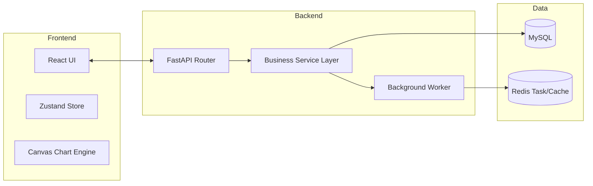

# 03 系統設計文件 (SDD) - SPC 系統架構與實體關聯 (詳細版)

## 1. 系統組件架構圖

---

## 2. 辭庫與業務實體關係 (ERD Concepts)

### 2.1 辭庫管理實體 (Master Data)
- **`products`**: 儲存產品料號、名稱。與 `quant_ccms` 1:N 關聯。
- **`stations`**: 儲存站台層級 (id, parent_id)。與 `quant_ccms` 1:N 關聯。
- **`spc_entities` & `spc_entity_groups`**: 實作層別標籤字典。
- **`ranks`**: 儲存等級判定閾值 (Value, Color)。

### 2.2 核心業務實體
- **`quant_ccms`**: 管制計畫主表。透過 JSON 欄位引用 `spc_entities`。
- **`quant_ccm_entity_samples`**: 樣本數據表。
    - **優化**: 對 `idx` 與 `quant_ccm_entity_id` 建立複合唯一索引。

---

## 3. 背景任務與任務狀態機
### 3.1 Redis 任務狀態定義
所有長耗時分析任務（如層化分析、批量匯入）均透過 Redis 管理：
- **Key**: `task:{type}:{id}`
- **Status**: `pending` -> `processing` -> `completed` | `failed`
- **TTL**: 任務完成後保留 3600 秒供前端輪詢。

---

## 4. 安全性與租戶隔離
- **Middleware**: 在 FastAPI 層實作 `TenantMiddleware`。
- **隔離邏輯**: 透過 SQLAlchemy `before_compile` 攔截器，自動為所有查詢語句掛載 `WHERE tenant_id = :tenant_id`。
- **稽核日誌 (Audit Trail)**: 建立單獨的 `audit_logs` 表，記錄辭庫（如等級基準、檢驗標準）的每一次異動。
