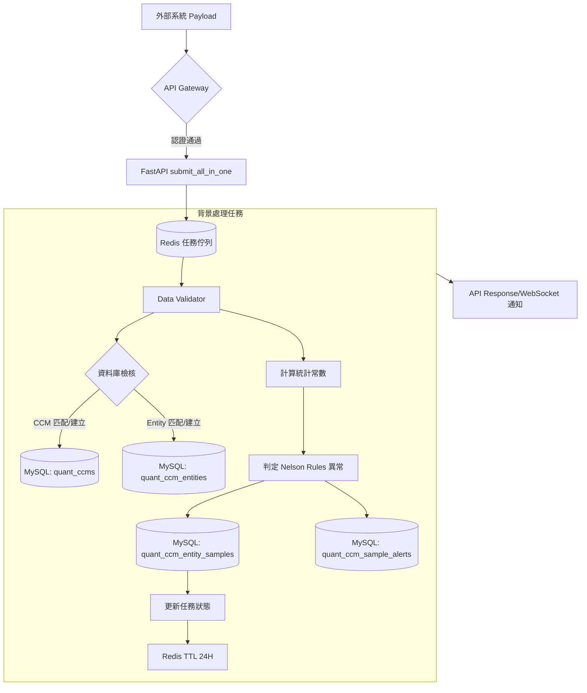

# 06 資料流程圖 (DFD)

> 本圖描述資料從外部系統進入 SPC 系統後的流動過程與核心處理邏輯。

## 1. 資料處理流程圖 (Mermaid)

## 2. 核心處理節點說明

### 2.1 接收層 (API Layer)
- **submit_all_in_one**: 系統主要接收端點。接受大批量資料 JSON 並將其非同步放入 Redis 佇列，避免 API 阻塞。

### 2.2 背景處理 (Worker Layer)
- **Data Validator**: 負責根據 JSON Schema 檢核資料格式。
- **資料庫檢核 (Upsert 邏輯)**: 系統會根據 `part_number`, `batch_number`, `characteristic_name` 自動判斷是否已存在計畫與項目。若無則自動建立，確保資料錄入之完整性。

### 2.3 計算與判定 (Logic Layer)
- **統計常數計算**: 系統自動根據樣本數選擇對應的常數（d2, c4 等）進行 $\sigma$ (Sigma) 計算。
- **Nelson Rules 判定**: 即時對新存入的數據點進行 1-8 號規則檢核。
- **警報觸發 (Alerting)**: 凡判定異常者，即時存入警報表，並視設定發送通知（如 Line/Teams）。

### 2.4 緩存管理 (Cache)
- **Redis TTL**: 非同步任務狀態僅保留 24 小時，過期自動清除。
