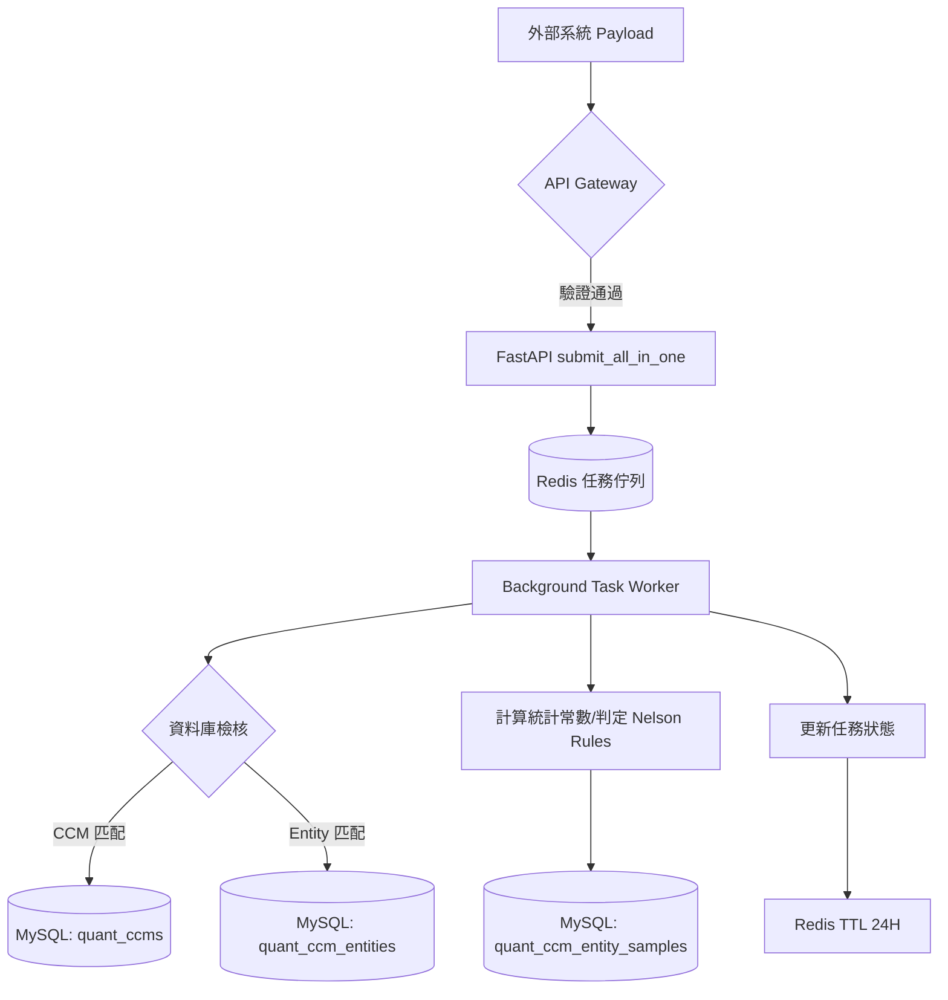

# 06 資料流程圖 (DFD)

本圖描述資料從外部系統進入 SPC 系統後的流動過程。

```mermaid
graph TD
    A[外部系統 Payload] --> B{API Gateway}
    B -->|驗證通過| C[FastAPI submit_all_in_one]
    C --> D[(Redis 任務佇列)]
    D --> E[Background Task Worker]
    E --> F{資料庫檢核}
    F -->|CCM 匹配| G[(MySQL: quant_ccms)]
    F -->|Entity 匹配| H[(MySQL: quant_ccm_entities)]
    E --> I[計算統計常數/判定 Nelson Rules]
    I --> J[(MySQL: quant_ccm_entity_samples)]
    E --> K[更新任務狀態]
    K --> L[Redis TTL 24H]
```
