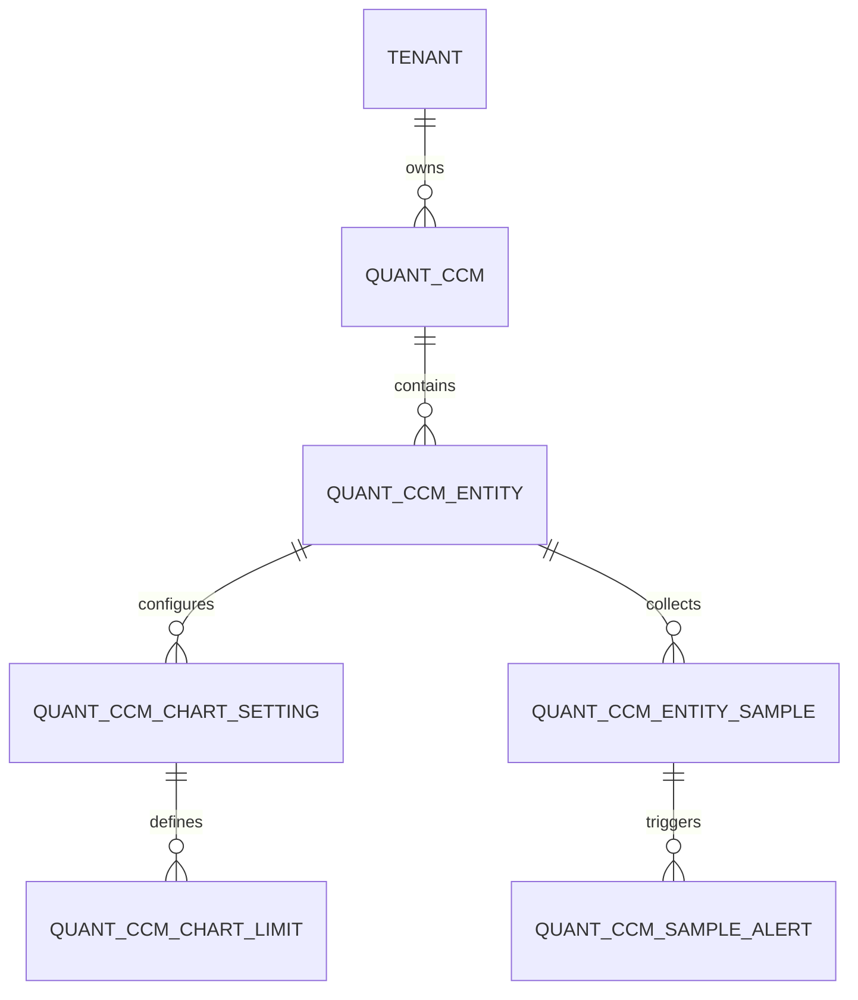

# 07 實體關係圖 (ERD)

描述資料庫核心資料表的關聯。

```mermaid
erDiagram
    TENANT ||--o{ QUANT_CCM : owns
    QUANT_CCM ||--o{ QUANT_CCM_ENTITY : contains
    QUANT_CCM_ENTITY ||--o{ QUANT_CCM_CHART_SETTING : configures
    QUANT_CCM_ENTITY ||--o{ QUANT_CCM_ENTITY_SAMPLE : collects
    QUANT_CCM_CHART_SETTING ||--o{ QUANT_CCM_CHART_LIMIT : defines
    QUANT_CCM_ENTITY_SAMPLE ||--o{ QUANT_CCM_SAMPLE_ALERT : triggers
```

## 核心關聯說明
- **QUANT_CCM**：定義計畫主體（料號 + 批號）。
- **QUANT_CCM_ENTITY**：定義計畫下之管制項目（鎳、厚度等）。
- **QUANT_CCM_ENTITY_SAMPLE**：儲存實際測量值（CSV 格式儲存於 TEXT 欄位）。
