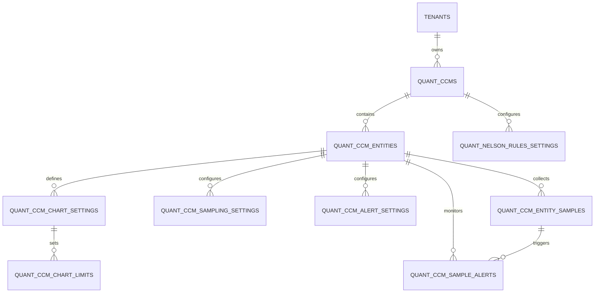

# 07 實體關係圖 (ERD)

> 本圖描述 SPC 系統資料庫中，各實體 (Entities) 之間的關聯架構。

## 1. ERD 關聯圖 (Mermaid)

## 2. 核心實體說明

### 2.1 定量計畫層級 (CCM Level)
- **QUANT_CCMS**: 計畫主體。由「料號 + 批號 + 名稱」定義一個管制計畫。
- **QUANT_NELSON_RULES_SETTINGS**: 計畫等級的檢核規則（Nelson Rules）。

### 2.2 定量項目層級 (Entity Level)
- **QUANT_CCM_ENTITIES**: 特定計畫下的量測項目（如：鎳厚度）。
- **QUANT_CCM_CHART_SETTINGS**: 定義此項目的管制圖類型（X-bar R 等）。
- **QUANT_CCM_CHART_LIMITS**: 儲存計算後的 UCL/LSL/CL 或手動設定的界限值。

### 2.3 數據與警報 (Data & Alert Level)
- **QUANT_CCM_ENTITY_SAMPLES**: 實際收集的量測數據（複數樣本儲存於 samples 欄位）。
- **QUANT_CCM_SAMPLE_ALERTS**: 系統判定異常後的紀錄，連結至具體的樣本 (Sample ID) 與項目 (Entity ID)。

## 3. 外鍵關聯索引 (Foreign Keys)

| 從資料表 (From) | 欄位 (FK) | 至資料表 (To) | 備註 |
| :--- | :--- | :--- | :--- |
| `quant_ccms` | `tenant_id` | `tenants.id` | 租戶歸屬 |
| `quant_ccm_entities` | `quant_ccm_id` | `quant_ccms.id` | 關聯至主計畫 |
| `quant_nelson_rules_settings` | `quant_ccm_id` | `quant_ccms.id` | 計畫規則設定 |
| `quant_ccm_chart_settings` | `quant_ccm_entity_id` | `quant_ccm_entities.id` | 項目圖表配置 |
| `quant_ccm_entity_samples` | `quant_ccm_entity_id` | `quant_ccm_entities.id` | 樣本歸屬 |
| `quant_ccm_sample_alerts` | `quant_ccm_entity_id` | `quant_ccm_entities.id` | 警報項目歸屬 |
| `quant_ccm_sample_alerts` | `quant_ccm_entity_sample_id` | `quant_ccm_entity_samples.id` | 異常樣本來源 |
