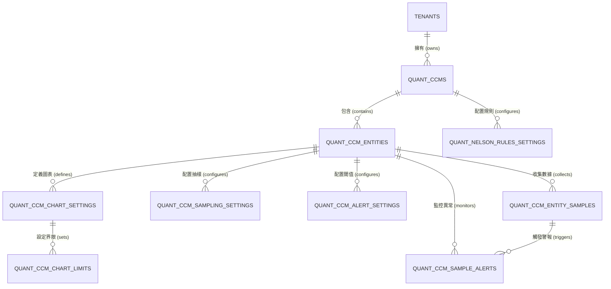

# 07 實體關係圖 (ERD)

> 本文件描述 SPC 系統資料庫中，各實體 (Entities) 之間的關聯架構與業務邏輯。

## 1. ERD 實體名稱對照表 (中英對照)

為了方便理解系統架構，下表列出資料庫表名與其對應的中文業務名稱：

| 英文 Table 名稱 | 中文業務名稱 | 說明 |
| :--- | :--- | :--- |
| **TENANTS** | **租戶/公司主檔** | 系統頂層結構，區分不同客戶的獨立資料空間。 |
| **QUANT_CCMS** | **定量管制計畫主表** | 定義一個計畫的基礎資訊（如：料號、批號、工站）。 |
| **QUANT_CCM_ENTITIES** | **管制項目設定表** | 每個計畫下的具體檢測項目（如：鎳厚度、拉力值）。 |
| **QUANT_NELSON_RULES_SETTINGS** | **Nelson Rules 設定表** | 針對特定計畫啟用的異常判定規則 (Rule 1-8)。 |
| **QUANT_CCM_CHART_SETTINGS** | **管制圖配置表** | 定義項目使用的管制圖類型（X-bar R 等）與子組大小。 |
| **QUANT_CCM_CHART_LIMITS** | **管制界限/規格表** | 儲存計算出的 UCL/LSL 管制界限與 USL/LSL 規格界限。 |
| **QUANT_CCM_ENTITY_SAMPLES** | **樣本量測數據表** | 實際收集到的數據點，與項目關聯。 |
| **QUANT_CCM_SAMPLE_ALERTS** | **異常警報紀錄表** | 當數據違反規則或超出界限時，產生的警報紀錄。 |

## 2. ERD 關聯圖 (Mermaid)

## 3. 核心關聯邏輯說明

### 3.1 階層式架構 (Hierarchy)
- **公司 > 計畫 > 項目**：
    - 一個**租戶 (Tenant)** 可以擁有多個**計畫 (CCM)**。
    - 一個**計畫 (CCM)** 可以包含多個**項目 (Entity)**。
    - *業務範例：某客戶的一個「PCB 生產計畫」下，同時檢測「鍍銅厚度」與「蝕刻線寬」兩個項目。*

### 3.2 配置與規則 (Configuration)
- **Nelson Rules**: 規則是綁定在**計畫**層級的。一旦設定，該計畫下的所有項目都會套用同一套判定邏輯。
- **管制圖設定**: 則是綁定在**項目**層級。鍍銅厚度可能用 X-bar R 圖，而蝕刻線寬可能用 X-bar S 圖。

### 3.3 數據流轉與警報 (Data Flow)
- 當一筆**樣本數據 (Sample)** 被存入時，系統會去比對**管制圖設定**與 **Nelson Rules**。
- 若判定異常，會同時在**異常警報表 (Alerts)** 產生紀錄，該紀錄會同時標註是哪個「樣本」在「哪個項目」中發生了什麼樣的「規則違反」。

## 4. 外鍵關聯索引 (Foreign Keys)

| 從資料表 (From) | 欄位 (FK) | 至資料表 (To) | 關聯意義 |
| :--- | :--- | :--- | :--- |
| `quant_ccms` | `tenant_id` | `tenants.id` | 識別此計畫屬於哪家公司。 |
| `quant_ccm_entities` | `quant_ccm_id` | `quant_ccms.id` | 識別此檢測項目屬於哪個計畫。 |
| `quant_nelson_rules_settings` | `quant_ccm_id` | `quant_ccms.id` | 讀取該計畫啟用的 Nelson Rules。 |
| `quant_ccm_chart_settings` | `quant_ccm_entity_id` | `quant_ccm_entities.id` | 讀取該項目的管制圖配置（如 n=5）。 |
| `quant_ccm_entity_samples` | `quant_ccm_entity_id` | `quant_ccm_entities.id` | 樣本數據歸屬於哪個項目。 |
| `quant_ccm_sample_alerts` | `quant_ccm_entity_sample_id` | `quant_ccm_entity_samples.id` | 標示警報是由哪一筆數據觸發的。 |
