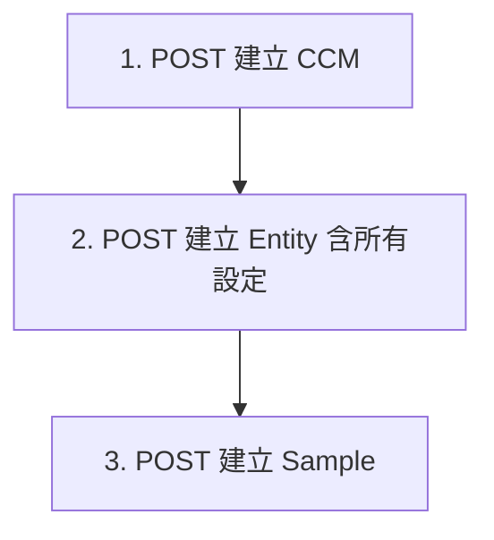

# 08 API 規格文件 (API Specification)

本文件定義 SPC 系統中關於「定量資料匯入與維護」相關接口的通訊協議、調用流程與實作範例。

---

# 第一部分：API 目錄 (API Index)

本章節列出所有 Quantitative 定量管制 API 資源的清單，幫助您快速了解系統提供了哪些功能。

## 1.1 資源列表（共 12 項）

| 順序 | Resource（資源）| 檔案 | 功能說明 |
| :--- | :--- | :--- | :--- |
| 1 | **Control Plans 管制計畫** | ccm.py | 建立、管理 SPC 檔案，包含名稱、料號、批號、層別資訊 |
| 2 | **Entities 管制項目** | entities.py | 定義管制項目（如厚度、長度），附帶所有相關設定 |
| 3 | **Chart Settings 管制圖設定** | chart_settings.py | 管制圖類型（X̄-R、X̄-S、X̄-MR）、UCL/LCL/CL 界限 |
| 4 | **Sampling Settings 抽樣設定** | sampling_settings.py | 樣本數、精度（小數位數）、抽樣頻率、方法 |
| 5 | **Alert Settings 警示設定** | alert_settings.py | 警示值、管理值、Cpk 臨界值設定 |
| 6 | **Samples 抽樣資料** | samples.py | 樣本 CRUD + 批量匯入 |
| 7 | **Sample Alerts 樣本警報紀錄** | sample_alerts.py | 查詢已觸發的警報（Nelson Rules、界限超標） |
| 8 | **Nelson Rules Settings 尼爾森法則設定** | nelson_rules.py | 8 種法則啟閉與參數配置 |
| 9 | **Samples Subset 抽樣資料子集** | samples_subset.py | 彈性篩選查詢（進階篩選） |
| 10 | **All-in-One 批量匯入** | all_in_one.py | 自動化一鍵匯入（Method 2） |
| 11 | **Export 匯出** | export.py | Excel 匯出功能 |

## 1.2 資源層級說明

```
Quantitative CCM（管制計畫）
├── QuantitativeCCMEntity（管制項目）
│   ├── QuantitativeCCMChartSetting（管制圖設定）
│   │   └── QuantitativeCCMChartLimit（管制界限）
│   ├── QuantitativeCCMSamplingSetting（抽樣設定）
│   ├── QuantitativeCCMAlertSetting（警示設定）
│   └── QuantitativeCCMEntitySample（樣本資料）
│       └── QuantitativeCCMSampleAlert（樣本警報）
└── QuantNelsonRulesSetting（尼爾森法則）
```

## 1.3 批量匯入方式說明

本系統提供兩種批量匯入方式：

| 方式 | 說明 | 适用場景 |
| :--- | :--- | :--- |
| **Method 1: 逐步建立** | 透過 API 按順序建立 CCM → Entity → Settings → Samples | 需要細部控制、前端介面建立 |
| **Method 2: All-in-One** | 自動化一鍵匯入，系統自動建立所有資源 | 大量資料一次性匯入 |

---

# 第二部分：API 詳細規格

本章節說明每隻 API 的呼叫方式，包含 Method、Path、Request、Response 範例。

> **Base Path**: `/private/ccm/quantitative`

## 2.1 Control Plans 管制計畫

建立、管理 SPC 檔案（CCM）。

### 1. 取得 CCM 清單

- **Method**: `GET`
- **Path**: `/`
- **Query Parameters**:
  - `offset`: 分頁偏移（預設 0）
  - `limit`: 每頁數量（預設 10，最大 100）
  - `order`: 排序方式 `asc` 或 `desc`（預設 desc）

**Response**:
```json
[
  {
    "id": "ccm-uuid",
    "name": "A線_厚度",
    "part_number": "PN-001",
    "batch_number": "BN-2026",
    "source": "manual",
    "created_at": "2026-04-14T10:00:00"
  }
]
```

### 2. 取得單一 CCM

- **Method**: `GET`
- **Path**: `/{ccm_id}`

**Response**:
```json
{
  "id": "ccm-uuid",
  "name": "A線_厚度",
  "part_number": "PN-001",
  "batch_number": "BN-2026",
  "source": "manual",
  "spec": "10.0±0.5",
  "station": "Station-A",
  "category_information": { "線別": "A線", "班別": "早班" },
  "chatroom_ids": ["chatroom-uuid"],
  "created_at": "2026-04-14T10:00:00",
  "entities": []
}
```

### 3. 建立 CCM

- **Method**: `POST`
- **Path**: `/`

**Request**:
```json
{
  "source": "manual",
  "name": "A線_厚度",
  "part_number": "PN-001",
  "batch_number": "BN-2026",
  "spec": "10.0±0.5",
  "station": "Station-A",
  "category_information": { "線別": "A線", "班別": "早班" }
}
```

### 4. 更新 CCM

- **Method**: `PUT`
- **Path**: `/{ccm_id}`

**Request**:
```json
{
  "name": "A線_厚度_新版",
  "part_number": "PN-001-v2"
}
```

### 5. 刪除 CCM

- **Method**: `DELETE`
- **Path**: `/{ccm_id}`
- **注意**: 硬刪除，會一併移除所有設定與歷史樣本

---

## 2.2 Entities 管制項目

定義管制項目（如厚度、長度）並附帶所有相關設定。

### 1. 取得 Entity 清單

- **Method**: `GET`
- **Path**: `/{ccm_id}/entities`

### 2. 建立 Entity（含所有設定）

- **Method**: `POST`
- **Path**: `/{ccm_id}/entities/with-settings`
- **說明**: 一次建立 Entity + Chart Settings + Sampling Settings + Alert Settings

**Request**:
```json
{
  "characteristic_name": "鎳層厚度",
  "measurement_unit": "μm",
  "manufacturing_information": {},
  "chart_settings": [
    {
      "chart_type": "x_bar_r",
      "subgroup_size": 5,
      "limits": [
        { "entity_name": "x_bar", "ucl": 10.5, "lcl": 9.5, "cl": 10.0 },
        { "entity_name": "range", "ucl": 1.5, "lcl": 0, "cl": 0.5 }
      ]
    }
  ],
  "sampling_settings": [
    { "num_of_samples": 5, "num_of_digits": 2, "frequency": "每2小時", "sampling_method": "隨機抽樣" }
  ],
  "alert_settings": [
    { "cpk_lower_limit": 1.33, "alert_upper_limit": 10.8, "alert_lower_limit": 9.2 }
  ]
}
```

### 3. 取得 Entity

- **Method**: `GET`
- **Path**: `/{ccm_id}/entities/{entity_id}`

### 4. 更新 Entity

- **Method**: `PUT`
- **Path**: `/{ccm_id}/entities/{entity_id}`

**Request**:
```json
{
  "characteristic_name": "鎳層厚度_新版",
  "measurement_unit": "mm"
}
```

### 5. 刪除 Entity

- **Method**: `DELETE`
- **Path**: `/{ccm_id}/entities/{entity_id}`

### 6. 重新排序 Entities

- **Method**: `PUT`
- **Path**: `/{ccm_id}/entities/reorder`

**Request**:
```json
{
  "entity_ids": ["entity-id-1", "entity-id-2", "entity-id-3"]
}
```

---

## 2.3 Chart Settings 管制圖設定

設定管制圖類型與 UCL/LCL/CL 界限。

### 1. 取得 Chart Settings

- **Method**: `GET`
- **Path**: `/{ccm_id}/entities/{entity_id}/chart-settings`

### 2. 建立 Chart Setting

- **Method**: `POST`
- **Path**: `/{ccm_id}/entities/{entity_id}/chart-settings`

**Request**:
```json
{
  "chart_type": "x_bar_r",
  "subgroup_size": 5
}
```

> **chart_type 說明**:
> - `x_bar_mr`: X̄-MR 圖（n=1，均值-移動全距圖）
> - `x_bar_r`: X̄-R 圖（2≤n≤10，均值-全距圖）
> - `x_bar_s`: X̄-S 圖（n>10，均值-標準差圖）

### 3. 更新 Chart Setting

- **Method**: `PUT`
- **Path**: `/{ccm_id}/entities/{entity_id}/chart-settings/{setting_id}`

### 4. 刪除 Chart Setting

- **Method**: `DELETE`
- **Path**: `/{ccm_id}/entities/{entity_id}/chart-settings/{setting_id}`

### 5. 建立 Chart Limit

- **Method**: `POST`
- **Path**: `/{ccm_id}/entities/{entity_id}/chart-settings/{setting_id}/limits`

**Request**:
```json
{
  "entity_name": "x_bar",
  "ucl": 10.5,
  "lcl": 9.5,
  "cl": 10.0,
  "ucl_management": 10.3,
  "lcl_management": 9.7,
  "cl_management": 10.0,
  "ucl_alarm": 10.8,
  "lcl_alarm": 9.2,
  "cl_alarm": 10.0
}
```

> **entity_name 說明**:
> - `x_bar`: 均值圖界限
> - `range`: 全距圖界限（x_bar_r 使用）
> - `std_dev`: 標準差圖界限（x_bar_s 使用）
> - `moving_range`: 移動全距圖界限（x_bar_mr 使用）

### 6. 更新 Chart Limit

- **Method**: `PUT`
- **Path**: `/{ccm_id}/entities/{entity_id}/chart-settings/{setting_id}/limits/{limit_id}`

### 7. 刪除 Chart Limit

- **Method**: `DELETE`
- **Path**: `/{ccm_id}/entities/{entity_id}/chart-settings/{setting_id}/limits/{limit_id}`

---

## 2.4 Sampling Settings 抽樣設定

設定樣本數、精度（小數位數）、抽樣頻率、方法。

### 1. 取得 Sampling Settings

- **Method**: `GET`
- **Path**: `/{ccm_id}/entities/{entity_id}/sampling-settings`

### 2. 建立 Sampling Setting

- **Method**: `POST`
- **Path**: `/{ccm_id}/entities/{entity_id}/sampling-settings`

**Request**:
```json
{
  "num_of_samples": 5,
  "num_of_digits": 2,
  "frequency": "每2小時",
  "sampling_method": "隨機抽樣"
}
```

> **欄位說明**:
> - `num_of_samples`: 子組大小（樣本數 n）
> - `num_of_digits`: 小數位數精度
> - `frequency`: 抽樣頻率
> - `sampling_method`: 抽樣方法

### 3. 更新 Sampling Setting

- **Method**: `PUT`
- **Path**: `/{ccm_id}/entities/{entity_id}/sampling-settings/{setting_id}`

### 4. 刪除 Sampling Setting

- **Method**: `DELETE`
- **Path**: `/{ccm_id}/entities/{entity_id}/sampling-settings/{setting_id}`

---

## 2.5 Alert Settings 警示設定

設定警示值、管理值、Cpk 臨界值。

### 1. 取得 Alert Settings

- **Method**: `GET`
- **Path**: `/{ccm_id}/entities/{entity_id}/alert-settings`

### 2. 建立 Alert Setting

- **Method**: `POST`
- **Path**: `/{ccm_id}/entities/{entity_id}/alert-settings`

**Request**:
```json
{
  "ca_upper_limit": 10.0,
  "cp_upper_limit": 2.0,
  "cpk_lower_limit": 1.33,
  "alert_upper_limit": 10.8,
  "alert_lower_limit": 9.2
}
```

### 3. 更新 Alert Setting

- **Method**: `PUT`
- **Path**: `/{ccm_id}/entities/{entity_id}/alert-settings/{setting_id}`

### 4. 刪除 Alert Setting

- **Method**: `DELETE`
- **Path**: `/{ccm_id}/entities/{entity_id}/alert-settings/{setting_id}`

---

## 2.6 Samples 抽樣資料

管理樣本資料。

### 1. 取得 Samples

- **Method**: `GET`
- **Path**: `/{ccm_id}/entities/{entity_id}/samples`
- **Query Parameters**:
  - `offset`: 分頁偏移
  - `limit`: 每頁數量（最大 100）
  - `order`: 排序方式 `asc` 或 `desc`
  - `start_date`: 起始日期篩選（YYYY-MM-DD）
  - `end_date`: 結束日期篩選（YYYY-MM-DD）

**Response**:
```json
[
  {
    "id": "sample-uuid",
    "idx": 0,
    "samples": [9.85, 9.84, 9.86, 9.83, 9.85],
    "mean_value": 9.846,
    "range_value": 0.03,
    "operator_name": "張小明",
    "category_information": { "線別": "A線" },
    "created_at": "2026-04-14T10:00:00"
  }
]
```

### 2. 建立單一 Sample

- **Method**: `POST`
- **Path**: `/{ccm_id}/entities/{entity_id}/samples`

**Request**:
```json
{
  "samples": [9.85, 9.84, 9.86, 9.83, 9.85],
  "operator_name": "張小明",
  "category_information": { "線別": "A線" }
}
```

> **注意**: 建立 Sample 前必須先設定 Sampling Setting

### 3. 批量建立 Samples

- **Method**: `POST`
- **Path**: `/{ccm_id}/entities/{entity_id}/samples/bulk`

**Request**:
```json
{
  "samples": [
    { "samples": [9.85, 9.84, 9.86, 9.83, 9.85], "operator_name": "張小明" },
    { "samples": [9.87, 9.85, 9.88, 9.84, 9.86], "operator_name": "李小華" }
  ]
}
```

### 4. 更新 Sample

- **Method**: `PUT`
- **Path**: `/{ccm_id}/entities/{entity_id}/samples/{sample_id}`

**Request**:
```json
{
  "samples": [9.91, 9.92, 9.90, 9.93, 9.91],
  "operator_name": "王小美"
}
```

### 5. 刪除 Sample

- **Method**: `DELETE`
- **Path**: `/{ccm_id}/entities/{entity_id}/samples/{sample_id}`

---

## 2.7 Nelson Rules Settings 尼爾森法則

設定 8 種 Nelson Rules（尼爾森法則）。

### 1. 取得 Nelson Rules

- **Method**: `GET`
- **Path**: `/{ccm_id}/nelson-rules`

### 2. 建立 Nelson Rules

- **Method**: `POST`
- **Path**: `/{ccm_id}/nelson-rules`

**Request**:
```json
{
  "nelson_rules_1": "N(1)",
  "nelson_rules_2": "N(9):S(both)",
  "nelson_rules_3": "N(6):S(both)"
}
```

> **格式說明**: `N(x):S(y)` 或 `M(x)/N(y):S(y)`
> - `N`: 連續點數
> - `M`: 點数閾值
> - `S`: 方向 `both`、`upper`、`lower`

### 3. 取得單一 Nelson Rule

- **Method**: `GET`
- **Path**: `/{ccm_id}/nelson-rules/{setting_id}`

### 4. 更新 Nelson Rules

- **Method**: `PUT`
- **Path**: `/{ccm_id}/nelson-rules/{setting_id}`

### 5. 刪除 Nelson Rules

- **Method**: `DELETE`
- **Path**: `/{ccm_id}/nelson-rules/{setting_id}`

---

## 2.8 Sample Alerts 樣本警報紀錄

查詢已觸發的警報。

### 1. 取得 Sample Alerts

- **Method**: `GET`
- **Path**: `/{ccm_id}/entities/{entity_id}/sample-alerts`
- **Query Parameters**:
  - `alert_type`: 篩選類型 `nelson_rule` 或 `alarm_limit`

### 2. 取得 Sample Alerts 數量

- **Method**: `GET`
- **Path**: `/{ccm_id}/entities/{entity_id}/sample-alerts/count`

---

## 2.9 All-in-One 批量匯入（Method 2）

自動化一鍵匯入，系統自動建立所有資源。

### 1. 提交匯入任務

- **Method**: `POST`
- **Path**: `/all-in-one`
- **Response**: `202 Accepted`

**Request**:
```json
{
  "items": [
    {
      "characteristic_name": "鎳層厚度",
      "part_number": "PN-001",
      "batch_number": "BN-2026",
      "category_information": [
        { "key": "線別", "value": "A線", "naming": true, "order": 1 }
      ],
      "samples": ["9.85", "9.84", "9.86", "9.83", "9.85"]
    }
  ]
}
```

**Response**:
```json
{ "task_id": "uuid-string" }
```

### 2. 查詢任務狀態

- **Method**: `GET`
- **Path**: `/all-in-one/{task_id}`

**Response**:
```json
{
  "task_id": "...",
  "status": "completed",
  "total": 1,
  "processed": 1,
  "errors": [],
  "created_ccm_ids": ["ccm-uuid"],
  "created_entity_ids": ["entity-uuid"]
}
```

### 任務狀態說明

| 狀態 | 說明 |
| :--- | :--- |
| `pending` | 任務等待處理 |
| `processing` | 處理中 |
| `completed` | 處理成功 |
| `failed` | 處理失敗 |

---

## 2.10 Export 匯出

將 CCM 資料匯出為 Excel。

### 1. 匯出 CCM（含所有 Entity）

- **Method**: `GET`
- **Path**: `/{ccm_id}/export`
- **Query Parameters**:
  - `category_filters`: JSON 格式的層別篩選條件

**Response**: `application/vnd.openxmlformats-officedocument.spreadsheetml.sheet`

### 2. 匯出單一 Entity

- **Method**: `GET`
- **Path**: `/{ccm_id}/entities/{entity_id}/export`

---

# 第三部分：調用情境指南

本章節說明常見業務情境的 API 呼叫流程。

## 3.1 情境 A：從零建立管制項目並匯入數據（Method 1 逐步建立）

**場景**: 需要細部控制，前端介面逐步建立。

### API 呼叫流程



### 詳細步驟

| 順序 | API | 說明 |
| :--- | :--- | :--- |
| 1 | `POST /` | 建立 CCM（管制計畫） |
| 2 | `POST /{ccm_id}/entities/with-settings` | 一次建立 Entity + Chart Setting + Sampling Setting + Alert Setting |
| 3 | `POST /{ccm_id}/entities/{entity_id}/samples` 或 `/samples/bulk` | 建立樣本資料 |

### 範例請求

**Step 1: 建立 CCM**
```json
POST /private/ccm/quantitative/
{
  "source": "manual",
  "name": "A線_厚度",
  "part_number": "PN-001",
  "batch_number": "BN-2026",
  "category_information": { "線別": "A線" }
}
```

**Step 2: 建立 Entity 含所有設定**
```json
POST /private/ccm/quantitative/{ccm_id}/entities/with-settings
{
  "characteristic_name": "鎳層厚度",
  "measurement_unit": "μm",
  "chart_settings": [{
    "chart_type": "x_bar_r",
    "subgroup_size": 5,
    "limits": [
      { "entity_name": "x_bar", "ucl": 10.5, "lcl": 9.5, "cl": 10.0 },
      { "entity_name": "range", "ucl": 1.5, "lcl": 0, "cl": 0.5 }
    ]
  }],
  "sampling_settings": [{
    "num_of_samples": 5,
    "num_of_digits": 2,
    "frequency": "每2小時",
    "sampling_method": "隨機抽樣"
  }],
  "alert_settings": [{
    "cpk_lower_limit": 1.33,
    "alert_upper_limit": 10.8,
    "alert_lower_limit": 9.2
  }]
}
```

**Step 3: 建立 Samples**
```json
POST /private/ccm/quantitative/{ccm_id}/entities/{entity_id}/samples/bulk
{
  "samples": [
    { "samples": ["9.85", "9.84", "9.86", "9.83", "9.85"], "operator_name": "張小明" },
    { "samples": ["9.87", "9.85", "9.88", "9.84", "9.86"], "operator_name": "李小華" }
  ]
}
```

---

## 3.2 情境 B：從零建立管制項目並匯入數據（Method 2 All-in-One）

**場景**: 大量資料一次性匯入，前端不需要顯示建立過程。

### API 呼叫流程

| 順序 | API | 說明 |
| :--- | :--- | :--- |
| 1 | `POST /all-in-one` | 提交匯入任務 |
| 2 | `GET /all-in-one/{task_id}` | 輪詢任務狀態 |

### 範例請求

```json
POST /private/ccm/quantitative/all-in-one
{
  "items": [
    {
      "characteristic_name": "鎳層厚度",
      "part_number": "PN-001",
      "batch_number": "BN-2026",
      "category_information": [
        { "key": "線別", "value": "A線", "naming": true, "order": 1 }
      ],
      "samples": ["9.85", "9.84", "9.86", "9.83", "9.85"]
    }
  ]
}
```

**輪詢任務狀態**:
```json
GET /private/ccm/quantitative/all-in-one/{task_id}
// 持續輪詢直到 status 為 "completed" 或 "failed"
```

---

## 3.3 情境 C：修正量測值

**場景**: 發現某筆量測值輸入錯誤，需要修正。

### API 呼叫流程

| 順序 | API | 說明 |
| :--- | :--- | :--- |
| 1 | `GET /{ccm_id}/entities/{entity_id}/samples` | 查詢現有樣本，找到要修正的 sample_id |
| 2 | `PUT /{ccm_id}/entities/{entity_id}/samples/{sample_id}` | 修正樣本值 |

### 範例請求

```json
PUT /private/ccm/quantitative/{ccm_id}/entities/{entity_id}/samples/{sample_id}
{
  "samples": [9.91, 9.92, 9.90, 9.93, 9.91],
  "operator_name": "王小美"
}
```

> **注意**：修改 samples 後，系統會重新計算 mean_value、range_value 等統計值。
>
> **實務建議**：多數客戶採用「**刪除後重新匯入**」的方式，而非直接修改。
> - Step 1: `DELETE` 刪除錯誤的樣本
> - Step 2: `POST` 重新匯入正確的樣本

---

## 3.4 情境 D：樣本數異動（n 變更）

**場景**：抽樣頻率改變，樣本數從 n=5 改為 n=3。

### 處理方式

| 方式 | 說明 |
| :--- | :--- |
| **Method 1（逐步建立）** | 可直接匯入，系統不驗證 len(samples) 與 num_of_samples 是否一致 |
| **Method 2（All-in-One）** | 系統只驗證同一次 API 呼叫內的樣本數一致，**不同次匯入**可接受不同樣本數 |

### 說明

- **後端不驗證**：系統不會檢查傳入的 samples 數量是否與 `sampling_settings.num_of_samples` 一致
- **建議保持一致**：因為 `num_of_samples` 決定管制圖類型（X̄-R、X̄-S、X̄-MR）與 σ 估計方式，保持一致可確保圖表統計正確
- **Method 2 限制**：
  - 同一 characteristic_name **同一次 API 呼叫**內，樣本數要一致
  - **不同次匯入**（第1次、第2次分開呼叫）可以有不同的樣本數

### API 呼叫流程

**Method 1**：
| 順序 | API | 說明 |
| :--- | :--- | :--- |
| 1 | `POST /{entity_id}/samples` 或 `/samples/bulk` | 直接匯入（可改變 samples 數量） |
| 可選 | `PUT /{entity_id}/sampling-settings/{setting_id}` | 同步更新 num_of_samples 以保持一致 |

**Method 2**：
| 順序 | API | 說明 |
| :--- | :--- | :--- |
| 1 | `POST /all-in-one`（同一 characteristic_name） | 同一 characteristic_name 下樣本數要一致 |
| 2 | `POST /all-in-one`（不同 characteristic_name） | 可接受不同樣本數 |

---

## 3.5 情境 E：跨廠區複製

**場景**: A 廠的管制項目要複製到 B 廠。

### 處理方式

將「廠區」設為 `naming=true` 的層別資訊，即可自動產生不同的 CCM 名稱。

### 範例請求

**A 廠資料**:
```json
POST /private/ccm/quantitative/all-in-one
{
  "items": [
    {
      "characteristic_name": "厚度",
      "category_information": [
        { "key": "廠區", "value": "A廠", "naming": true, "order": 1 }
      ],
      "samples": ["9.85", "9.84"]
    }
  ]
}
// 系統會自動建立 CCM: "A廠"
```

**B 廠資料**:
```json
{
  "items": [
    {
      "characteristic_name": "厚度",
      "category_information": [
        { "key": "廠區", "value": "B廠", "naming": true, "order": 1 }
      ],
      "samples": ["9.88", "9.87"]
    }
  ]
}
// 系統會自動建立 CCM: "B廠"
```

> **結果**: 系統會自動建立「A廠_厚度」與「B廠_厚度」兩個不同的 CCM，資料自動分開管理。

---

## 3.6 情境 F：重新校驗後更新數據

**場景**: 儀器重新校驗後，需要更新歷史量測資料。

### 處理方式

| 方式 | 說明 |
| :--- | :--- |
| **方式一（建議）**: 建立新的 CCM | 將新量測資料匯入新的 CCM |
| **方式二**: 逐一更新 Sample | 使用 `PUT` 修正每筆資料 |

### API 呼叫流程（方式一）

| 順序 | API | 說明 |
| :--- | :--- | :--- |
| 1 | `POST /all-in-one` | 匯入新 CCM（新名稱如「A線_厚度_校驗後」） |
| 2 | `GET /all-in-one/{task_id}` | 確認匯入成功 |

---

# 附錄：認證與錯誤處理

## HTTP 狀態碼說明

| 狀態碼 | 說明 | 建議操作 |
| :--- | :--- | :--- |
| `200` | 成功 | 正常處理 |
| `201` | 建立成功 | 正常處理 |
| `204` | 刪除成功 | 無回傳內容 |
| `400` | 業務校驗失敗 | 修正 Payload 後重試 |
| `401` | 認證失效 | 重新獲取 Bearer Token |
| `404` | 資源不存在 | 確認 ID 與 TTL |
| `409` | 衝突（如重複資料） | 檢查資料唯一性 |
| `500` | 系統內部異常 | 記錄錯誤軌跡並回報 |

## 常見錯誤訊息

| 錯誤訊息 | 說明 |
| :--- | :--- |
| `CCM not found` | CCM ID 不存在或無權限 |
| `Entity not found` | Entity ID 不存在 |
| `Sample not found` | Sample ID 不存在 |
| `Sample size mismatch` | 樣本數與設定不符（需先建立 Sampling Setting） |
| `Duplicate chart type` | 同一 entity 已有相同 chart type 的設定 |
| `Cannot delete: referenced by other records` | 有其他資料關聯，無法刪除 |

---

# 修訂歷史

| 日期 | 版本 | 說明 |
| :--- | :--- | :--- |
| 2026-04-14 | 1.0 | 初始版本 |