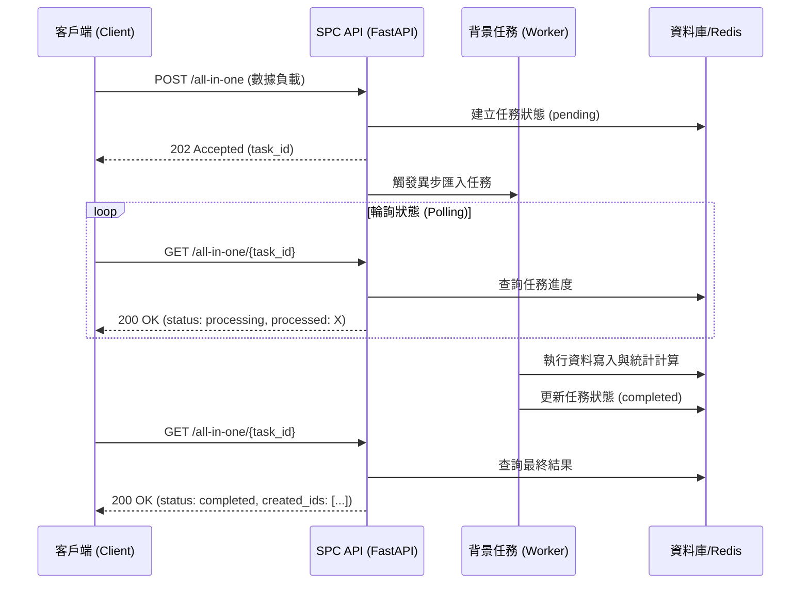

# 08 API 規格與用法說明

本文件說明 SPC 系統批量匯入接口 (`/all-in-one`) 的業務功能、異步處理機制與系統對接規範。

## 1. 業務價值 (Value Proposition)

`All-in-One` API 旨在提供一站式的數據對接與自動化配置，系統會依據資料自動完成以下操作：
- **計畫自動建立**：根據層別組合與命名規則，自動建立新的管制計畫。
- **辭庫自動建立**：自動維護層別資訊與管制項目字典。
- **統計參數自動設定**：依據樣本數 ($n$) 自動決定圖表類型，並依傳入精度決定顯示位數。
- **資料庫同步**：完成高精度量測數據的寫入與關聯。

---

## 2. 異步任務處理機制

為確保大量數據處理（每批次可達 10,000 筆）時的系統穩定性，批量匯入採 **異步任務 (Background Task)** 模式。

### 2.1 呼叫流程 (Polling Pattern)

系統採用非同步處理機制，調用方需遵循以下流程：



1. **提交請求 (Submit)**：客戶端發送數據，API 立即回傳 `task_id` (HTTP 202)。
2. **進度輪詢 (Polling)**：客戶端持 `task_id` 定期查詢進度。
3. **結果獲取**：當 `status` 為 `completed` 或 `failed` 時停止輪詢。

### 2.2 呼叫建議與限制
- **輪詢間隔**：建議每 **1 秒** 查詢一次。
- **超時機制**：若任務在 60 秒內未完成（輪詢 60 次），建議標註為匯入超時。
- **單次請求限制**：建議單次請求 **10,000 筆**（此為技術上限）。建議客戶端依業務量評估，若數據極大可分多批次異步提交。
- **保存期限 (TTL)**：任務狀態在 Redis 中僅保留 **3,600 秒 (1 小時)**。超過此時間查詢將回傳 `404 Not Found`。
- **事務一致性**：匯入以「計畫 (CCM Group)」為單位。若單一計畫內資料有誤，該計畫的所有異動（包含下屬項目與樣本）將會回滾 (Rollback)，不影響其他成功計畫。

---

## 3. 數據維護與變更管理 (Data Maintenance)

當匯入錯誤或需要調整現有數據時，可使用以下維護接口。請注意，所有刪除操作均為 **硬刪除 (Hard Delete)**，一旦執行將無法從系統回收站找回。

### 3.1 樣本資料維護 (Sample Level)
- **[PUT]** `/private/ccm/quantitative/{ccm_id}/entities/{entity_id}/samples/{sample_id}`
    - **用途**：修正已匯入的量測值或操作員名稱。
- **[DELETE]** `/private/ccm/quantitative/{ccm_id}/entities/{entity_id}/samples/{sample_id}`
    - **用途**：移除錯誤的單一樣本點。

### 3.2 計畫與配置維護 (CCM Level)
- **[PUT]** `/private/ccm/quantitative/{ccm_id}`
    - **用途**：更新計畫名稱、料號、批號或層級資訊。
- **[DELETE]** `/private/ccm/quantitative/{ccm_id}`
    - **用途**：刪除整個管制計畫及其下屬所有項目與歷史樣本。

---

## 4. 認證與安全規範

所有 API 調用均需在 Header 中提供有效的 Bearer Token：
```http
Authorization: Bearer <YOUR_ACCESS_TOKEN>
```
*註：系統會將 Token 轉發至內部認證服務進行權限校驗。*

---

## 5. 錯誤處理指引

| 狀態碼 | 錯誤原因說明 | 建議操作 |
| :--- | :--- | :--- |
| `400` | 業務邏輯校驗失敗 (如: 樣本數不一致、order 重複) | 檢查回應中的 `detail` 訊息，修正資料後重新提交。 |
| `401` | Token 無效或已過期 | 重新進行認證以獲取新的 Access Token。 |
| `404` | 任務 ID 不存在或已過期 | 確認 `task_id` 正確性，或檢查是否超過 1 小時 TTL。 |
| `429` | 觸發流量頻率限制 | 採用指數退避 (Exponential Backoff) 延遲重試。 |
| `500` | 系統內部處理異常 | 記錄錯誤軌跡並聯繫 SPC 技術支援團隊。 |

---

## 6. 系統狀態定義 (Task Status)

| 狀態 | 說明 |
| :--- | :--- |
| `pending` | 任務已提交，於隊列中等待分配。 |
| `processing` | 任務處理中。可參考 `processed` 欄位掌握進度。 |
| `completed` | 全數處理成功，已寫入資料庫。 |
| `failed` | 處理失敗。請檢視 `errors` 列表獲取具體失敗原因。 |
