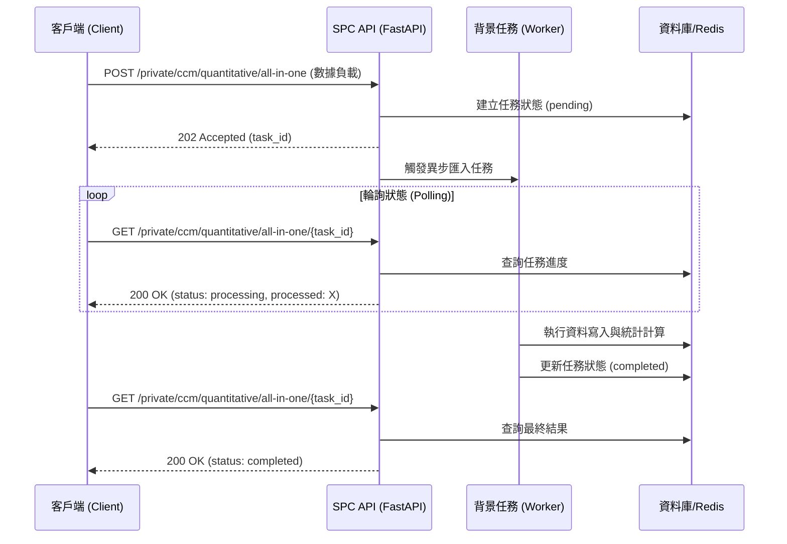

# 08 API 規格文件 (API Specification)

本文件定義 SPC 系統中關於「定量資料匯入與維護」相關接口的通訊協議、調用流程與實作範例。

## 1. 功能簡介 (Functional Overview)

本套件 API 提供自動化數據對接與資料生命週期維護能力：
- **批量匯入 (Bulk Import)**：透過 All-in-One 接口快速建立計畫、辭庫並寫入數據。
- **異步追蹤 (Async Tracking)**：處理大規模數據時的進度監控。
- **數據修正 (Data Correction)**：針對已建立的計畫配置或樣本值進行調整。

---

## 2. 批量匯入業務流 (Import Workflow)

### 2.1 異步處理機制 (Mechanism)

批量匯入採非同步處理，調用方需遵循以下流程：



### 2.2 接口調用規範

#### [POST] 提交匯入任務
- **路徑**: `/private/ccm/quantitative/all-in-one`
- **範例 JSON**:
  ```json
  {
    "items": [
      {
        "characteristic_name": "鎳層厚度",
        "category_information": [
          { "key": "線別", "value": "A線", "naming": true, "order": 1 }
        ],
        "samples": ["9.85", "9.84"]
      }
    ]
  }
  ```
- **回傳範例 (202 Accepted)**:
  ```json
  { "task_id": "uuid-string" }
  ```
- **詳細欄位規範**: 請參閱 **[09 節 1.1](./09_JSON_格式規範.md#11-單一項目-allinonepayload)**。

#### [GET] 查詢任務狀態
- **路徑**: `/private/ccm/quantitative/all-in-one/{task_id}`
- **功能**: 獲取目前處理進度。
- **回傳範例 (200 OK)**:
  ```json
  {
    "task_id": "...",
    "status": "completed",
    "total": 1,
    "processed": 1,
    "errors": [],
    "created_ccm_ids": ["ccm-uuid"],
    "created_entity_ids": ["entity-uuid"]
  }
  ```
- **詳細規範**: 請參閱 **[09 節 1.3](./09_JSON_格式規範.md#13-任務執行結果-taskstatusresult)**。
- **建議頻率**: 每 1,000ms 輪詢一次。

---

## 3. 系統自動化處理邏輯 (Processing Logic)

系統在處理批量匯入時，會依據傳入數據自動執行以下邏輯：

### 3.1 樣本精度自動推斷 (Precision Inference)
系統會分析 `samples` 傳入的字串格式：
1. 去除右側無效零位。
2. 計算各樣本小數位數。
3. 取整組樣本的 **最大值** 作為計畫精度。

### 3.2 計畫自動命名與歸屬 (CCM Naming)
1. **識別碼 (ID)**：計畫名稱由 `naming=True` 的層別依 `order` 連結而成 (如 `線別_班別`)。
2. **唯一性限制**：系統採「存在即獲取 (Get or Create)」邏輯。

### 3.3 統計圖表類型判定
依據單批次樣本數 ($n$) 自動設定統計圖表：
- **$n = 1$**: X̄-MR (均值-移動全距圖)
- **$2 \le n \le 10$**: X̄-R (均值-全距圖)
- **$n > 10$**: X̄-S (均值-標準差圖)

---

## 4. 任務狀態定義 (Task Status)

| 狀態 (Status) | 說明 | 後續操作建議 |
| :--- | :--- | :--- |
| `pending` | 任務於隊列中等待處理。 | 繼續輪詢。 |
| `processing` | 任務處理中。 | 繼續輪詢。 |
| `completed` | 處理成功，資料已入庫。 | 停止輪詢，完成作業。 |
| `failed` | 處理失敗。 | 停止輪詢，檢視回傳之 `errors` 列表。 |

---

## 5. 數據維護與變更接口 (Maintenance APIs)

### 5.1 管制計畫維護 (CCM Level)

- **更新計畫 [PUT]**: `/private/ccm/quantitative/{ccm_id}`
  - **範例 JSON**:
    ```json
    { "name": "新計畫名稱", "part_number": "PN-2026" }
    ```
  - **回傳範例 (200 OK)**:
    ```json
    {
      "id": "ccm-uuid",
      "name": "新計畫名稱",
      "part_number": "PN-2026",
      "created_at": "2026-04-02T10:00:00",
      "entities": []
    }
    ```
  - **欄位細節**: 請參閱 **[09 節 2.1](./09_JSON_格式規範.md#21-管制計畫更新-updateccmpayload)**。

- **刪除計畫 [DELETE]**: `/private/ccm/quantitative/{ccm_id}`
  - **回傳**: 204 No Content
  - **警告**: **硬刪除**。將一併移除所有設定與歷史樣本。

### 5.2 樣本資料維護 (Sample Level)

- **更新樣本 [PUT]**: `/private/ccm/quantitative/{ccm_id}/entities/{entity_id}/samples/{sample_id}`
  - **範例 JSON**:
    ```json
    { "samples": [9.851, 9.842], "operator_name": "張小明" }
    ```
  - **回傳範例 (200 OK)**:
    ```json
    {
      "id": "sample-uuid",
      "samples": [9.851, 9.842],
      "mean_value": 9.8465,
      "operator_name": "張小明"
    }
    ```
  - **欄位細節**: 請參閱 **[09 節 2.2](./09_JSON_格式規範.md#22-樣本資料更新-updatesamplepayload)**。

- **刪除樣本 [DELETE]**: `/private/ccm/quantitative/{ccm_id}/entities/{entity_id}/samples/{sample_id}`
  - **回傳**: 204 No Content

---

## 6. 認證與錯誤處理

| 狀態碼 | 說明 | 建議操作 |
| :--- | :--- | :--- |
| `400` | 業務校驗失敗 | 修正 Payload 後重試。 |
| `401` | 認證失效 | 重新獲取 Bearer Token。 |
| `404` | 資源不存在 | 確認 ID 與 TTL。 |
| `500` | 系統內部異常 | 記錄錯誤軌跡。 |
