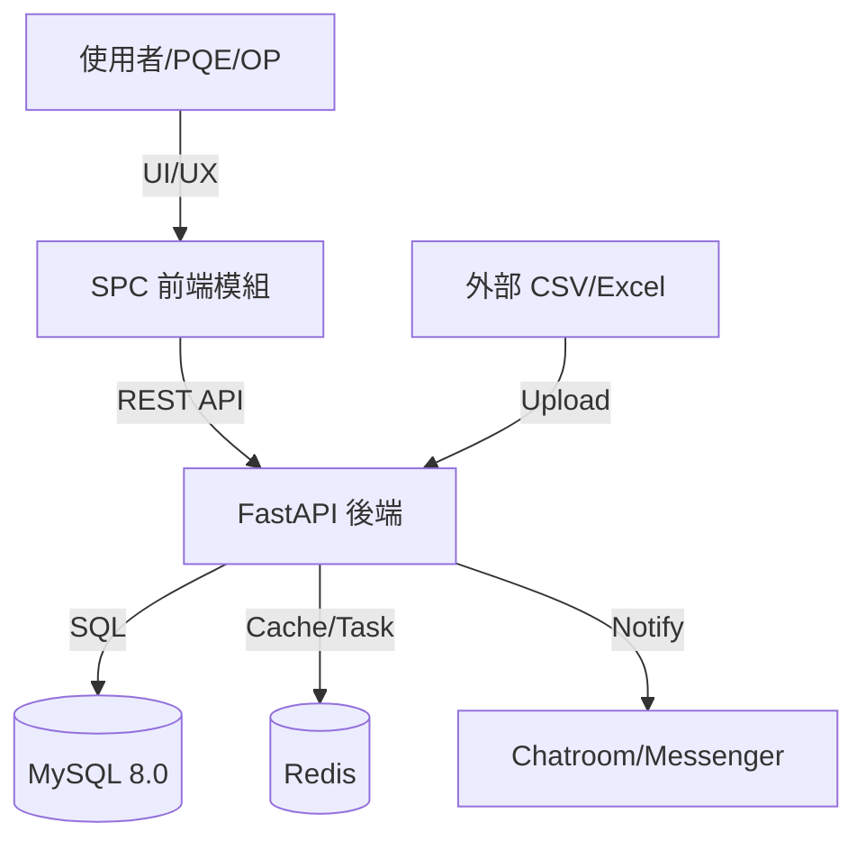
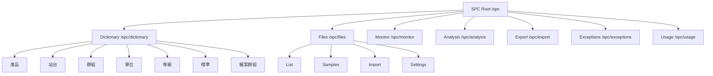
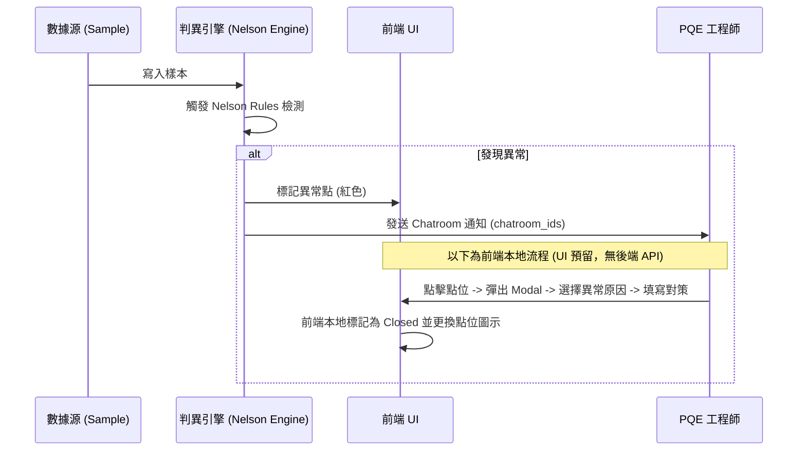
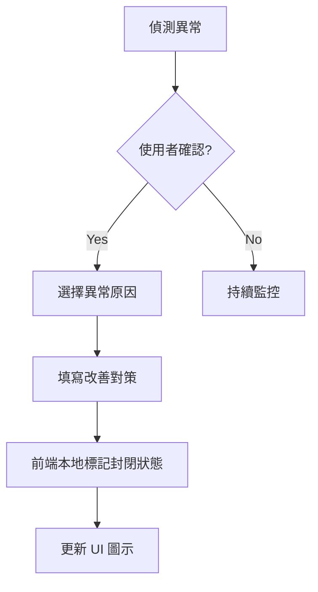
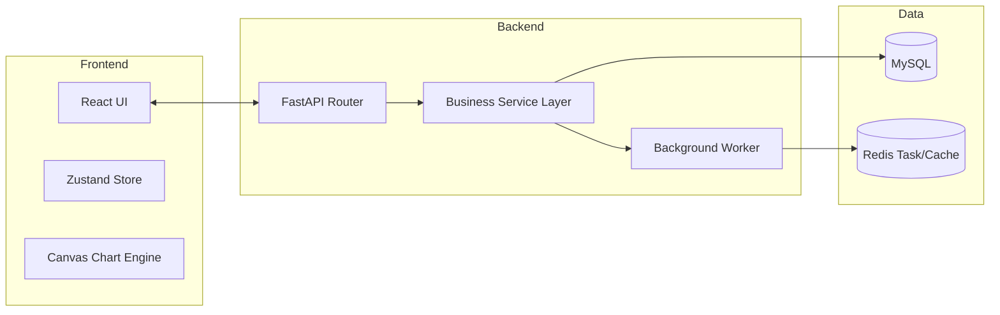
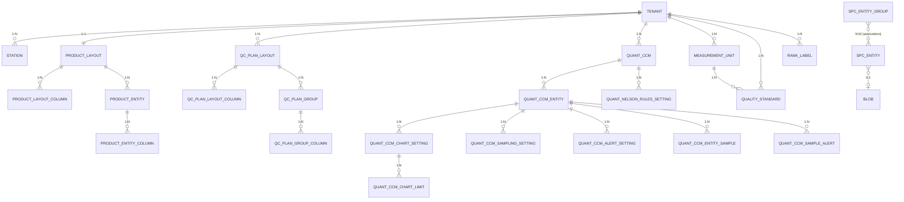
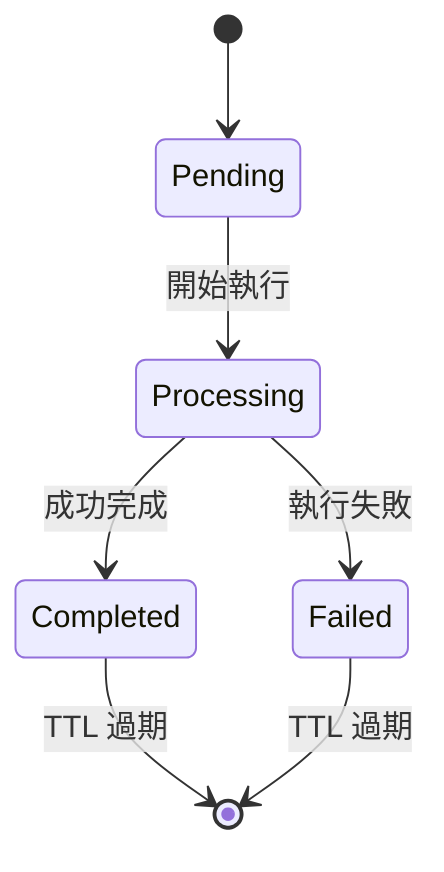
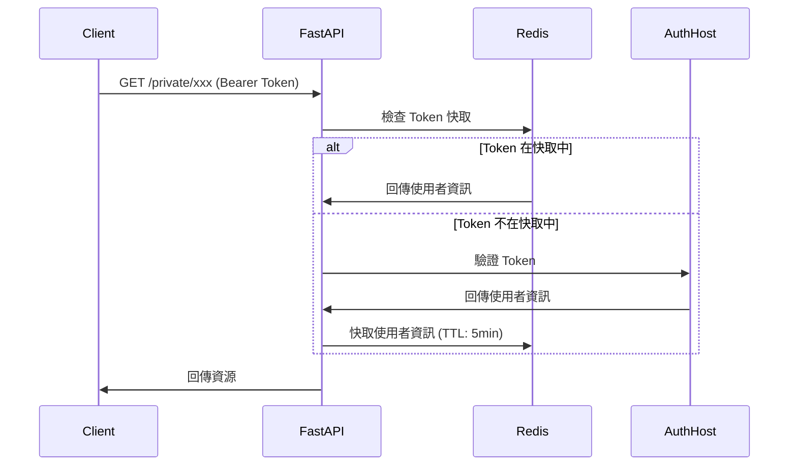
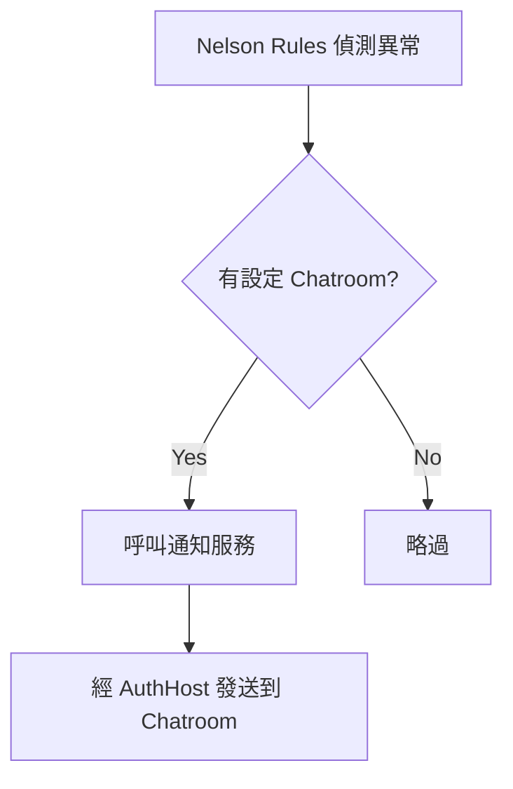
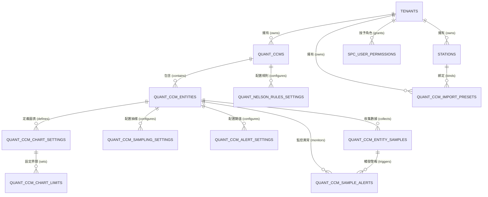

# 數辰 SPC 系統對接規範文件索引 (v1.3)

本目錄包含 SPC 系統整合之完整技術規格文件，旨在提供開發、測試與維護之標準指引。

## 📄 文件目錄

| 中文名稱 | 英文名稱 | 簡要說明 |
| :--- | :--- | :--- |
| [01 需求規格書](#doc-01) | Software Requirements Specification (SRS) | 定義系統功能與非功能需求，是整個專案基礎 |
| [02 功能規格書](#doc-02) | Functional Specification Document (FSD) | 詳細描述系統功能與操作流程 |
| [03 系統設計文件](#doc-03) | System Design Document (SDD) | 系統架構、模組設計、技術選型 |
| [04 詳細設計文件](#doc-04) | Detailed Design Document (DDD) | 模組內部邏輯與實作細節 |
| [05 資料字典](#doc-05) | Data Dictionary (DD) | 定義資料欄位、型態、長度與說明 |
| [06 資料流程圖](#doc-06) | Data Flow Diagram (DFD) | 描述資料在系統中的流動方式 |
| [07 實體關係圖](#doc-07) | Entity Relationship Diagram (ERD) | 資料庫結構與關聯設計 |
| [08 API 規格文件](#doc-08) | API Specification | 定義系統之間的介面與資料交換格式（常用 JSON） |
| [09 JSON 格式定義](#doc-09) | JSON Schema | 規範資料交換的 JSON 結構 |
| [10 技術提問回覆](#doc-10) | Frequently Asked Questions (FAQ) | 常見問題：針對提問回覆 |
| [11 對接快速指南](#doc-11) | Integration Quickstart | 取得 Token → 提交匯入 → 輪詢，含 JS/Python 可執行範例 |
| [12 版次異動說明](#doc-12) | Changelog | 文件集修訂歷史；以 JSON 範本呈現差異，差異處以註解標註 |

---
**最後更新**：2026-07-06
**負責團隊**：數辰 PM 團隊 / IT 開發組

# 01 軟體需求規格書 (SRS) - SPC 系統全範疇規範 {#doc-01}

## 1. 系統願景與架構圖
本系統旨在建構一個全方位、可擴展的統計製程管制中心。



## 1.1 技術棧明細

### 後端技術棧
| 層級 | 技術 | 版本 |
| :--- | :--- | :--- |
| Framework | FastAPI | 0.100+ |
| ORM | SQLAlchemy | 1.4+ |
| Database | MySQL | 8.0+ |
| Cache | Redis | 6.0+ |
| Migration | Alembic | - |

### 前端技術棧
| 層級 | 技術 | 版本 |
| :--- | :--- | :--- |
| Framework | React | 18.x |
| State | Zustand | - |
| HTTP | Axios | - |
| Charts | Canvas / Recharts | - |
| Table | 自定義 Virtual Scroll | - |

---

## 2. 辭庫管理全模組需求 (Master Data Requirements)
系統必須提供以下辭庫管理功能，作為管制計畫的引用基準：

- **產品資料 (Products)**: 支援料號 (Part Number) 的 CRUD 與批量匯入。需儲存品名、客戶資訊及規格型號。
- **檢測站別 (Stations)**: 支援樹狀組織結構。每個計畫必須關聯至一個特定站點，以便進行站點間的良率對比。
- **群組設定 (Entity Groups)**: 允許將多個層別（如：A、B、C 三台機台）打包為一個邏輯群組，用於快速篩選。
- **量測單位 (Measurement Units)**: 標準化物理單位字典（mm, kg, μm）。需設定預設的小數位數 (Digits)。
- **等級基準 (Grade Standards)**: 定義 Cpk 燈號規則（例如：Cpk > 1.33 為綠色 A 級）。
- **檢驗標準 (Inspection Standards)**: **[UI 預留]** 關聯至 SOP 文件或 AQL 抽樣計畫，目前僅需儲存鏈結。
- **檔案群組 (File Groups)**: 提供虛擬資料夾結構，用於分類管理大量的管制計畫。

## 2.1 辭庫 Table 結構彙整

### 2.1.1 基礎辭庫表
| Table 名稱 | 模型類別 | 用途說明 | 主要欄位 |
| :--- | :--- | :--- | :--- |
| `tenants` | Tenant | 多租戶隔離 | id, name, code |
| `stations` | Station | 檢測站別 | id, name, external_id, parent_id |
| `measurement_units` | MeasurementUnit | 量測單位 | id, name, symbol, digits |
| `quality_standards` | QualityStandard | 檢驗標準 | id, name, target, tolerance, unit_id |
| `rank_labels` | RankLabel | 等級基準 | id, name, target (cp/ca/cpk), lower_bound, color |

### 2.1.2 產品與 QC Plan 表
| Table 名稱 | 模型類別 | 用途說明 | 主要欄位 |
| :--- | :--- | :--- | :--- |
| `product_layouts` | ProductLayout | 產品版面配置 | id, tenant_id, name |
| `product_layout_columns` | ProductLayoutColumn | 版面欄位定義 | id, layout_id, key, label, order |
| `product_entities` | ProductEntity | 產品資料筆 | id, layout_id, values (JSON) |
| `qc_plan_layouts` | QCPlanLayout | QC Plan 版面配置 | id, tenant_id, name |
| `qc_plan_layout_columns` | QCPlanLayoutColumn | QC Plan 欄位定義 | id, layout_id, key, label, order |
| `qc_plan_groups` | QCPlanGroup | QC Plan 群組 | id, layout_id, name |
| `qc_plan_group_columns` | QCPlanGroupColumn | 群組欄位值 | id, group_id, values (JSON) |

### 2.1.3 SPC 實體表
| Table 名稱 | 模型類別 | 用途說明 | 主要欄位 |
| :--- | :--- | :--- | :--- |
| `spc_entity_groups` | SPCEntityGroup | SPC 實體群組 | id, name, type (category/defect/...) |
| `spc_entities` | SPCEntity | SPC 實體項目 | id, group_id, name, blob_id |

### 2.1.4 檔案儲存表
| Table 名稱 | 模型類別 | 用途說明 | 主要欄位 |
| :--- | :--- | :--- | :--- |
| `blobs` | Blob | 檔案儲存 | id, content_type, url, size, filename |

---

## 3. 管制計畫模組需求 (Quantitative CCM Requirements)

### 3.1 核心 Table 結構

| Table 名稱 | 模型類別 | 用途說明 | 主要欄位 |
| :--- | :--- | :--- | :--- |
| `quant_ccms` | QuantitativeCCM | 管制計畫主表 | id, name, part_number, batch_number, spec, station, category_information, department_id |
| `quant_ccm_entities` | QuantitativeCCMEntity | 管制項目 | id, ccm_id, order, characteristic_name, measurement_unit |
| `quant_ccm_chart_settings` | QuantitativeCCMChartSetting | 管制圖設定 | id, entity_id, chart_type, subgroup_size |
| `quant_ccm_chart_limits` | QuantitativeCCMChartLimit | 管制界限 | id, setting_id, ucl/lcl/cl (含管理值/警戒值) |
| `quant_ccm_sampling_settings` | QuantitativeCCMSamplingSetting | 抽樣設定 | id, entity_id, num_of_samples, num_of_digits, frequency |
| `quant_ccm_alert_settings` | QuantitativeCCMAlertSetting | 警報設定 | id, entity_id, ca_upper_limit, cp_upper_limit, cpk_lower_limit, alert_upper_limit, alert_lower_limit |
| `quant_nelson_rules_settings` | QuantNelsonRulesSetting | Nelson Rules 設定 | id, ccm_id, nelson_rules_1~8 |
| `quant_ccm_entity_samples` | QuantitativeCCMEntitySample | 樣本資料 | id, entity_id, idx, samples (CSV), operator_name |
| `quant_ccm_sample_alerts` | QuantitativeCCMSampleAlert | 樣本警報 | id, entity_id, sample_id, alert_type, rule_number, description |
| `quant_ccm_import_presets` | ImportPreset | 匯入預設設定 | id, tenant_id, name, naming_keys, station_id, chatroom_id, table_id, default_ucl/cl/lcl |
| `spc_user_permissions` | SPCUserPermission | SPC 角色權限 | id, tenant_id, user_id, role |

> **權限模型與部門隔離**：定量 CCM 具 4 種 SPC 角色（`system_admin`、`quality_staff`、`line_operator` 具寫入權限；`viewer` 唯讀，亦為預設）並實施**部門級資料隔離**——CCM 與匯入預設綁定建立者的 `department_id`，一般使用者僅能存取自己部門資料。詳見 [08 API 規格文件](#doc-08) 第二部分。
>
> **`category_information` 型別差異**：建立 CCM（`CreateQuantitativeCCMPayload`）時為**物件**（鍵值對，如 `{"線別":"A線"}`）；而 all-in-one 匯入（`AllInOnePayload`）時為 **CategoryInfo 陣列**（含 `key`/`value`/`order`/`naming`）。兩者結構不同，對接時務必區分。

### 3.2 管制圖類型與子組大小

| Chart Type | 識別值 | 子組大小 (n) | 適用情境 | Sigma 計算公式 |
| :--- | :--- | :--- | :--- | :--- |
| **X̄-MR** | `x_bar_mr` | n = 1 | 單件量測、昂貴產品 | σ = MR̄ / d₂(2) |
| **X̄-R** | `x_bar_r` | 2 ≤ n ≤ 10 | 小批量生產 | σ = R̄ / d₂(n) |
| **X̄-S** | `x_bar_s` | n > 10 | 大批量生產 | σ = S̄ / c₄(n) |

### 3.3 Capacity 指數需求

| 指數 | 公式 | 用途 | 短期/長期 |
| :--- | :--- | :--- | :--- |
| **Cp** | (USL - LSL) / 6σ | 潛在能力 | 短期 (σ_within) |
| **Ca** | (X̄ - M) / ((USL-LSL)/2) | 準確度 | 短期 |
| **Cpk** | min(CPU, CPL) | 實際能力 | 短期 (σ_within) |
| **Pp** | (USL - LSL) / 6σ_overall | 績效 | 長期 (σ_overall) |
| **Ppk** | min(PPU, PPL) | 實際績效 | 長期 (σ_overall) |

---

## 4. API 端點彙整 (按 Router 分類)

### 4.1 公開端點
| Method | Path | 說明 |
| :--- | :--- | :--- |
| GET | `/` | 根路由，導向 FastAPI docs |
| GET | `/health` | 健康檢查 (DB + Redis) |
| GET | `/docs` | 自定義 Swagger UI |

### 4.2 私有端點 (需 Bearer Token)
| Router | Path | 說明 |
| :--- | :--- | :--- |
| **Auth** | `/private/auth/**` | 認證相關 |
| **Product** | `/private/product/**` | 產品 CRUD + 批量 |
| **SPC Entity** | `/private/spc_entity/**` | SPC 實體與群組 |
| **Station** | `/private/station/**` | 站別 CRUD |
| **Unit** | `/private/unit/**` | 量測單位 CRUD |
| **Rank Label** | `/private/rank_label/**` | 等級基準 CRUD |
| **Standard** | `/private/standard/**` | 檢驗標準 CRUD |
| **QC Plan** | `/private/qc_plan/**` | QC Plan CRUD |

### 4.3 定量 CCM 端點 (Base Path: `/private/ccm/quantitative`)

> 資源為**巢狀路徑**（非扁平），以下 Path 皆相對於 Base Path；完整端點、參數與範例詳見 [08 API 規格文件](#doc-08)。

| Method | Path（相對 Base） | 說明 |
| :--- | :--- | :--- |
| GET/POST/PUT/DELETE | `/` · `/{ccm_id}` · `/count` | 管制計畫 CRUD 與計數 |
| GET/POST/PUT/DELETE | `/{ccm_id}/entities` · `/{ccm_id}/entities/{entity_id}` | 管制項目 CRUD |
| PUT/POST | `/{ccm_id}/entities/reorder` · `/swap-order` · `/with-settings` | 排序 / 一次建立含設定 |
| GET/POST/PUT/DELETE | `/{ccm_id}/entities/{entity_id}/chart-settings`（含 `.../{setting_id}/limits`） | 管制圖設定與界限 |
| GET/POST/PUT/DELETE | `/{ccm_id}/entities/{entity_id}/sampling-settings` | 抽樣設定 |
| GET/POST/PUT/DELETE | `/{ccm_id}/entities/{entity_id}/alert-settings` | 警報設定 |
| GET/POST/PUT/DELETE | `/{ccm_id}/entities/{entity_id}/samples`（含 `/samples/bulk`、`/samples/count`、`/samples/category-values`） | 樣本資料 CRUD / 批量 |
| GET | `/{ccm_id}/entities/{entity_id}/samples/capability`（含 `/count`、`/recommended-limits`） | 能力分析（依篩選集計算 Cp/Cpk/Pp/Ppk） |
| GET | `/{ccm_id}/entities/{entity_id}/sample-alerts`（含 `/count`） | 樣本警報查詢（僅讀） |
| GET/POST/PUT/DELETE | `/{ccm_id}/nelson-rules` · `/{ccm_id}/nelson-rules/{setting_id}` | Nelson Rules 設定 |
| POST/GET | `/all-in-one` · `/all-in-one/{task_id}` · `/all-in-one/compare` | 一鍵匯入（非同步） / 比對預覽 |
| GET | `/{ccm_id}/export` · `/{ccm_id}/export/v2`（Entity 層亦有 `.../export`、`.../export/v2`） | Excel 匯出（v1 / v2） |
| GET/POST/PUT/DELETE | `/import-presets` · `/import-presets/{preset_id}` | 匯入預設設定 |
| GET/PUT/DELETE | `/permissions` · `/permissions/me` · `/permissions/{user_id}` | SPC 角色權限 |

---

## 5. 分析工具需求 (Analysis Tooling Requirements)
- **多維度層化分析**: 支援按辭庫定義的維度（如機台、操作員）進行數據分組對比。
- **趨勢監控面板**: 即時展示各計畫的 Cpk 波動。
- **異常原因統計 (Pareto)**: 自動統計異常原因出現頻率，協助定位製程瓶頸。
- **預測性維護 (Trend Prediction)**: **[開發中/UI 僅展示]** 基於線性回歸或移動平均預估未來點位走勢。

## 6. 功能開發狀態表
| 模組 | 功能名稱 | 狀態 | 備註 |
| :--- | :--- | :--- | :--- |
| **辭庫** | 產品/站台/單位 | 已完成 | 支援批量同步 |
| **辭庫** | 等級基準設定 | 已完成 | 支援自定義燈號顏色 |
| **辭庫** | 檢驗標準關聯 | **UI 預留** | 僅前端 UI 框架，邏輯待對接 |
| **分析** | 管制圖基本功能 | 已完成 | 支援 8 大尼爾森規則 |
| **分析** | 趨勢預測面板 | **UI 預留** | 僅前端 UI 佔位，後端算法開發中 |
| **計畫** | 檔案群組管理 | 已完成 | 支援多級虛擬目錄 |

---

## 7. 非功能需求 (Non-functional Requirements)
- **資料治理**: `characteristic_name`、`station`、`part_number`、`batch_number` 等**字串欄位**長度上限為 128 字元；小數位數需符合單位辭庫（或抽樣設定 `num_of_digits`）。樣本值本身為數值/字串陣列，不受 128 字元限制。
- **效能**: 大量批量匯入（all-in-one）採**非同步任務**處理——提交後回傳 `202 Accepted` 與 `task_id`，由呼叫端輪詢 `GET /all-in-one/{task_id}` 取得進度與結果，而非同步阻塞至完成。
- **安全性**: 所有辭庫異動需記錄稽核日誌 (Audit Log)。

## 8. 統計常數表 (AIAG 標準)

### 8.1 d₂ 常數表 (用於 X̄-R 圖)
| n | 2 | 3 | 4 | 5 | 6 | 7 | 8 | 9 | 10 |
| :--- | :--- | :--- | :--- | :--- | :--- | :--- | :--- | :--- | :--- |
| **d₂** | 1.128 | 1.693 | 2.059 | 2.326 | 2.534 | 2.704 | 2.847 | 2.970 | 3.078 |
| n | 11 | 12 | 13 | 14 | 15 | 16 | 17 | 18 | 19 | 20 |
| **d₂** | 3.173 | 3.258 | 3.336 | 3.407 | 3.472 | 3.532 | 3.588 | 3.640 | 3.689 | 3.735 |
| n | 21 | 22 | 23 | 24 | 25 | >25 |
| **d₂** | 3.778 | 3.819 | 3.858 | 3.895 | 3.931 | 依 AIAG 標準表查表（d₂ 隨 n 緩增，無簡易封閉式） |

> 註：X̄-R 圖後端子組大小限制為 2 ≤ n ≤ 10；n > 10 改用 X̄-S 圖（以 c₄ 計算），故上表 n > 10 的 d₂ 值一般不會用於 X̄-R。

### 8.2 c₄ 常數表 (用於 X̄-S 圖)
| n | 2 | 3 | 4 | 5 | 6 | 7 | 8 | 9 | 10 |
| :--- | :--- | :--- | :--- | :--- | :--- | :--- | :--- | :--- | :--- |
| **c₄** | 0.7979 | 0.8862 | 0.9213 | 0.9400 | 0.9515 | 0.9594 | 0.9650 | 0.9693 | 0.9727 |
| n | 11 | 12 | 13 | 14 | 15 | 16 | 17 | 18 | 19 | 20 |
| **c₄** | 0.9754 | 0.9776 | 0.9794 | 0.9810 | 0.9823 | 0.9835 | 0.9845 | 0.9854 | 0.9862 |
| n | 21 | 22 | 23 | 24 | 25 | >25 |
| **c₄** | 0.9876 | 0.9882 | 0.9887 | 0.9892 | 0.9896 | 4(n-1)/(4n-3) |

# 02 功能規格書 (FSD) - SPC 操作流程與組件規範 {#doc-02}

## 1. 辭庫管理模組詳解 (Master Data UI/UX)

### 1.1 產品與站台 (Products & Stations)
- **交互**: 提供 Search-as-you-type 搜尋功能。支援 CSV 批量上傳產品清單。
- **規則**: 刪除站點時，若已有計畫關聯，系統應提示「無法刪除，請先移除相關計畫」。

### 1.2 量測單位與等級基準 (Units & Ranks)
- **單位設定**: 使用者可自定義單位的「顯示名稱」與「精度（小數點後幾位）」。
- **等級判定**: 提供色塊選擇器與數值滑桿。設定變更後，全系統 Cpk 看板應即時套用新燈號。

### 1.3 檔案群組 (File Groups)
- **目錄樹**: 支援 Drag-and-Drop 檔案移動。
- **權限**: 資料夾可設定「僅 PQE 可見」或「全公開」。

---

## 1.4 前端頁面路由架構



### 1.5 前端頁面路由與功能

| 路由 | 功能說明 |
| :--- | :--- |
| `/spc` | 重新導向至辭庫總覽 |
| `/spc/dictionary` | 辭庫總覽頁面 |
| `/spc/dictionary/product` | 產品列表管理 |
| `/spc/dictionary/product/bulk-add` | 產品批量新增 |
| `/spc/dictionary/station` | 站台列表管理 |
| `/spc/dictionary/group` | 群組列表管理 |
| `/spc/dictionary/unit` | 單位列表管理 |
| `/spc/dictionary/level` | 等級基準管理 |
| `/spc/dictionary/standard` | 檢驗標準管理 |
| `/spc/dictionary/file-group` | 檔案群組管理 |
| `/spc/files/measurement-value` | 量測值計畫列表 |
| `/spc/files/measurement-value/samples` | 樣本資料檢視/編輯 |
| `/spc/files/measurement-value/import` | Excel/CSV 匯入 |
| `/spc/files/measurement-value/settings` | 計畫設定 |
| `/spc/analysis` | SPC 分析工具 |
| `/spc/export` | 匯出報表 |
| `/spc/exceptions` | 異常彙總 |
| `/spc/usage` | 使用紀錄 |
| `/spc/monitor` | 即時監控看板 |

---

## 2. 分析工具交互規範 (Analysis Tools)

### 2.1 層化分析 (Stratification)
- **操作流**: 
  1. 使用者在側邊欄勾選特定辭庫維度（如：機台 #1, 機台 #2）。
  2. 點擊「執行層化」。
  3. **預期結果**: 管制圖以「疊圖」形式呈現，兩條曲線分別代表不同機台的變異狀況。

### 2.2 異常閉環流程 (Alert Closure)

> **⚠️ [部分 UI 預留]**：後端 sample-alerts 端點目前**僅提供查詢**（`GET .../sample-alerts` 與 `.../sample-alerts/count`），**無**關閉/確認（close/ack）端點，警報物件亦**無** `reason`／`status`／對策 等欄位。下圖中「選擇異常原因 → 填寫對策 → Status: Closed」為**前端本地狀態流程**，尚無後端 API 支撐。



---

## 2.3 前端資料存取與載入機制

前端以 React 搭配資料取得層（data-fetching）向後端 REST API 讀寫資料，並以快取與分頁機制支撐大量樣本的效能。功能上分為三類：

- **資料讀取**：載入計畫（含管制項目與各項設定）、辭庫資料（產品、站台、單位、群組、等級、檢驗標準）、計畫與樣本清單，以及分析所需的層化資料、統計摘要與能力分析的建議界限。
  - **列表載入策略**：計畫/樣本清單支援「過濾查詢」、「延遲載入」與「混合模式」；大量樣本採**無限滾動**分批取回，避免一次載入全部資料。
- **匯入流程**：支援新版匯入流程、對應到既有計畫的匯入，以及匯入時的辭庫（層別/單位等）解析與比對。
- **資料表運算**：提供樞紐分析、統計彙總，以及 Excel 匯入/匯出的前端處理。

> 上述皆為前端呼叫 §4.3 / [08 API 規格文件](#doc-08) 所列端點後的資料組裝與呈現，客戶端對接時以 API 為準。

---

## 2.4 前端狀態管理機制

計畫編輯頁採用 Zustand 作為**前端本地狀態**（client-side state），在使用者按下儲存前於瀏覽器暫存草稿，減少往返請求。管理的內容與行為包含：

- **計畫基本設定**：名稱、料號、批號、規格、站別、層別資訊等（對應建立/更新 CCM 的欄位）。
- **管制項目編輯**：新增、更新、刪除、重新排序管制項目，並可設定層別維度與目前選取的項目。
- **未儲存變更追蹤**：以「dirty」標記提示尚未儲存的變更；新建立但未落庫的項目使用臨時識別碼，儲存後再由後端配發正式 ID。
- **載入與重設**：可從 API 載入既有計畫資料至本地狀態，或完全重設/重設設定。

---

## 2.5 常數定義

### 2.5.1 計畫類型

| 值 | 說明 |
| :--- | :--- |
| `measurement-value` | 計量值計畫（本文件對接對象） |
| `count-value` | 計數值計畫 |
| `merged` | 合併計畫 |

### 2.5.2 辭庫類型

| 值 | 說明 |
| :--- | :--- |
| `product` | 產品 |
| `station` | 站台 |
| `group` | 群組 |
| `unit` | 單位 |
| `level` | 等級 |
| `standard` | 檢驗標準 |
| `fileGroup` | 檔案群組 |

### 2.5.3 管制圖類型

| 值 | 標籤 | 子組大小 (n) |
| :--- | :--- | :--- |
| `x_bar_mr` | X̄-MR | n = 1 |
| `x_bar_r` | X̄-R | 2 ≤ n ≤ 10 |
| `x_bar_s` | X̄-S | n > 10 |

> 與 [09 JSON 格式規範](#doc-09) 的 `chart_type` 列舉一致。

---

## 3. UI 佔位功能定義 (UI-only / Pending)

### 3.1 趨勢預測與建模
- **UI 現狀**: 提供「未來趨勢預估」開關。
- **交互限制**: 點擊後僅顯示模擬曲線，並彈出「AI 模組串接中」之提示。

### 3.2 檢驗標準文檔
- **UI 現狀**: 顯示文件清單。
- **交互限制**: 目前點擊僅能下載，無法進行線上預覽與版本比對（預留為 Phase 3）。

---

## 4. UI 性能與響應規範
- **虛擬列表 (Virtual Scroll)**: 樣本列表在萬筆數據下必須採用虛擬滾動，確保 FPS > 50。
- **即時驗證**: 規格設定時 (UCL/LSL)，輸入框應即時檢驗「USL 必須大於 LSL」。

---

## 5. 分析頁面功能組成

### 5.1 分析頁面版面

分析頁面由以下功能區塊組成：

- **分析側邊欄**：選擇計畫、管制項目與層別維度，設定分析條件。
- **統計摘要**：顯示樣本數、平均值、標準差與能力指標（Cp/Cpk/Pp/Ppk）等彙總。
- **資料集區塊**：呈現目前分析所使用的樣本集與篩選條件。
- **管制圖區塊**：繪製 X̄-MR / X̄-R / X̄-S 管制圖，並標記異常點。
- **資料表區塊**：以表格檢視樣本明細，支援虛擬滾動。
- **層化長條圖**：以長條圖比較不同層別（如機台、班別）的變異或指標差異。

### 5.2 圖表類型

分析與監控頁面提供的圖表類型：管制圖、直方圖、箱線圖、散佈圖、層化圖。管制圖採 Canvas 繪製以支撐大量點位的效能。

### 5.3 共用 UI 能力

跨頁面共用的介面能力包含：頁面版面與分頁導覽、辭庫/單位/項目/群組的下拉選擇器、管制界限設定區塊、欄位設定與表單、可拖曳排序清單、行內確認、新增值/單位彈窗、資料表（含彙總與操作列）、空狀態與資訊卡等。

---

## 6. 異常原因統計功能 (Pareto)

### 6.1 取樣警報查詢

警報查詢由後端 sample-alerts 端點提供，僅支援**分頁**（`offset`/`limit`/`order`）與依 `alert_type`（`nelson_rule` / `alarm_limit`，不帶則回全部）過濾；**不提供** `groupBy` / `reason` 之類的分組參數。

因此 Pareto 原因統計採用「前端彙整」機制：取回警報後，前端依 `alert_type`、`rule_number`（Nelson 法則編號）與 `description` 自行分組與計次，再繪製長條圖。

### 6.2 警报類型
| alert_type | 說明 |
| :--- | :--- |
| `nelson_rule` | Nelson Rules 偵測異常 |
| `alarm_limit` | 超過管制界限 |

### 6.3 異常關閉流程 [UI 預留]

> **⚠️ [UI 預留]**：後端目前無警報關閉/確認端點，警報物件亦無原因/對策/狀態欄位。下列「選擇原因 → 填寫對策 → 儲存封閉狀態」為**前端本地流程**，尚無後端 API 支撐（詳見 §2.2 說明）。



# 03 系統設計文件 (SDD) - SPC 系統架構與實體關聯 {#doc-03}

## 1. 系統組件架構圖


---

## 1.1 後端分層架構

後端採分層設計，各層職責如下：

| 層 | 職責 |
| :--- | :--- |
| **API 路由層** | 對外端點。分為受保護路由（`/private`，需 Bearer Token）、管理路由（`/db`、`/root`，以管理權杖授權）；定量管制（Quantitative CCM）為主要業務路由群。 |
| **業務邏輯層** | CCM、管制圖、能力分析、Excel 匯出等領域邏輯。 |
| **資料存取層 (CRUD)** | 產品版面、QC Plan 版面、計畫物件、租戶等實體的存取。 |
| **資料模型層** | 資料庫實體與關聯定義（產品、站台、SPC 實體、定量 CCM、品質標準、量測單位、等級標籤、租戶等）。 |
| **依賴與工具層** | 認證/授權、DB 與 Redis 連線、能力指標計算、憑證處理、錯誤處理、物件儲存、日誌與通知。 |
| **Schema 層** | 請求 Payload 與回應模型（對應 OpenAPI 定義）。 |

---

## 2. 辭庫與業務實體關係 (ERD Concepts)

### 2.1 辭庫管理實體 (Master Data)
- **`products`**: 儲存產品料號、名稱。與 `quant_ccms` 1:N 關聯。
- **`stations`**: 儲存站台層級 (id, parent_id)。與 `quant_ccms` 1:N 關聯。
- **`spc_entities` & `spc_entity_groups`**: 實���層別標籤字典。
- **`ranks`**: 儲存等級判定閾值 (Value, Color)。

### 2.2 核心業務實體
- **`quant_ccms`**: 管制計畫主表。透過 JSON 欄位引用 `spc_entities`。
- **`quant_ccm_entity_samples`**: 樣本數據表。
    - **優化**: 對 `idx` 與 `quant_ccm_entity_id` 建立複合唯一索引。

### 2.3 完整 ERD 關聯圖



---

## 3. 背景任務與任務狀態機

### 3.1 Redis 任務狀態定義
目前僅 **all-in-one 批量匯入** 採用非同步任務（回傳 `202 Accepted` + 輪詢）；層化分析與能力分析皆為同步端點，不經 Redis 任務管理。
- **Key**: `all_in_one_task:{tenant_id}:{task_id}`
- **Status**: `pending` -> `processing` -> `completed` | `failed`
- **TTL**: 每次寫入均以 `SETEX` 設定 3600 秒，供前端輪詢 `GET /all-in-one/{task_id}`。

### 3.2 任務流程圖


---

## 4. 安全性與租戶隔離

### 4.1 認證流程
> **重點**：SPC 系統本身不簽發 token。使用者持 TeamSync 簽發的 Bearer Token（效期預設 15 分鐘）呼叫 SPC；SPC 透過 `GET {AUTH_HOST}/private/user/me` 向 AuthHost 驗證，並將使用者資訊快取於 Redis（key: `auth:token:{token}`，TTL 5 分鐘）。



### 4.2 API Key 驗證
| Header | 用途 | 角色 |
| :--- | :--- | :--- |
| `X-ADMIN-TOKEN` | 管理 API | Admin |
| `X-SUPER-ADMIN-TOKEN` | 超級管理 API | Super Admin |

### 4.3 租戶與部門隔離實作
- **Middleware**: 應用層唯一註冊的 middleware 是 `CORSMiddleware`（無自訂 TenantMiddleware）。
- **隔離邏輯**: 各資料表帶有 `tenant_id` / `department_id` 欄位；認證通過後由使用者資訊解析出所屬租戶，查詢時於各業務端點顯式過濾（非自動 SQL 攔截）。
- **SPC 權限模型**: 另有使用者層級的 SPC 角色與部門級資料隔離，透過 `/permissions`、`/permissions/me` 端點管理，欄位包含 `SPCPermissionRole`、`can_manage_permissions`、`can_read_all_departments`。

### 4.4 環境變數配置

| 變數 | 用途 | 範例 |
| :--- | :--- | :--- |
| `DB_HOST` | MySQL 主機 | `localhost` |
| `DB_PORT` | MySQL 連接埠 | `3306` |
| `DB_USER` | MySQL 使用者 | `root` |
| `DB_PASS` | MySQL 密碼 | `password` |
| `DB_NAME` | 資料庫名稱 | `spc_db` |
| `REDIS_HOST` | Redis 主機 | `localhost` |
| `REDIS_PORT` | Redis 連接埠 | `6379` |
| `AUTH_HOST` | 認證服務主機 | `https://auth.example.com` |

---

## 5. 資料庫連線池配置

### 5.1 連線池參數
系統以 SQLAlchemy 連線池管理 MySQL 連線，預設值如下（皆可由環境變數覆寫）：

| 參數 | 預設值 | 環境變數 | 說明 |
| :--- | :--- | :--- | :--- |
| 連線池大小 | 20 | `DB_POOL_SIZE` | 常駐連線數 |
| 最大溢出 | 30 | `DB_MAX_OVERFLOW` | 尖峰額外可開連線數 |
| 連線回收秒數 | 600 | `DB_POOL_RECYCLE` | 在 RDS idle 關閉連線前主動回收 |

### 5.2 連線池監控
- **健康檢查**: `/health` 端點僅執行 `SELECT 1` 與 `redis.ping()` 驗證 DB／Redis 連線，成功回 `{"status": "ok"}`，失敗回 503。**不會**自動建立資料庫。
- **資料庫初始化**: 資料庫「不存在則建立」的動作在服務啟動時與 `/db` 管理路由執行，與 `/health` 無關。

---

## 6. Excel 匯出服務

### 6.1 匯出內容
後端 Excel 匯出服務會產生包含以下區塊的活頁簿：

| 區塊 | 內容 |
| :--- | :--- |
| **Block A** | Compact header (CCM 資訊 + 管制界限) |
| **Block B** | 樣本資料表 (橫向/縱向) |
| **Block C** | 管制圖 (X̄ 和 R/MR/S) |
| **Block D** | 能力分析 |

### 6.2 匯出方式
匯出以 HTTP GET 端點提供，可依 CCM 或單一 Entity 匯出，並支援日期區間與層別過濾：

- `GET /{ccm_id}/export`、`GET /{ccm_id}/export/v2`（整份 CCM）
- `GET /{ccm_id}/entities/{entity_id}/export`、`.../export/v2`（單一管制項目）

回應為 Excel 檔案串流（xlsx）。

---

## 7. 通知系統

### 7.1 通知流程


### 7.2 通知觸發條件
- **Nelson Rule 觸發**: 任何一條規則偵測到異常
- **警報條件**: 超過設定的 Ca/Cp/Cpk 閾值

### 7.3 通知傳送機制
通知不由 SPC 直接對外送 Webhook，而是委由 **AuthHost（TeamSync）** 的通知服務轉發至指定 Chatroom：

- 傳送目標：AuthHost 的 Chatroom 通知端點，以管理權杖（`X-ADMIN-TOKEN`）授權。
- 傳送內容：僅標題（title）與內文（content）兩個欄位。告警的細節（觸發規則編號、料號、批號、管制項目名稱等）會先組裝成人類可讀的標題／內文後再送出。

# 04 詳細設計文件 (DDD) - SPC 邏輯與統計細節 {#doc-04}

## 1. 核心統計邏輯 (Statistical Core)

### 1.1 統計常數與精度推估
系統內建 AIAG 標準常數表 ($n=2 \sim 25$):
- **$d_2$ 近似值**: 當 $n > 25$ 時，採用 $3.087 - (0.083 / n)$。
- **$c_4$ 近似值**: 當 $n > 25$ 時，採用 $(4n - 4) / (4n - 3)$。
- **單位精確度**: 計算過程採用 `Decimal` 以防止浮點數精度丟失，僅在存儲與顯示時根據「單位辭庫」設定的 `Digits` 進行四捨五入。

### 1.2 等級基準判定算法 (Grade Selection)
- **輸入**: 當前計算之 Cpk 值。
- **邏輯**: 從快取讀取 `RankDefinitions` -> 按 `lower_bound` 降序排列 -> 尋找第一個 `cpk >= lower_bound` 的等級。
- **輸出**: 等級標籤 (A/B/C) 與對應的 16 進位顏色代碼。

---

## 1.3 完整 d₂ 常數表
| n | d₂ | n | d₂ | n | d₂ | n | d₂ | n | d₂ |
| :--- | :--- | :--- | :--- | :--- | :--- | :--- | :--- | :--- | :--- |
| 2 | 1.128 | 7 | 2.704 | 12 | 3.258 | 17 | 3.588 | 22 | 3.819 |
| 3 | 1.693 | 8 | 2.847 | 13 | 3.336 | 18 | 3.640 | 23 | 3.858 |
| 4 | 2.059 | 9 | 2.970 | 14 | 3.407 | 19 | 3.689 | 24 | 3.895 |
| 5 | 2.326 | 10 | 3.078 | 15 | 3.472 | 20 | 3.735 | 25 | 3.931 |
| 6 | 2.534 | 11 | 3.173 | 16 | 3.532 | 21 | 3.778 | >25 | 3.087 - 0.083/n |

### 1.4 完整 c₄ 常數表
| n | c₄ | n | c₄ | n | c₄ | n | c₄ | n | c₄ |
| :--- | :--- | :--- | :--- | :--- | :--- | :--- | :--- | :--- | :--- |
| 2 | 0.7979 | 7 | 0.9594 | 12 | 0.9776 | 17 | 0.9845 | 22 | 0.9882 |
| 3 | 0.8862 | 8 | 0.9650 | 13 | 0.9794 | 18 | 0.9854 | 23 | 0.9887 |
| 4 | 0.9213 | 9 | 0.9693 | 14 | 0.9810 | 19 | 0.9862 | 24 | 0.9892 |
| 5 | 0.9400 | 10 | 0.9727 | 15 | 0.9823 | 20 | 0.9869 | 25 | 0.9896 |
| 6 | 0.9515 | 11 | 0.9754 | 16 | 0.9835 | 21 | 0.9876 | >25 | 4(n-1)/(4n-3) |

---

## 2. Nelson Rules 詳細演算法

### 2.1 各規則說明
| 規則 | 名稱 | 觸發條件 | 建議動作 |
| :--- | :--- | :--- | :--- |
| **Rule 1** | 超出管制界限 | N 點超出 ±3σ | 立即檢查量測設備 |
| **Rule 2** | 連續偏移 | N 點在均值同側 | 檢查原物料/參數變更 |
| **Rule 3** | 趨勢異常 | N 點連續上升/下降 | 檢查刀具磨損 |
| **Rule 4** | 週期性振盪 | N 點交替上下 | 檢查 two-level 因子 |
| **Rule 5** | 偏移警告 (2σ) | M/N 點超出 ±2σ | 密切監控後續數據 |
| **Rule 6** | 偏移警告 (1σ) | M/N 點超出 ±1σ | 檢視細微變化 |
| **Rule 7** | 層化現象 | N 點在 ±1σ 內 | 檢查量測系統 |
| **Rule 8** | 混合模式 | N 點在 ±1σ 外兩側 | 檢查母體混合 |

### 2.2 設定格式

API 契約中每條規則為**結構化物件**（未設定則為 `null` 表示停用），透過 `POST/PUT /{ccm_id}/nelson-rules` 傳遞：

| 規則欄位 | 物件格式 | 範例 (JSON) | 預設值 |
| :--- | :--- | :--- | :--- |
| `nelson_rules_1` | `{ n }` | `{"n": 1}` → 1點超出 3σ | N=1 |
| `nelson_rules_2` | `{ n, side }` | `{"n": 9, "side": "both"}` → 9點在同側 | N=9, side=both |
| `nelson_rules_3` | `{ n, side }` | `{"n": 6, "side": "upper"}` → 6點上升 | N=6, side=both |
| `nelson_rules_4` | `{ n }` | `{"n": 14}` → 14點交替 | N=14 |
| `nelson_rules_5` | `{ m, n }` | `{"m": 2, "n": 3}` → 3點中2點超出 2σ | M=2, N=3 |
| `nelson_rules_6` | `{ m, n }` | `{"m": 4, "n": 5}` → 5點中4點超出 1σ | M=4, N=5 |
| `nelson_rules_7` | `{ n }` | `{"n": 15}` → 15點在 1σ 內 | N=15 |
| `nelson_rules_8` | `{ n }` | `{"n": 8}` → 8點在 1σ 外 | N=8 |

其中 `side` 為 `both` / `upper` / `lower`（`NelsonRuleSide`）。

> **內部儲存格式**：後端資料表以逗號分隔字串儲存（如 `"9,both"`、`"2,3"`），由 API 層負責與上述結構化物件互轉；整合對接時一律使用結構化物件。

### 2.3 判定邏輯

偵測以子組平均值序列為對象，取最近的點數視窗（依各規則設定的 N/M）與製程中心線 μ、σ 帶界比對。各規則判定邏輯如下（σ=0 或點數不足時不觸發）：

| 規則 | 判定邏輯 |
| :--- | :--- |
| **Rule 1** | 最近 N 點皆落在 μ±3σ 之外 → 觸發 |
| **Rule 2** | 最近 N 點皆位於中心線同一側（依 `side`：upper 全大於 μ、lower 全小於 μ、both 任一側全滿足） |
| **Rule 3** | 最近 N 點連續遞增或遞減（upper=遞增、lower=遞減、both=任一） |
| **Rule 4** | 最近 N 點方向持續交替（相鄰兩差值正負相反） |
| **Rule 5** | 最近 N 點中，同方向有 ≥ M 點落在 μ±2σ 之外 |
| **Rule 6** | 最近 N 點中，同方向有 ≥ M 點落在 μ±1σ 之外 |
| **Rule 7** | 最近 N 點皆落在 μ±1σ 之內（層化，變異過小） |
| **Rule 8** | 最近 N 點皆落在 μ±1σ 之外，且中心線兩側皆有點（混合） |

### 2.4 規則觸發流程
```mermaid
flowchart TD
    A[樣本寫入/更新] --> B[查詢 Nelson Rules 設定]
    B --> C[取得最大 N 值需求]
    C --> D[取得最近樣本均值 (至少 25 點，或規則所需更多)]
    D --> E{計算 Sigma}
    E -->|X̄-MR| F[σ = MR̄ / d₂(2)]
    E -->|X̄-R| G[σ = R̄ / d₂(n)]
    E -->|X̄-S| H[σ = S̄ / c₄(n)]
    F --> I[執行 8 條規則偵測]
    G --> I
    H --> I
    I --> J{有異常?}
    J -->|No| K[結束]
    J -->|Yes| L[建立 Alert 記錄]
    L --> M[發送 Chatroom 通知]
    M --> N[更新 UI]
```

---

## 3. Capability 計算公式

### 3.1 Sigma 計算方式

| 圖表類型 | Sigma 公式 | 說明 |
| :--- | :--- | :--- |
| **I-MR (n=1)** | σ = MR̄ / d₂(2) | MR̄ = 平均移動極差 |
| **X̄-R (2≤n≤10)** | σ = R̄ / d₂(n) | R̄ = 平均全距 |
| **X̄-S (n>10)** | σ = S̄ / c₄(n) | S̄ = 平均標準差 |

### 3.2 短期能力指數 (Within-Subgroup)

#### Cp (Process Capability)
$$C_p = \frac{USL - LSL}{6\sigma_{within}}$$

- 要求雙邊公差 (USL 和 LSL 均有值)
- σ_within 根據圖表類型計算

#### Ca (Capability Accuracy)
$$C_a = \frac{X̄ - M}{(USL - LSL) / 2}$$
其中 $M = (USL + LSL) / 2$ (規格中心)

- 正值表示製程偏向上限
- 負值表示製程偏向下限

#### CPU (Upper Process Capability Index)
$$C_{PU} = \frac{USL - X̄}{3\sigma_{within}}$$

- 用於單邊上限公差 (USL only)

#### CPL (Lower Process Capability Index)
$$C_{PL} = \frac{X̄ - LSL}{3\sigma_{within}}$$

- 用於單邊下限公差 (LSL only)

#### Cpk (Process Capability Index)
$$C_{pk} = min(C_{PU}, C_{PL})$$

- 雙邊公差：取兩者最小值
- 單邊公差：直接使用可用值

### 3.3 長期能力指數 (Overall)

- 使用 **整體標準差** σ_overall (所有樣本的真實標準差)
- 計算公式與短期相同，但σ來源不同：
  - Pp = (USL - LSL) / 6σ_overall
  - PPU = (USL - X̄) / 3σ_overall
  - PPL = (X̄ - LSL) / 3σ_overall
  - Ppk = min(PPU, PPL)

### 3.4 計算行為與取得方式

能力指標由後端依管制界限（USL/LSL/CL）、圖型（chart_type）與樣本聚合統計即時計算，計算行為如下：

- **σ_within** 依圖型選用對應估計式（MR̄/d₂、R̄/d₂、S̄/c₄）。
- **Cp** 需雙邊公差（USL、LSL 皆有）；缺一則為 `null`（單邊）。σ_within=0 時回 0。
- **Cpk** 取 min(CPU, CPL)；單邊公差時直接取可計算的一側（USL only→CPU、LSL only→CPL）。
- Pp/Ppk 邏輯相同，但改用 σ_overall。

整合方取得能力指標的端點：

- `GET /{ccm_id}/entities/{entity_id}/samples/capability`（可帶 `category_filters`、日期區間、`merge_duplicates` 等參數；回應含每組管制界限的 Cp/Ca/CPU/CPL/Cpk/Pp/PPU/PPL/Ppk 與 sigma_within）。
- 各 `chart_limit` 資訊（含能力指標）亦隨 CCM/Entity 查詢一併回傳。

---

## 4. 推薦限制計算 (Recommended Limits)

### 4.1 反向 Capability 計算
給定目標能力指數（`target_index` 可為 `cp` / `cpk` / `pp` / `ppk`）與目標值，推算所需的 USL/LSL（以製程平均值置中）：

$$USL = μ + 3σ \times target\_value$$
$$LSL = μ - 3σ \times target\_value$$
$$CL = μ$$

- 目標為 `cp` / `cpk` 時，σ 採 **σ_within**；目標為 `pp` / `ppk` 時，σ 採 **σ_overall**。
- 置中於製程平均值可使 Ca ≈ 0，因此 Cpk ≈ Cp（Ppk ≈ Pp）。

### 4.2 取得方式

推薦界限由端點提供：

- `GET /{ccm_id}/entities/{entity_id}/samples/capability/recommended-limits`
- 查詢參數：`target_index`（`cp` / `cpk` / `pp` / `ppk`）、`target_value`，另可帶 `category_filters`、日期區間、`merge_duplicates`。
- 回應為每組管制圖設定的建議 `recommended_ucl` / `recommended_lcl` / `recommended_cl`，並回傳計算所用的製程平均值與 σ。

---

## 5. 分析工具實作邏輯 (Analysis Tool Implementation)

### 5.1 層化篩選 (Stratification)
- **機制**: 層別資訊（category_information）以 JSON 形式儲存於樣本上，後端以 MySQL JSON 查詢依指定層別鍵值過濾樣本子集後再計算。
- **使用方式**: 於樣本查詢、能力分析、匯出等端點帶入 `category_filters` 查詢參數即可取得指定層別的資料子集；可用層別值可透過 `GET /{ccm_id}/entities/{entity_id}/samples/category-values` 取得。

---

## 6. 前端狀態管理（概念）

前端採用集中式狀態管理（Zustand），將 CCM 編輯狀態與辭庫快取分層管理，供整合方理解互動模型：

- **計畫編輯狀態**: 保存目前編輯中的 CCM 基本資訊、層別資訊、管制項目清單與 Nelson Rules 設定，並追蹤「是否有未儲存變更（dirty）」；新增中的項目以暫時性負值 ID 標記，儲存後由後端換發正式 ID。
- **辭庫快取**: 產品、站台、量測單位等主資料的前端快取。
- **分析狀態**: 圖表縮放、層別過濾器等檢視狀態。
- **檔案樹狀態**: 檔案群組樹與拖放操作的暫存。

狀態與後端的資料交換一律經由 Quantitative CCM 的 REST 端點（Base Path `/private/ccm/quantitative`），詳見文件 08。

---

## 7. 樣本寫入處理機制

### 7.1 樣本新增／更新的自動處理

透過樣本端點（`POST /{ccm_id}/entities/{entity_id}/samples` 及批量寫入）新增樣本時，後端會自動執行下列處理，整合方無需自行處理：

1. **驗證抽樣設定**: 若該管制項目尚未設定抽樣設定，寫入會被拒絕。
2. **數值格式化**: 依抽樣設定的小數位數（num_of_digits）將樣本值格式化後儲存。
3. **序號 (idx) 自動遞增**: 在同一管制項目內依既有最大序號自動 +1，整合方送出樣本時不需帶 idx。
4. **欄位繼承**: 自所屬 CCM 複製 `category_information`、`part_number`、`batch_number`（層別資訊可於樣本層以 override 部分覆寫）。

樣本寫入後，即依 §2 的 Nelson Rules 邏輯進行異常偵測，命中則建立樣本警報並觸發通知。

---

## 8. 樣本資料計算屬性

### 8.1 樣本層級統計
每個 `QuantitativeCCMEntitySample` 有以下計算屬性：

| 屬性 | 公式 | 說明 |
| :--- | :--- | :--- |
| `total_value` | Σxᵢ | 樣本總和 |
| `mean_value` | Σxᵢ/n | 子組平均值 |
| `range_value` | max - min | 子組全距 |
| `std_dev` | √(Σ(xᵢ-x̄)²/(n-1)) | 子組標準差 |
| `mr_value` | \|xᵢ - xᵢ₋₁\| | 移動極差 (n=1時) |

### 8.2 Entity 層級聚合
每個 `QuantitativeCCMEntity` 有以下聚合屬性：

| 屬性 | 公式 | 用途 |
| :--- | :--- | :--- |
| `samples_mean_avg` | X̄ of means | X̄ 圖中心線 |
| `samples_range_avg` | R̄ | R 圖中心線 |
| `samples_std_dev_avg` | S̄ | S 圖中心線 |
| `samples_mr_avg` | MR̄ | MR 圖中心線 |
| `samples_overall_mean` | X̄ of all | Ca 計算 |
| `samples_overall_std_dev` | σ overall | Pp/Ppk 計算 |

# 05 資料字典 (DD) {#doc-05}

> 本文件定義 SPC 系統之核心資料庫 Table Schema，供 IT 實作與維護參考。

> **通用說明**：
> - **時間戳**：除另有註明外，所有資料表皆含 `created_at` (DATETIME, 建立時間) 與 `updated_at` (DATETIME, 更新時間)，以下各表不再逐一列出。
> - **DB 欄位 vs API 計算屬性**：本文件僅列「實際儲存於資料庫的欄位」。部分 API 回傳值為系統依樣本即時計算、**不存於資料庫**的屬性，包含：樣本層級的 `mean_value`/`range_value`/`std_dev`/`mr_value`/`total_value`，以及界限層級的 `sigma_within`/`cp`/`ca`/`cpu`/`cpl`/`cpk`/`pp`/`ppu`/`ppl`/`ppk`。整合商無須（也無法）自行寫入這些值。

## 1. QuantitativeCCM (管制計畫主表 `quant_ccms`)
定義計畫名稱、料號、批號等層別資訊。

| 欄位名稱 (Key) | SQL 型態 | 長度限制 | 必填 | 說明 |
| :--- | :--- | :--- | :--- | :--- |
| `id` | VARCHAR(36) | 36 | 是 | UUID v4 (Primary Key) |
| `tenant_id` | VARCHAR(36) | 36 | 是 | 所屬租戶 ID (Foreign Key to `tenants`) |
| `source` | VARCHAR(128) | 128 | 是 | 資料來源 (e.g., manual, api) |
| `name` | VARCHAR(128) | 128 | 是 | 計畫名稱 (層別組合) |
| `part_number` | VARCHAR(128) | 128 | 是 | 產品料號 |
| `batch_number` | VARCHAR(128) | 128 | 是 | 產品批號 |
| `spec` | VARCHAR(128) | 128 | 否 | 規格描述 |
| `station` | VARCHAR(128) | 128 | 否 | 工站名稱 |
| `department_id` | VARCHAR(36) | 36 | 否 | 建立者部門 ID (應用層資料隔離用；非 DB 外鍵) |
| `category_information` | JSON | - | 是 | 自定義層級資訊 (JSON Object) |
| `chatroom_ids` | JSON | - | 否 | 通知頻道 ID 列表 |
| `created_at` | DATETIME | - | 是 | 建立時間 |
| `updated_at` | DATETIME | - | 是 | 更新時間 |

## 2. QuantitativeCCMEntity (管制項目表 `quant_ccm_entities`)
定義計畫下之各個管制參數（如：鎳厚度、長度等）。

| 欄位名稱 (Key) | SQL 型態 | 長度限制 | 必填 | 說明 |
| :--- | :--- | :--- | :--- | :--- |
| `id` | VARCHAR(36) | 36 | 是 | UUID v4 (Primary Key) |
| `quant_ccm_id` | VARCHAR(36) | 36 | 是 | 所屬計畫 ID (Foreign Key to `quant_ccms`) |
| `order` | INT | - | 否 | 項目顯示順序 (自動遞增) |
| `characteristic_name`| VARCHAR(128) | 128 | 是 | 管制項目名稱 |
| `measurement_unit` | VARCHAR(128) | 128 | 是 | 量測單位 (e.g., mm, kg, um) |
| `manufacturing_information` | JSON | - | 是 | 製程相關資訊 (JSON Object) |
| `department_id` | VARCHAR(36) | 36 | 否 | 建立者部門 ID (應用層資料隔離用；非 DB 外鍵) |

> **唯一鍵**: (`quant_ccm_id`, `order`) 複合唯一。

## 3. QuantNelsonRulesSetting (Nelson Rules 設定表 `quant_nelson_rules_settings`)
定義針對特定計畫啟用的 Nelson Rules 參數。

| 欄位名稱 (Key) | SQL 型態 | 長度限制 | 必填 | 說明 |
| :--- | :--- | :--- | :--- | :--- |
| `id` | VARCHAR(36) | 36 | 是 | UUID v4 (Primary Key) |
| `quant_ccm_id` | VARCHAR(36) | 36 | 是 | 所屬計畫 ID (Foreign Key to `quant_ccms`) |
| `nelson_rules_1` | VARCHAR(6) | 6 | 否 | 規則 1 參數 (N) |
| `nelson_rules_2` | VARCHAR(12) | 12 | 否 | 規則 2 參數 (N, side) |
| `nelson_rules_3` | VARCHAR(12) | 12 | 否 | 規則 3 參數 (N, side) |
| `nelson_rules_4` | VARCHAR(6) | 6 | 否 | 規則 4 參數 (N) |
| `nelson_rules_5` | VARCHAR(12) | 12 | 否 | 規則 5 參數 (M, N) |
| `nelson_rules_6` | VARCHAR(12) | 12 | 否 | 規則 6 參數 (M, N) |
| `nelson_rules_7` | VARCHAR(6) | 6 | 否 | 規則 7 參數 (N) |
| `nelson_rules_8` | VARCHAR(6) | 6 | 否 | 規則 8 參數 (N) |

## 4. QuantitativeCCMChartSetting (管制圖設定表 `quant_ccm_chart_settings`)
定義管制圖類型與子組大小。

| 欄位名稱 (Key) | SQL 型態 | 長度限制 | 必填 | 說明 |
| :--- | :--- | :--- | :--- | :--- |
| `id` | VARCHAR(36) | 36 | 是 | UUID v4 (Primary Key) |
| `quant_ccm_entity_id`| VARCHAR(36) | 36 | 是 | 所屬管制項目 ID (Foreign Key) |
| `chart_type` | VARCHAR(128) | 128 | 是 | 管制圖類型 (x_bar_mr, x_bar_r, x_bar_s) |
| `subgroup_size` | INT | - | 是 | 子組大小 (n): 1, 2-10, >10 |

> **唯一鍵**: (`quant_ccm_entity_id`, `chart_type`) 複合唯一（同一項目不可有重複圖型）。

## 5. QuantitativeCCMChartLimit (管制圖界限表 `quant_ccm_chart_limits`)
定義規格界限、管制界限、警戒值等。

| 欄位名稱 (Key) | SQL 型態 | 必填 | 說明 |
| :--- | :--- | :--- | :--- |
| `id` | VARCHAR(36) | 是 | UUID v4 (Primary Key) |
| `quant_ccm_chart_setting_id` | VARCHAR(36) | 是 | 所屬設定 ID (Foreign Key) |
| `entity_name` | VARCHAR(128) | 是 | 關聯項目名稱 |
| `ucl` / `lcl` / `cl` | FLOAT | 是 | 規格上限/下限/中心線 |
| `ucl_management` / `lcl_management` / `cl_management` | FLOAT | 否 | 管理上限/下限/中心線 |
| `ucl_alarm` / `lcl_alarm` / `cl_alarm` | FLOAT | 否 | 警戒上限/下限/中心線 |

> **唯一鍵**: (`quant_ccm_chart_setting_id`, `entity_name`) 複合唯一。
> **說明**: `ucl`/`lcl`/`cl` 為規格界限 (USL/LSL/CL)，可支援單邊公差（僅給 `ucl` 或僅給 `lcl`）。能力指標 (`cp`/`ca`/`cpk`/`pp`/`ppk` 等) 與 `sigma_within` 為 API 依樣本即時計算之屬性，**非本表欄位**。

## 6. QuantitativeCCMEntitySample (樣本資料表 `quant_ccm_entity_samples`)
儲存實際量測樣本值。

| 欄位名稱 (Key) | SQL 型態 | 長度限制 | 必填 | 說明 |
| :--- | :--- | :--- | :--- | :--- |
| `id` | VARCHAR(36) | 36 | 是 | UUID v4 (Primary Key) |
| `quant_ccm_entity_id`| VARCHAR(36) | 36 | 是 | 所屬管制項目 ID (Foreign Key) |
| `idx` | INT | - | 是 | 樣本流水序號 (自動遞增) |
| `samples` | TEXT | - | 是 | 以逗點分隔之樣本字串 (e.g. "1.23,1.25") |
| `operator_name` | VARCHAR(64) | 64 | 是 | 量測人員 |
| `part_number` | VARCHAR(128) | 128 | 是 | 冗餘儲存以便快查 (Sync from CCM) |
| `batch_number` | VARCHAR(128) | 128 | 是 | 冗餘儲存以便快查 (Sync from CCM) |
| `category_information`| JSON | - | 是 | 快照當時之層級資訊 |

> **唯一鍵**: (`quant_ccm_entity_id`, `idx`) 複合唯一。
> **`samples` 格式**: 以逗號分隔之數值字串 (e.g. `"1.23,1.25"`)，值的個數應等於對應 Sampling Setting 的 `num_of_samples`；寫入時系統會依 `num_of_digits` 自動格式化補足小數位（如設定 2 位，送入 `"1.2"` 會被存為 `"1.20"`）。統計值 (`mean_value`/`range_value`/`std_dev`/`mr_value`/`total_value`) 為 API 即時計算，非本表欄位。

## 7. QuantitativeCCMSampleAlert (異常警報表 `quant_ccm_sample_alerts`)
紀錄 Nelson Rules 或界限違反之警報紀錄。

| 欄位名稱 (Key) | SQL 型態 | 必填 | 說明 |
| :--- | :--- | :--- | :--- |
| `id` | VARCHAR(36) | 是 | UUID v4 (Primary Key) |
| `quant_ccm_entity_id`| VARCHAR(36) | 是 | 關聯項目 ID |
| `quant_ccm_entity_sample_id` | VARCHAR(36) | 是 | 觸發警報之樣本 ID |
| `alert_type` | VARCHAR(32) | 是 | 警報類型 (`nelson_rule`, `alarm_limit`) |
| `rule_number` | INT | 否 | 違反之 Nelson Rule 編號 (1-8) |
| `entity_name` | VARCHAR(128) | 否 | 觸發之界限項目名稱 (x_bar/range/std_dev/moving_range，`alarm_limit` 用) |
| `direction` | VARCHAR(8) | 否 | 超標方向 (upper/lower，`alarm_limit` 用) |
| `actual_value` | FLOAT | 否 | 當時之觀測值/平均值 |
| `limit_value` | FLOAT | 否 | 當時之界限值 |
| `description` | TEXT | 是 | 警報詳細描述與建議處置 |

## 8. QuantitativeCCMSamplingSetting (抽樣設定表 `quant_ccm_sampling_settings`)
定義項目之抽樣頻率與數值精確度。

| 欄位名稱 (Key) | SQL 型態 | 必填 | 說明 |
| :--- | :--- | :--- | :--- |
| `id` | VARCHAR(36) | 是 | UUID v4 (Primary Key) |
| `quant_ccm_entity_id`| VARCHAR(36) | 是 | 所屬項目 ID |
| `num_of_samples` | INT | 是 | 每次抽樣數 (子組大小) |
| `num_of_digits` | INT | 是 | 小數點保留位數 |
| `frequency` | VARCHAR(128) | 是 | 抽樣頻率 (e.g., "1/hour") |
| `sampling_method` | VARCHAR(128) | 是 | 抽樣方法 (e.g., "random") |

## 9. QuantitativeCCMAlertSetting (指標警報閾值表 `quant_ccm_alert_settings`)
定義 Cp/Ca/Cpk 等指標之警報觸發閾值。

| 欄位名稱 (Key) | SQL 型態 | 必填 | 說明 |
| :--- | :--- | :--- | :--- |
| `id` | VARCHAR(36) | 是 | UUID v4 (Primary Key) |
| `quant_ccm_entity_id`| VARCHAR(36) | 是 | 所屬項目 ID |
| `ca_upper_limit` | FLOAT | 是 | Ca 警報上限 |
| `cp_upper_limit` | FLOAT | 是 | Cp 警報上限 |
| `cpk_lower_limit` | FLOAT | 是 | Cpk 警報下限 |
| `alert_upper_limit` | FLOAT | 是 | 指標通用的警報上限 |
| `alert_lower_limit` | FLOAT | 是 | 指標通用的警報下限 |

## 10. QuantitativeCCMImportPreset (匯入預設設定表 `quant_ccm_import_presets`)
儲存匯入 UI 使用的預設設定（命名規則、綁定站別、預設界限等）。

| 欄位名稱 (Key) | SQL 型態 | 長度限制 | 必填 | 說明 |
| :--- | :--- | :--- | :--- | :--- |
| `id` | VARCHAR(36) | 36 | 是 | UUID v4 (Primary Key) |
| `tenant_id` | VARCHAR(36) | 36 | 是 | 所屬租戶 ID (Foreign Key to `tenants`) |
| `name` | VARCHAR(128) | 128 | 是 | 預設名稱 |
| `station_id` | VARCHAR(36) | 36 | 否 | 綁定站別 ID (Foreign Key to `stations`, ON DELETE SET NULL) |
| `chatroom_id` | VARCHAR(36) | 36 | 否 | 綁定通知頻道 ID |
| `table_id` | VARCHAR(36) | 36 | 否 | 綁定規格表 ID |
| `naming_keys` | JSON | - | 是 | 組裝計畫名稱的層別鍵（支援 `_part_number_`/`_batch_number_`） |
| `composite_keys` | JSON | - | 是 | 複合比對鍵映射（目前為保留欄位） |
| `limit_mappings` | JSON | - | 是 | 上下限欄位映射（目前為保留欄位） |
| `timestamp_key` | VARCHAR(128) | 128 | 否 | 時間戳欄位鍵（供樣本排序） |
| `default_ucl` | FLOAT | - | 否 | 預設規格上限 |
| `default_cl` | FLOAT | - | 否 | 預設規格中心線 |
| `default_lcl` | FLOAT | - | 否 | 預設規格下限 |

## 11. SPCUserPermission (SPC 使用者權限表 `spc_user_permissions`)
定義使用者於某租戶下的 SPC 角色（配合部門級資料隔離）。

| 欄位名稱 (Key) | SQL 型態 | 長度限制 | 必填 | 說明 |
| :--- | :--- | :--- | :--- | :--- |
| `id` | VARCHAR(36) | 36 | 是 | UUID v4 (Primary Key) |
| `tenant_id` | VARCHAR(36) | 36 | 是 | 所屬租戶 ID (Foreign Key to `tenants`) |
| `user_id` | VARCHAR(36) | 36 | 是 | TeamSync 使用者 ID |
| `role` | VARCHAR(32) | 32 | 是 | SPC 角色 (`system_admin`/`quality_staff`/`line_operator`/`viewer`) |

> **唯一鍵**: (`tenant_id`, `user_id`) 複合唯一（同一租戶下每位使用者僅一筆權限）。

## 12. Station (工站主檔 `stations`)
定義租戶下的工站清單，供 Import Preset 綁定與匯入比對。

| 欄位名稱 (Key) | SQL 型態 | 長度限制 | 必填 | 說明 |
| :--- | :--- | :--- | :--- | :--- |
| `id` | VARCHAR(36) | 36 | 是 | UUID v4 (Primary Key) |
| `tenant_id` | VARCHAR(36) | 36 | 是 | 所屬租戶 ID (Foreign Key to `tenants`) |
| `name` | VARCHAR(32) | 32 | 是 | 工站名稱 |
| `description` | VARCHAR(256) | 256 | 否 | 工站描述 |
| `external_id` | VARCHAR(256) | 256 | 否 | 外部系統對應 ID |

> **唯一鍵**: (`tenant_id`, `name`) 複合唯一。

## 13. Tenant (租戶/公司主檔 `tenants`)
系統頂層結構，區分不同客戶的獨立資料空間。

| 欄位名稱 (Key) | SQL 型態 | 長度限制 | 必填 | 說明 |
| :--- | :--- | :--- | :--- | :--- |
| `id` | VARCHAR(36) | 36 | 是 | UUID v4 (Primary Key) |
| `external_id` | VARCHAR(256) | 256 | 否 | 外部系統對應 ID (唯一) |
| `name` | VARCHAR(32) | 32 | 否 | 租戶名稱 (唯一) |

# 06 資料流程圖 (DFD) {#doc-06}

> 本圖描述資料從外部系統進入 SPC 系統後的流動過程與核心處理邏輯。

## 1. 資料處理流程圖 (Mermaid)

```mermaid
graph TD
    A[外部系統 Payload] --> B{Bearer Token 認證}
    B -->|認證通過| C[FastAPI POST /all-in-one]

    subgraph Phase1 [階段一：提交 (同步)]
        C --> P[建立任務 pending 寫入 Redis]
        P --> R202[立即回應 202 + task_id]
    end

    C -. 排程背景任務 .-> E

    subgraph Phase2 [階段二：背景處理 (FastAPI BackgroundTasks，進程內)]
        E[Data Validator] --> F{資料庫檢核 (Upsert)}
        F -->|依 name+station+tenant+department 匹配/建立| G[(MySQL: quant_ccms)]
        F -->|Entity 匹配/建立| H[(MySQL: quant_ccm_entities)]

        E --> I[計算統計常數 d2/c4 與 σ]
        I --> J[判定 Nelson Rules 異常]
        J --> K[(MySQL: quant_ccm_entity_samples)]
        J --> L[(MySQL: quant_ccm_sample_alerts)]

        K --> M[更新任務狀態 processing → completed/failed]
        M --> N[(Redis: 任務狀態，TTL 1 小時)]
    end

    subgraph Phase3 [階段三：查詢結果 (輪詢)]
        Q[外部系統輪詢 GET /all-in-one/task_id] --> N
    end
```

## 2. 核心處理節點說明

### 2.1 接收層 (API Layer)
- **POST /all-in-one**: 系統主要接收端點。收到 Payload 後建立一筆任務狀態（`pending`）寫入 Redis，透過 **FastAPI BackgroundTasks**（同一應用程式進程內的背景任務，**非** Redis 訊息佇列 / 非外部 worker）排程處理，並**立即回應 `202 Accepted` 與 `task_id`**，避免 API 阻塞。Redis 在此僅用於**儲存任務狀態與進度**，而非任務佇列。

### 2.2 背景處理 (Background Task)
- **Data Validator**: 負責根據 JSON Schema 檢核資料格式。
- **資料庫檢核 (Upsert 邏輯)**: 系統以 **`name`（由 naming 層別鍵組成）+ `station` + `tenant_id` + `department_id`** 作為匹配鍵，自動判斷計畫 (CCM) 是否已存在，若無則建立；`station` 為**必填**，`part_number`／`batch_number` 為**選填**。項目 (Entity) 則依 `characteristic_name` 匹配/建立，確保資料錄入之完整性。

### 2.3 計算與判定 (Logic Layer)
- **統計常數計算**: 系統自動根據樣本數選擇對應的常數（d2, c4 等）進行 $\sigma$ (Sigma) 計算。
- **Nelson Rules 判定**: 即時對新存入的數據點進行 1-8 號規則檢核。
- **警報觸發 (Alerting)**: 凡判定異常者，即時存入警報表，並視設定發送通知（如 Line/Teams）。

### 2.4 任務狀態查詢與緩存管理 (Task Status & Cache)
- **輪詢查詢**: 外部系統以提交時取得的 `task_id` 呼叫 `GET /all-in-one/{task_id}` 輪詢任務狀態（`pending` / `processing` / `completed` / `failed`）。系統**不使用 WebSocket 推播**。
- **Redis TTL**: 任務狀態存於 Redis，TTL 為 **1 小時（3600 秒）**，過期自動清除。

# 07 實體關係圖 (ERD) {#doc-07}

> 本文件描述 SPC 系統資料庫中，各實體 (Entities) 之間的關聯架構與業務邏輯。

## 1. ERD 實體名稱對照表 (中英對照)

為了方便理解系統架構，下表列出資料庫表名與其對應的中文業務名稱：

| 英文 Table 名稱 | 中文業務名稱 | 說明 |
| :--- | :--- | :--- |
| **TENANTS** | **租戶/公司主檔** | 系統頂層結構，區分不同客戶的獨立資料空間。 |
| **QUANT_CCMS** | **定量管制計畫主表** | 定義一個計畫的基礎資訊（如：料號、批號、工站）。 |
| **QUANT_CCM_ENTITIES** | **管制項目設定表** | 每個計畫下的具體檢測項目（如：鎳厚度、拉力值）。 |
| **QUANT_NELSON_RULES_SETTINGS** | **Nelson Rules 設定表** | 針對特定計畫啟用的異常判定規則 (Rule 1-8)。 |
| **QUANT_CCM_CHART_SETTINGS** | **管制圖配置表** | 定義項目使用的管制圖類型（X-bar R 等）與子組大小。 |
| **QUANT_CCM_CHART_LIMITS** | **管制界限/規格表** | 儲存計算出的 UCL/LSL 管制界限與 USL/LSL 規格界限。 |
| **QUANT_CCM_SAMPLING_SETTINGS** | **抽樣設定表** | 每個項目的抽樣數、精度、頻率與方法。 |
| **QUANT_CCM_ALERT_SETTINGS** | **指標警報閾值表** | 每個項目的 Ca/Cp/Cpk 等指標警報觸發閾值。 |
| **QUANT_CCM_ENTITY_SAMPLES** | **樣本量測數據表** | 實際收集到的數據點，與項目關聯。 |
| **QUANT_CCM_SAMPLE_ALERTS** | **異常警報紀錄表** | 當數據違反規則或超出界限時，產生的警報紀錄。 |
| **QUANT_CCM_IMPORT_PRESETS** | **匯入預設設定表** | 匯入 UI 使用的命名規則、綁定站別/聊天室、預設界限。 |
| **STATIONS** | **工站主檔** | 租戶下的工站清單，供 Import Preset 綁定與匯入比對。 |
| **SPC_USER_PERMISSIONS** | **SPC 使用者權限表** | 使用者於租戶下的 SPC 角色（配合部門級資料隔離）。 |

## 2. ERD 關聯圖 (Mermaid)



> **備註**：計畫 (CCM)、項目 (Entity) 與匯入預設皆帶有 `department_id`，用於**部門級資料隔離**。該欄位為**應用層邏輯**判斷，並未在資料庫建立 Foreign Key（無 departments 表），故 ERD 不以關聯線表示。

## 3. 核心關聯邏輯說明

### 3.1 階層式架構 (Hierarchy)
- **公司 > 計畫 > 項目**：
    - 一個**租戶 (Tenant)** 可以擁有多個**計畫 (CCM)**。
    - 一個**計畫 (CCM)** 可以包含多個**項目 (Entity)**。
    - *業務範例：某客戶的一個「PCB 生產計畫」下，同時檢測「鍍銅厚度」與「蝕刻線寬」兩個項目。*

### 3.2 配置與規則 (Configuration)
- **Nelson Rules**: 規則是綁定在**計畫**層級的。一旦設定，該計畫下的所有項目都會套用同一套判定邏輯。
- **管制圖設定**: 則是綁定在**項目**層級。鍍銅厚度可能用 X-bar R 圖，而蝕刻線寬可能用 X-bar S 圖。

### 3.3 數據流轉與警報 (Data Flow)
- 當一筆**樣本數據 (Sample)** 被存入時，系統會去比對**管制圖設定**與 **Nelson Rules**。
- 若判定異常，會同時在**異常警報表 (Alerts)** 產生紀錄，該紀錄會同時標註是哪個「樣本」在「哪個項目」中發生了什麼樣的「規則違反」。

## 4. 外鍵關聯索引 (Foreign Keys)

| 從資料表 (From) | 欄位 (FK) | 至資料表 (To) | 關聯意義 |
| :--- | :--- | :--- | :--- |
| `quant_ccms` | `tenant_id` | `tenants.id` | 識別此計畫屬於哪家公司。 |
| `quant_ccm_entities` | `quant_ccm_id` | `quant_ccms.id` | 識別此檢測項目屬於哪個計畫。 |
| `quant_nelson_rules_settings` | `quant_ccm_id` | `quant_ccms.id` | 讀取該計畫啟用的 Nelson Rules。 |
| `quant_ccm_chart_settings` | `quant_ccm_entity_id` | `quant_ccm_entities.id` | 讀取該項目的管制圖配置（如 n=5）。 |
| `quant_ccm_chart_limits` | `quant_ccm_chart_setting_id` | `quant_ccm_chart_settings.id` | 界限歸屬於哪個管制圖設定。 |
| `quant_ccm_sampling_settings` | `quant_ccm_entity_id` | `quant_ccm_entities.id` | 抽樣設定歸屬於哪個項目。 |
| `quant_ccm_alert_settings` | `quant_ccm_entity_id` | `quant_ccm_entities.id` | 指標警報閾值歸屬於哪個項目。 |
| `quant_ccm_entity_samples` | `quant_ccm_entity_id` | `quant_ccm_entities.id` | 樣本數據歸屬於哪個項目。 |
| `quant_ccm_sample_alerts` | `quant_ccm_entity_id` | `quant_ccm_entities.id` | 警報歸屬於哪個項目。 |
| `quant_ccm_sample_alerts` | `quant_ccm_entity_sample_id` | `quant_ccm_entity_samples.id` | 標示警報是由哪一筆數據觸發的。 |
| `stations` | `tenant_id` | `tenants.id` | 工站屬於哪家公司。 |
| `quant_ccm_import_presets` | `tenant_id` | `tenants.id` | 匯入預設屬於哪家公司。 |
| `quant_ccm_import_presets` | `station_id` | `stations.id` | 匯入預設綁定的工站（ON DELETE SET NULL）。 |
| `spc_user_permissions` | `tenant_id` | `tenants.id` | 權限紀錄屬於哪家公司。 |

# 08 API 規格文件 (API Specification) {#doc-08}

本文件定義 SPC 系統中「Quantitative 定量管制」相關接口的通訊協議、調用流程與實作範例，內容與後端現行實作同步。

> - 欄位級 JSON 結構、型別與限制請參閱 **[09 JSON 格式規範](#doc-09)**。
> - 取得 Token 與可執行對接範例請參閱 **[11 對接快速指南](#doc-11)**。

---

# 第一部分：API 目錄 (API Index)

## 1.1 資源列表

| # | Resource（資源）| 功能說明 |
| :--- | :--- | :--- |
| 1 | **Control Plans 管制計畫** | 建立、管理 SPC 計畫（名稱、料號、批號、站別、層別資訊） |
| 2 | **Entities 管制項目** | 管制項目（如厚度、長度）及其排序 |
| 3 | **Chart Settings 管制圖設定** | 管制圖類型（X̄-R/X̄-S/X̄-MR）與界限（含能力指標） |
| 4 | **Sampling Settings 抽樣設定** | 樣本數、精度、抽樣頻率、方法 |
| 5 | **Alert Settings 警示設定** | Ca/Cp/Cpk 臨界值與警示界限 |
| 6 | **Samples 抽樣資料** | 樣本 CRUD、批量建立、計數、層別值 |
| 7 | **Capability 能力分析** | 依篩選集計算 Cp/Cpk/Pp/Ppk 與建議界限 |
| 8 | **Sample Alerts 樣本警報紀錄** | 查詢已觸發警報（Nelson Rules、界限超標）與計數 |
| 9 | **Nelson Rules Settings 尼爾森法則** | 8 種法則啟閉與參數 |
| 10 | **All-in-One 批量匯入** | 自動化一鍵匯入與規格比對預覽 |
| 11 | **Export 匯出** | Excel 匯出（v1 / v2） |
| 12 | **Import Presets 匯入預設** | 匯入預設設定（命名鍵、綁定站別、預設界限等） |
| 13 | **Permissions 權限** | SPC 角色權限查詢與管理 |

## 1.2 資源層級

```
Quantitative CCM（管制計畫）
├── QuantitativeCCMEntity（管制項目）
│   ├── QuantitativeCCMChartSetting（管制圖設定）
│   │   └── QuantitativeCCMChartLimit（管制界限 + 能力指標）
│   ├── QuantitativeCCMSamplingSetting（抽樣設定）
│   ├── QuantitativeCCMAlertSetting（警示設定）
│   └── QuantitativeCCMEntitySample（樣本資料）
│       └── QuantitativeCCMSampleAlert（樣本警報）
└── QuantNelsonRulesSetting（尼爾森法則）
```

## 1.3 批量匯入方式

| 方式 | 說明 | 適用場景 |
| :--- | :--- | :--- |
| **Method 1: 逐步建立** | 依序建立 CCM → Entity → Settings → Samples | 需細部控制 |
| **Method 2: All-in-One** | 一鍵匯入，系統自動建立所有資源 | 大量資料一次性匯入 |

> **Base Path**: `/private/ccm/quantitative`（以下各端點 Path 皆為相對此前綴）

---

# 第二部分：存取控制與權限模型

所有 `/private` 端點皆需帶 Bearer Token（取得方式見 [11](#doc-11)）。除認證外，Quantitative CCM 另有 **SPC 角色** 與 **部門級資料隔離**。

## 2.0.1 SPC 角色

| 角色 (`role`) | 說明 | 寫入權限 |
| :--- | :--- | :--- |
| `system_admin` | 系統管理者 | ✓ |
| `quality_staff` | 品保人員 | ✓ |
| `line_operator` | 線上操作員 | ✓ |
| `viewer` | 唯讀檢視者 | ✗（唯讀） |

- 未設定權限者，預設視為 `viewer`（唯讀）。
- **匯入預設 (Import Presets)** 寫入僅限 `system_admin`、`quality_staff`。
- 權限不足時回傳 `403 Forbidden`。

## 2.0.2 部門級資料隔離

- 每筆計畫（CCM）與管制項目（Entity）綁定建立者的 `department_id`；**匯入預設（Import Presets）為租戶層級，不分部門**。
- 一般使用者**只能存取自己部門**的資料；跨部門資料不會出現在清單，存取會被拒。
- **精確比對**：部門比對為精確相等。既有 `department_id` 為 NULL 的歷史資料，對「已設定部門」的使用者**不可見**；無部門的使用者則只看得到 NULL 記錄。遷移上線前若要保留歷史資料可見，需先回填 `department_id`。
- 具跨部門讀取權限者（系統最高層級）方可讀取所有部門資料。
- **例外**：能力分析／樣本子集分析端點（§3.7 的 capability、capability/count、recommended-limits）**僅做租戶隔離、刻意不套部門可見性**，跨部門的 `entity_id` 亦可查詢成功。
- 因此「查不到某筆資料」或「回傳清單較少」可能是部門隔離所致，並非資料不存在。

---

# 第三部分：API 詳細規格

## 3.1 Control Plans 管制計畫

| # | Method | Path | 說明 |
| :--- | :--- | :--- | :--- |
| 1 | GET | `/` | 取得 CCM 清單（`offset`/`limit`≤100/`order`=asc\|desc） |
| 2 | GET | `/count` | 取得 CCM 總數 |
| 3 | GET | `/{ccm_id}` | 取得單一 CCM（含 entities） |
| 4 | POST | `/` | 建立 CCM |
| 5 | PUT | `/{ccm_id}` | 更新 CCM（部分更新） |
| 6 | DELETE | `/{ccm_id}` | 刪除 CCM（硬刪除，連帶移除設定與樣本） |

**建立 CCM — Request**（`CreateQuantitativeCCMPayload`）：
```json
{
  "source": "manual",
  "name": "A線_厚度",
  "part_number": "PN-001",
  "batch_number": "BN-2026",
  "spec": "10.0±0.5",
  "station": "Station-A",
  "category_information": { "線別": "A線", "班別": "早班" },
  "chatroom_ids": ["chatroom-uuid"]
}
```
> `source` 為列舉：`api` / `mqtt` / `manual`。`category_information` 此處為**物件**（鍵值對）。

**Response**（`QuantitativeCCMInfo`，節錄）：
```json
{
  "id": "ccm-uuid", "source": "manual", "name": "A線_厚度",
  "part_number": "PN-001", "batch_number": "BN-2026",
  "spec": "10.0±0.5", "station": "Station-A",
  "category_information": { "線別": "A線" },
  "chatroom_ids": ["chatroom-uuid"],
  "created_at": "2026-04-14T10:00:00", "updated_at": "2026-04-14T10:00:00",
  "entities": []
}
```

---

## 3.2 Entities 管制項目

| # | Method | Path | 說明 |
| :--- | :--- | :--- | :--- |
| 1 | GET | `/{ccm_id}/entities` | 取得 Entity 清單 |
| 2 | POST | `/{ccm_id}/entities` | 建立 Entity（基本，不含設定） |
| 3 | POST | `/{ccm_id}/entities/with-settings` | 一次建立 Entity + 所有設定 |
| 4 | PUT | `/{ccm_id}/entities/{entity_id}` | 更新 Entity（部分更新） |
| 5 | DELETE | `/{ccm_id}/entities/{entity_id}` | 刪除 Entity |
| 6 | PUT | `/{ccm_id}/entities/reorder` | 全量重新排序（傳入完整 `entity_ids` 順序） |
| 7 | PUT | `/{ccm_id}/entities/swap-order` | 交換兩個 Entity 的順序 |

**建立 Entity（基本）— Request**（`CreateQuantitativeCCMEntityPayload`）：
```json
{
  "characteristic_name": "鎳層厚度",
  "measurement_unit": "μm",
  "manufacturing_information": {}
}
```

**建立 Entity（含所有設定）— Request**（`CreateQuantitativeCCMEntityWithSettingsPayload`）：
```json
{
  "characteristic_name": "鎳層厚度",
  "measurement_unit": "μm",
  "manufacturing_information": {},
  "chart_settings": [
    {
      "chart_type": "x_bar_r",
      "subgroup_size": 5,
      "limits": [
        { "entity_name": "x_bar", "ucl": 10.5, "lcl": 9.5, "cl": 10.0 },
        { "entity_name": "range", "ucl": 1.5, "lcl": 0, "cl": 0.5 }
      ]
    }
  ],
  "sampling_settings": [
    { "num_of_samples": 5, "num_of_digits": 2, "frequency": "每2小時", "sampling_method": "隨機抽樣" }
  ],
  "alert_settings": [
    { "ca_upper_limit": 10.0, "cp_upper_limit": 2.0, "cpk_lower_limit": 1.33, "alert_upper_limit": 10.8, "alert_lower_limit": 9.2 }
  ]
}
```

**交換順序 — Request**（`SwapEntityOrderPayload`）：
```json
{ "entity_id_1": "entity-a", "entity_id_2": "entity-b" }
```

**重新排序 — Request**（`ReorderEntitiesPayload`）：
```json
{ "entity_ids": ["entity-id-1", "entity-id-2", "entity-id-3"] }
```

> Entity 回傳（`QuantitativeCCMEntityInfo`）含彙總統計：`total_samples_count`、`samples_mean_avg`（X̄̄）、`samples_overall_mean`、`samples_overall_std_dev`、`samples_range_avg`（R̄）、`samples_std_dev_avg`（S̄）、`samples_mr_avg`（MR̄），及巢狀 `chart_settings`/`sampling_settings`/`alert_settings`。

---

## 3.3 Chart Settings 管制圖設定

| # | Method | Path | 說明 |
| :--- | :--- | :--- | :--- |
| 1 | GET | `/{ccm_id}/entities/{entity_id}/chart-settings` | 取得清單 |
| 2 | POST | `/{ccm_id}/entities/{entity_id}/chart-settings` | 建立 |
| 3 | PUT | `.../chart-settings/{setting_id}` | 更新 |
| 4 | DELETE | `.../chart-settings/{setting_id}` | 刪除 |
| 5 | POST | `.../chart-settings/{setting_id}/limits` | 建立管制界限 |
| 6 | PUT | `.../chart-settings/{setting_id}/limits/{limit_id}` | 更新管制界限 |
| 7 | DELETE | `.../chart-settings/{setting_id}/limits/{limit_id}` | 刪除管制界限 |

**建立 Chart Setting — Request**：
```json
{ "chart_type": "x_bar_r", "subgroup_size": 5 }
```

> **chart_type 與 subgroup_size (n)**：
> - `x_bar_mr`：X̄-MR 圖（n=1）
> - `x_bar_r`：X̄-R 圖（2≤n≤10）
> - `x_bar_s`：X̄-S 圖（n>10）

**建立 Chart Limit — Request**（`CreateQuantitativeCCMChartLimitPayload`）：
```json
{
  "entity_name": "x_bar",
  "ucl": 10.5, "lcl": 9.5, "cl": 10.0,
  "ucl_management": 10.3, "lcl_management": 9.7, "cl_management": 10.0,
  "ucl_alarm": 10.8, "lcl_alarm": 9.2, "cl_alarm": 10.0
}
```

> **entity_name（`ChartLimitType`）**：`x_bar`（平均值/個別值圖）、`range`（全距圖，x_bar_r 用）、`std_dev`（標準差圖，x_bar_s 用）、`moving_range`（移動全距圖，x_bar_mr 用）。
>
> **公差類型**：雙邊（同時給 `ucl`+`lcl`）、上單邊（只給 `ucl`）、下單邊（只給 `lcl`）。
>
> **能力指標**：Chart Limit 回傳（`QuantitativeCCMChartLimitInfo`）會依樣本自動計算 `sigma_within` 與 `cp/ca/cpu/cpl/cpk/pp/ppu/ppl/ppk`（不適用時為 `null`）。詳見 §3.7 能力分析。

---

## 3.4 Sampling Settings 抽樣設定

| # | Method | Path | 說明 |
| :--- | :--- | :--- | :--- |
| 1 | GET | `/{ccm_id}/entities/{entity_id}/sampling-settings` | 取得清單 |
| 2 | POST | `.../sampling-settings` | 建立 |
| 3 | PUT | `.../sampling-settings/{setting_id}` | 更新 |
| 4 | DELETE | `.../sampling-settings/{setting_id}` | 刪除 |

**Request**：
```json
{ "num_of_samples": 5, "num_of_digits": 2, "frequency": "每2小時", "sampling_method": "隨機抽樣" }
```
> `num_of_samples`=子組大小 n；`num_of_digits`=小數位精度。

---

## 3.5 Alert Settings 警示設定

| # | Method | Path | 說明 |
| :--- | :--- | :--- | :--- |
| 1 | GET | `/{ccm_id}/entities/{entity_id}/alert-settings` | 取得清單 |
| 2 | POST | `.../alert-settings` | 建立 |
| 3 | PUT | `.../alert-settings/{setting_id}` | 更新 |
| 4 | DELETE | `.../alert-settings/{setting_id}` | 刪除 |

**Request**（建立時 5 欄皆必填）：
```json
{
  "ca_upper_limit": 10.0, "cp_upper_limit": 2.0, "cpk_lower_limit": 1.33,
  "alert_upper_limit": 10.8, "alert_lower_limit": 9.2
}
```

---

## 3.6 Samples 抽樣資料

| # | Method | Path | 說明 |
| :--- | :--- | :--- | :--- |
| 1 | GET | `/{ccm_id}/entities/{entity_id}/samples` | 取得樣本（分頁+日期篩選） |
| 2 | GET | `.../samples/count` | 取得樣本總數（`start_date`/`end_date`） |
| 3 | GET | `.../samples/category-values` | 取得各層別鍵的唯一值集合 |
| 4 | POST | `.../samples` | 建立單一樣本 |
| 5 | POST | `.../samples/bulk` | 批量建立樣本 |
| 6 | PUT | `.../samples/{sample_id}` | 更新樣本 |
| 7 | DELETE | `.../samples/{sample_id}` | 刪除樣本 |

**GET 查詢參數**：`offset`、`limit`（≤100）、`order`（asc\|desc）、`start_date`、`end_date`（YYYY-MM-DD）。

**建立單一樣本 — Request**（`CreateQuantitativeCCMEntitySamplePayload`）：
```json
{
  "samples": [9.85, 9.84, 9.86, 9.83, 9.85],
  "operator_name": "張小明",
  "category_information": { "線別": "A線" }
}
```
> **注意**：此端點 `samples` 為**數值陣列**（與 all-in-one 的字串陣列不同）。`category_information` 可選，提供時覆寫父 CCM 的層別。建立前須先設定 Sampling Setting。

**批量建立 — Request**（`BulkCreateQuantitativeCCMEntitySamplePayload`）：
```json
{
  "samples": [
    { "samples": [9.85, 9.84, 9.86, 9.83, 9.85], "operator_name": "張小明" },
    { "samples": [9.87, 9.85, 9.88, 9.84, 9.86], "operator_name": "李小華" }
  ]
}
```

**樣本回傳**（`QuantitativeCCMEntitySampleInfo`）含 `mean_value`、`range_value`、`std_dev`、`mr_value`、`total_value`、`idx` 及 `part_number`/`batch_number`/`category_information`（由 CCM 複製）。

**Category Values 回傳**（`CategoryUniqueValuesResponse`）：
```json
{ "values": { "線別": ["A線", "B線"], "班別": ["早班", "晚班"] } }
```

---

## 3.7 Capability 能力分析

依「篩選後的樣本集」計算製程能力指標。

> **隔離注意**：能力分析端點僅租戶層級隔離、**不受部門隔離**（見 §2.0.2 例外），跨部門 `entity_id` 亦可查詢成功。

| # | Method | Path | 說明 |
| :--- | :--- | :--- | :--- |
| 1 | GET | `.../samples/capability` | 篩選樣本 + 能力指標 |
| 2 | GET | `.../samples/capability/count` | 篩選後樣本數 |
| 3 | GET | `.../samples/capability/recommended-limits` | 依目標指標推算建議界限 |

**能力分析查詢參數**：`category_filters`（JSON 層別篩選）、`start_date`、`end_date`、`merge_duplicates`（是否合併重複）、`offset`/`limit`/`order`。

**能力分析回傳**（`CapabilityAnalysisResponse`）：
```json
{
  "capability": {
    "total_samples_count": 120,
    "samples_mean_avg": 9.85, "samples_overall_mean": 9.85,
    "samples_overall_std_dev": 0.12, "samples_range_avg": 0.30,
    "samples_std_dev_avg": 0.11, "samples_mr_avg": 0.10,
    "chart_limits": [
      {
        "chart_setting_id": "cs-uuid", "chart_type": "x_bar_r", "subgroup_size": 5,
        "limit_id": "lim-uuid", "entity_name": "x_bar",
        "ucl": 10.5, "lcl": 9.5, "cl": 10.0, "sigma_within": 0.13,
        "cp": 1.28, "ca": 0.10, "cpu": 1.66, "cpl": 0.89, "cpk": 0.89,
        "pp": 1.20, "ppu": 1.55, "ppl": 0.83, "ppk": 0.83
      }
    ]
  },
  "samples": []
}
```

**建議界限查詢參數**：`target_index`（`cp`/`cpk`/`pp`/`ppk`）、`target_value`（number）、`category_filters`、`start_date`、`end_date`、`merge_duplicates`。
**回傳**（`RecommendedLimitsResponse`）：含 `target_index`、`target_value`、製程 `samples_overall_mean`/`samples_overall_std_dev`，以及每個 chart setting 的 `recommended_ucl`/`recommended_lcl`/`recommended_cl`。

> 能力指標定義：`Cp=(USL-LSL)/(6σ_within)`、`Cpk=min(CPU,CPL)`、`Ca=|μ-CL|/((USL-LSL)/2)`；Pp/Ppk 以 σ_overall 計算。單邊公差時對應指標為 `null`。

---

## 3.8 Sample Alerts 樣本警報紀錄

| # | Method | Path | 說明 |
| :--- | :--- | :--- | :--- |
| 1 | GET | `.../sample-alerts` | 查詢警報（`alert_type`=nelson_rule\|alarm_limit，分頁） |
| 2 | GET | `.../sample-alerts/count` | 警報數量（可帶 `alert_type`） |

**回傳**（`QuantitativeCCMSampleAlertInfo`）含 `alert_type`、`rule_number`（Nelson 1-8）、`entity_name`/`direction`/`actual_value`/`limit_value`（alarm_limit 用）、`description` 與觸發的 `sample`。

---

## 3.9 Nelson Rules Settings 尼爾森法則

| # | Method | Path | 說明 |
| :--- | :--- | :--- | :--- |
| 1 | GET | `/{ccm_id}/nelson-rules` | 取得清單 |
| 2 | POST | `/{ccm_id}/nelson-rules` | 建立（回 201） |
| 3 | GET | `/{ccm_id}/nelson-rules/{setting_id}` | 取得單一 |
| 4 | PUT | `/{ccm_id}/nelson-rules/{setting_id}` | 更新（部分更新；設為 `null` 停用該法則） |
| 5 | DELETE | `/{ccm_id}/nelson-rules/{setting_id}` | 刪除 |

> **格式（重要）**：每條法則為**結構化物件**（非字串），**不支援舊版 `N(x):S(y)` 字串格式**。未提供或設為 `null` 表示停用該法則。

**Request**（`CreateQuantNelsonRulesSettingPayload`，各法則皆選填）：
```json
{
  "nelson_rules_1": { "n": 1 },
  "nelson_rules_2": { "n": 9, "side": "both" },
  "nelson_rules_3": { "n": 6, "side": "both" },
  "nelson_rules_4": { "n": 14 },
  "nelson_rules_5": { "m": 2, "n": 3 },
  "nelson_rules_6": { "m": 4, "n": 5 },
  "nelson_rules_7": { "n": 15 },
  "nelson_rules_8": { "n": 8 }
}
```

| 法則 | 參數 | 預設 | 說明 |
| :--- | :--- | :--- | :--- |
| 1 | `n` | 1 | 超出 A 區（>3σ）的點數 |
| 2 | `n`,`side` | 9, both | 連續同側於中心線的點數 |
| 3 | `n`,`side` | 6, both | 連續遞增/遞減的點數 |
| 4 | `n` | 14 | 連續交替方向的點數 |
| 5 | `m`,`n` | 2, 3 | N 點中 M 點 >2σ 同側 |
| 6 | `m`,`n` | 4, 5 | N 點中 M 點 >1σ 同側 |
| 7 | `n` | 15 | 連續在 1σ 內的點數 |
| 8 | `n` | 8 | 連續皆不在 1σ 內（雙向） |

> `side`（`NelsonRuleSide`）：`both` / `upper` / `lower`。

---

## 3.10 All-in-One 批量匯入

| # | Method | Path | 說明 |
| :--- | :--- | :--- | :--- |
| 1 | POST | `/all-in-one` | 提交匯入任務（`202 Accepted`，回 `task_id`） |
| 2 | GET | `/all-in-one/{task_id}` | 查詢任務狀態 |
| 3 | POST | `/all-in-one/compare` | 規格界限比對整併預覽（無狀態，不寫入） |

**提交匯入 — Request**（`BulkAllInOnePayload`）：
```json
{
  "preset_id": null,
  "items": [
    {
      "characteristic_name": "鎳層厚度",
      "station": "電鍍",
      "part_number": "PN-001",
      "batch_number": "BN-2026",
      "category_information": [
        { "key": "線別", "value": "A線", "naming": true, "order": 1 }
      ],
      "samples": ["9.85", "9.84", "9.86", "9.83", "9.85"],
      "ucl": 10.5, "cl": 10.0, "lcl": 9.5
    }
  ]
}
```

> **欄位重點**（`AllInOnePayload`）：
> - `characteristic_name`、`station`、`category_information`、`samples` **為必填**（`station` 為新增必填欄）。
> - `part_number`、`batch_number` 為選填。
> - `ucl`/`cl`/`lcl` 為選填規格界限，可於匯入時直接帶入。
> - `samples` 為**字串陣列**（以字串傳遞以避免浮點誤差、保留數值原樣），至少 1 筆。詳見下方「精度自動推斷」。
> - `station` 長度 1–128 字元、前後空白會被去除；**恆為必填**。若使用綁定站別的 `preset_id`，該 preset 的站別會**覆寫**此處送出的 `station`。
> - `BulkAllInOnePayload.preset_id` 選填；提供時套用該匯入預設（命名鍵、綁定站別等），否則走 `naming=true` 邏輯。
> - **自動抽出料號/批號**：若 `category_information` 含鍵 `料號`/`part_number` 或 `批號`/`batch_number`，系統會將其值填入 `part_number`/`batch_number`，並**從層別清單移除**（不再作為一般層別）。

**自動圖型判定**：不需指定 chart_type，系統依每筆 `samples` 長度 `n` 自動決定，並自動推斷小數位數。

| 樣本數 `n` | 主圖 | 副圖 |
| :--- | :--- | :--- |
| `n = 1` | X̄-MR | `moving_range` |
| `2 ≤ n ≤ 10` | X̄-R | `range` |
| `n > 10` | X̄-S | `std_dev` |

> 同一 `characteristic_name` 單次呼叫內的 `samples` 長度須一致，否則回 `Inconsistent sample sizes`。

### 精度自動推斷 (Precision Inference) {#precision-inference}

匯入時系統會掃描該次全部 `samples` 字串，取小數點後**有效位數（去除尾端 0）的最大值**作為該計畫的小數位數（`num_of_digits`），後續統計計算與顯示皆以此精度為準。

- 例：整批最精細為 `"1.251"` → 3 位；`"1.250"` 會被視為 **2 位**（尾端 0 不計入）。若需固定位數，請確保資料中確有該精度的值。
- 以字串（而非數值）傳遞，可避免浮點解析誤差（如 `1.24999999`）影響 Cp/Cpk 統計。

**查詢任務狀態 — Response**：
```json
{
  "task_id": "uuid", "status": "completed",
  "total": 1, "processed": 1, "errors": [],
  "created_ccm_ids": ["ccm-uuid"], "created_entity_ids": ["entity-uuid"]
}
```
| 狀態 | 說明 |
| :--- | :--- |
| `pending` | 等待處理 |
| `processing` | 處理中 |
| `completed` | 成功 |
| `failed` | 失敗（詳見 `errors`） |

**比對預覽 — Request**（`CompareAllInOnePayload`）：用於將 SPC 匯入資料與 TeamSync 規格表進行界限映射整併的**預覽**（不寫入資料）。主要欄位：`import_items`（同 all-in-one items）、`teamsync_table_rows`（前端已扁平化的規格列）、`composite_keys`（複合比對鍵映射）、`limit_mappings`（上下限欄位映射）、`naming_keys`（組裝計畫名稱的層別鍵）。
**Response**（`CompareResponse`）：`comparisons[]`（`PlanCompareResult`：`plan_name`、`station`、`characteristic_name`、映射後 `ucl`/`cl`/`lcl`、`samples_count`、`source_rows` 明細）。

---

## 3.11 Export 匯出

| # | Method | Path | 說明 |
| :--- | :--- | :--- | :--- |
| 1 | GET | `/{ccm_id}/export` | 匯出 CCM（含所有 Entity）為 Excel |
| 2 | GET | `/{ccm_id}/export/v2` | 匯出 CCM（v2，含資料去重） |
| 3 | GET | `/{ccm_id}/entities/{entity_id}/export` | 匯出單一 Entity |
| 4 | GET | `/{ccm_id}/entities/{entity_id}/export/v2` | 匯出單一 Entity（v2） |

**查詢參數**：`start_date`、`end_date`、`category_filters`（JSON 層別篩選）。
**回應**：`application/vnd.openxmlformats-officedocument.spreadsheetml.sheet`。
> v2 相對 v1 加入資料去重（重複量測列合併），適合避免重複資料造成的統計失真。

---

## 3.12 Import Presets 匯入預設

匯入 UI 使用的預設設定（命名鍵、綁定站別/聊天室/表格、預設界限）。**為租戶層級（不分部門）**。**讀取**需 `system_admin` / `quality_staff` / `line_operator`（viewer 讀取會回 `403`）；**寫入**僅限 `system_admin`、`quality_staff`。

| # | Method | Path | 說明 |
| :--- | :--- | :--- | :--- |
| 1 | GET | `/import-presets` | 清單 |
| 2 | POST | `/import-presets` | 建立 |
| 3 | GET | `/import-presets/{preset_id}` | 取得單一 |
| 4 | PUT | `/import-presets/{preset_id}` | 更新 |
| 5 | DELETE | `/import-presets/{preset_id}` | 刪除 |

**Request**（`ImportPresetCreate`）：
```json
{
  "name": "電鍍線預設",
  "station_id": "station-uuid",
  "chatroom_id": null,
  "table_id": null,
  "naming_keys": ["線別", "班別"],
  "timestamp_key": "檢驗時間",
  "default_ucl": 10.5, "default_cl": 10.0, "default_lcl": 9.5
}
```
> `naming_keys` **必填且至少 1 個鍵**（空陣列回 `422`）；支援特殊符 `_part_number_`、`_batch_number_`。
> `timestamp_key`：指定後，匯入時系統依該層別欄位的時間值排序決定樣本順序（`idx`）；**不含時區的時間一律視為 UTC**；無法解析的非空時間值會使該計畫匯入失敗。
> `composite_keys`/`limit_mappings` 目前為保留欄位（僅儲存與回傳）。

---

## 3.13 Permissions 權限

管理 SPC 角色（見第二部分權限模型）。管理端點需具權限管理資格。

| # | Method | Path | 說明 |
| :--- | :--- | :--- | :--- |
| 1 | GET | `/permissions/me` | 取得自己的權限 |
| 2 | GET | `/permissions` | 列出所有權限 |
| 3 | PUT | `/permissions/{user_id}` | 設定/更新某使用者角色 |
| 4 | DELETE | `/permissions/{user_id}` | 移除某使用者權限 |

**自己的權限 — Response**（`SPCMyPermissionResponse`）：
```json
{
  "user_id": "ts-user-id", "tenant_id": "tenant-id",
  "role": "quality_staff", "is_default": false,
  "can_manage_permissions": true, "can_read_all_departments": false
}
```

**設定角色 — Request**（`SPCPermissionUpsert`）：
```json
{ "role": "line_operator" }
```
> `role`（`SPCPermissionRole`）：`system_admin` / `quality_staff` / `line_operator` / `viewer`。

---

# 第四部分：調用情境指南

## 4.1 情境 A：逐步建立並匯入（Method 1）

| 順序 | API | 說明 |
| :--- | :--- | :--- |
| 1 | `POST /` | 建立 CCM |
| 2 | `POST /{ccm_id}/entities/with-settings` | 一次建立 Entity + 所有設定 |
| 3 | `POST /{ccm_id}/entities/{entity_id}/samples/bulk` | 批量建立樣本 |

## 4.2 情境 B：一鍵匯入（Method 2）

| 順序 | API | 說明 |
| :--- | :--- | :--- |
| 1 | `POST /all-in-one` | 提交匯入任務（需含 `station`） |
| 2 | `GET /all-in-one/{task_id}` | 輪詢任務狀態 |

> 可執行程式碼範例見 [11 對接快速指南](#doc-11)。

## 4.3 情境 C：修正量測值

| 順序 | API | 說明 |
| :--- | :--- | :--- |
| 1 | `GET .../samples` | 找到要修正的 `sample_id` |
| 2 | `PUT .../samples/{sample_id}` | 修正樣本值（系統重算統計） |

> **實務建議**：多數客戶採「刪除後重新匯入」（`DELETE` → `POST`），而非直接修改。

## 4.4 情境 D：能力分析與建議界限

| 順序 | API | 說明 |
| :--- | :--- | :--- |
| 1 | `GET .../samples/capability?category_filters=...` | 取得指定層別的 Cp/Cpk 等 |
| 2 | `GET .../samples/capability/recommended-limits?target_index=cpk&target_value=1.33` | 依目標 Cpk 推算建議界限 |

---

# 附錄：認證與錯誤處理

## HTTP 狀態碼

| 狀態碼 | 說明 | 建議操作 |
| :--- | :--- | :--- |
| `200` | 成功 | 正常處理 |
| `201` | 建立成功 | 正常處理 |
| `202` | 已受理（異步） | 以 `task_id` 輪詢 |
| `204` | 刪除成功 | 無回傳內容 |
| `400` | 業務校驗失敗 | 修正 Payload 後重試 |
| `401` | 認證失效 | 重新取得 Bearer Token |
| `403` | 權限不足 | 確認 SPC 角色與部門權限（見第二部分） |
| `404` | 資源不存在 | 確認 ID、TTL 與部門可見性 |
| `409` | 衝突（如重複資料） | 檢查資料唯一性 |
| `422` | 參數格式錯誤 | 檢查必填欄位與型別 |
| `500` | 系統內部異常 | 記錄錯誤並回報 |

## 常見錯誤訊息

| 錯誤訊息 | 說明 |
| :--- | :--- |
| `Inconsistent sample sizes` | 同一 characteristic_name 單次呼叫內樣本數不一致 |
| `at least one category_information must have naming=True` | 缺少命名層別（未使用 preset 時） |
| `CCM not found` / `Entity not found` / `Sample not found` | ID 不存在、無權限或非本部門 |
| `Sample size mismatch` | 樣本數與設定不符（需先建立 Sampling Setting） |
| `Duplicate chart type` | 同一 entity 已有相同 chart type 的設定 |
| `Cannot delete: referenced by other records` | 有其他資料關聯，無法刪除 |

> **修訂歷史**已統一彙整至 [12 文件版次異動 (Changelog)](#doc-12)。

# 09 JSON 格式定義 (JSON Schema) {#doc-09}

本文件定義 Quantitative 定量管制接口之資料交換格式、結構標準與驗證規則，與後端現行實作同步。

> **提示**：接口路徑、調用流程與存取控制請參閱 **[08 API 規格文件](#doc-08)**。型別以 OpenAPI 為準；標示 `null` 者為可選（可省略或傳 null）。

---

# 第一部分：批量匯入接口負載

## 1.1 單一項目 (AllInOnePayload)

用於 `POST /all-in-one` 的 `items[]`。

| 欄位 | 型別 | 必填 | 說明 / 限制 |
| :--- | :--- | :--- | :--- |
| `characteristic_name` | String | 是 | 管制項目名稱，上限 128 字元（DB，見下） |
| `station` | String | 是 | 站別（必填，1–128 字元；API 層驗證） |
| `category_information` | Array&lt;CategoryInfo&gt; | 是 | 層別資訊；未使用 preset 時至少一項 `naming=true` |
| `samples` | Array&lt;String&gt; | 是 | 樣本值（**字串**陣列，以字串傳遞避免浮點誤差；精度取小數點後有效位數最大值，見 08 §3.10） |
| `part_number` | String \| null | 否 | 產品料號，上限 128 字元（DB，見下） |
| `batch_number` | String \| null | 否 | 產品批號，上限 128 字元（DB，見下） |
| `ucl` | Number \| null | 否 | 規格上限（可於匯入時直接帶入） |
| `cl` | Number \| null | 否 | 規格中心值 |
| `lcl` | Number \| null | 否 | 規格下限 |

## 1.2 層別資訊單項 (CategoryInfo)

| 欄位 | 型別 | 必填 | 說明 / 限制 |
| :--- | :--- | :--- | :--- |
| `key` | String | 是 | 層別名稱（如：線別、機台） |
| `value` | String | 是 | 層別數值（如：A線、M01） |
| `order` | Integer | 是 | 命名拼接順序，**同項目內必須唯一** |
| `naming` | Boolean | 否 | `true`：參與計畫命名；`false`/省略：僅作紀錄 |

> **字串長度政策**：`characteristic_name`／`part_number`／`batch_number`／`station`（及逐步建立的 `name`／`spec`／`measurement_unit`）在資料庫層皆為 **VARCHAR(128)**，有效上限 **128** 字元；`operator_name` 為 **64**。
> **強制層級不同**：`station` 於 API 層驗證（超過回 `422`）；其餘欄位在 **All-in-One 路徑不做前置驗證**，超過 128 會在**寫入資料庫時失敗**（回 `500` 或依 DB 設定截斷），而非乾淨的 `422`。逐步建立（§2）API 多數欄位於 API 層即驗證 128。
> 層別 `category_information` 的 `key`／`value` 存於 **JSON 欄位，無長度上限**。

## 1.3 批量匯入根物件 (BulkAllInOnePayload)

| 欄位 | 型別 | 必填 | 說明 |
| :--- | :--- | :--- | :--- |
| `items` | Array&lt;AllInOnePayload&gt; | 是 | 批量匯入項目，1–10,000 筆 |
| `preset_id` | String \| null | 否 | 匯入預設 ID；提供時套用該預設命名鍵，否則走 `naming=true` 邏輯 |

## 1.4 任務執行結果 (TaskStatusResult)

`GET /all-in-one/{task_id}` 的回傳。

| 欄位 | 型別 | 說明 |
| :--- | :--- | :--- |
| `task_id` | String | 任務唯一識別碼 |
| `status` | String | `pending` / `processing` / `completed` / `failed` |
| `total` | Integer | 總待處理項目數 |
| `processed` | Integer | 已處理數 |
| `errors` | Array&lt;String&gt; | 錯誤訊息列表 |
| `created_ccm_ids` | Array&lt;String&gt; | 建立的計畫 ID |
| `created_entity_ids` | Array&lt;String&gt; | 建立的管制項目 ID |

## 1.5 比對預覽 (CompareAllInOnePayload / CompareResponse)

`POST /all-in-one/compare`（無狀態預覽，不寫入）。

**Request（CompareAllInOnePayload）**：

| 欄位 | 型別 | 必填 | 說明 |
| :--- | :--- | :--- | :--- |
| `import_items` | Array&lt;AllInOnePayload&gt; | 是 | 原始 SPC 匯入資料 |
| `teamsync_table_rows` | Array&lt;Object&gt; | 是 | 前端已扁平化的 TeamSync 規格表列 |
| `composite_keys` | Array&lt;KeyMapping&gt; | 是 | 複合比對鍵映射（`spc_column_key` ↔ `etl_column_key`） |
| `limit_mappings` | LimitMapping | 是 | 上/中/下限欄位映射（`ucl_/cl_/lcl_etl_column_key`） |
| `naming_keys` | Array&lt;String&gt; | 是 | 組裝計畫名稱的層別鍵 |

**Response（CompareResponse.comparisons[] = PlanCompareResult）**：`plan_name`、`station`、`characteristic_name`、`ucl`/`cl`/`lcl`（映射後）、`samples_count`、`source_rows[]`（`spc_row_index`、`category_values`、映射 `ucl`/`cl`/`lcl`）。

---

# 第二部分：各資源 Payload（按 08 順序）

## 2.1 Control Plans 管制計畫

**建立 (CreateQuantitativeCCMPayload)**

| 欄位 | 型別 | 必填 | 說明 |
| :--- | :--- | :--- | :--- |
| `source` | String(enum) | 是 | `api` / `mqtt` / `manual` |
| `name` | String | 是 | 計畫名稱 |
| `part_number` | String | 是 | 產品料號 |
| `batch_number` | String | 是 | 產品批號 |
| `category_information` | Object | 是 | 層別資訊（**物件**鍵值對，如 `{"線別":"A線"}`） |
| `spec` | String \| null | 否 | 規格 |
| `station` | String \| null | 否 | 站別 |
| `chatroom_ids` | Array&lt;String&gt; \| null | 否 | 通知聊天室 ID |

**更新 (UpdateQuantitativeCCMPayload)**：上述欄位皆為選填（部分更新）。

**回傳 (QuantitativeCCMInfo)**：`id`、上述欄位、`created_at`、`updated_at`、`entities[]`。清單版 `QuantitativeCCMBasicInfo` 不含 `entities`。

## 2.2 Entities 管制項目

**建立（基本，CreateQuantitativeCCMEntityPayload）**

| 欄位 | 型別 | 必填 | 說明 |
| :--- | :--- | :--- | :--- |
| `characteristic_name` | String | 是 | 管制項目名稱 |
| `measurement_unit` | String | 是 | 量測單位 |
| `manufacturing_information` | Object | 是 | 製造資訊（可為 `{}`） |

**建立（含設定，CreateQuantitativeCCMEntityWithSettingsPayload）**：上述 + `chart_settings[]`（ChartSettingWithLimitsPayload）+ `sampling_settings[]` + `alert_settings[]`。

**更新 (UpdateQuantitativeCCMEntityPayload)**：`characteristic_name`、`measurement_unit`、`manufacturing_information` 皆選填。

**排序**：`ReorderEntitiesPayload` = `{ entity_ids: [...] }`（全量）；`SwapEntityOrderPayload` = `{ entity_id_1, entity_id_2 }`（交換）。

**回傳 (QuantitativeCCMEntityInfo)**：`id`、`order`、`characteristic_name`、`measurement_unit`、`manufacturing_information`，彙總統計 `total_samples_count`、`samples_mean_avg`、`samples_overall_mean`、`samples_overall_std_dev`、`samples_range_avg`、`samples_std_dev_avg`、`samples_mr_avg`，及 `chart_settings[]`/`sampling_settings[]`/`alert_settings[]`。

## 2.3 Chart Settings 管制圖設定

**建立 (CreateQuantitativeCCMChartSettingPayload)**

| 欄位 | 型別 | 必填 | 說明 |
| :--- | :--- | :--- | :--- |
| `chart_type` | String(enum) | 是 | `x_bar_mr` / `x_bar_r` / `x_bar_s` |
| `subgroup_size` | Integer | 是 | 子組大小 n（1 / 2–10 / >10） |

**更新 (UpdateQuantitativeCCMChartSettingPayload)**：`chart_type`、`subgroup_size` 選填。

**建立管制界限 (CreateQuantitativeCCMChartLimitPayload)**

| 欄位 | 型別 | 必填 | 說明 |
| :--- | :--- | :--- | :--- |
| `entity_name` | String(enum) | 是 | `x_bar` / `range` / `moving_range` / `std_dev` |
| `ucl` | Number \| null | 否 | 上規格限（上單邊/雙邊需要） |
| `lcl` | Number \| null | 否 | 下規格限（下單邊/雙邊需要） |
| `cl` | Number \| null | 否 | 中心線/目標值（Ca 計算需要） |
| `ucl_management` / `lcl_management` / `cl_management` | Number \| null | 否 | 管理限 |
| `ucl_alarm` / `lcl_alarm` / `cl_alarm` | Number \| null | 否 | 警戒限 |

> **公差類型**：雙邊（ucl+lcl）、上單邊（僅 ucl）、下單邊（僅 lcl）。
> **更新 (UpdateQuantitativeCCMChartLimitPayload)**：所有欄位選填；設為 `null` 可清除該界限（轉為單邊）。

**回傳 (QuantitativeCCMChartLimitInfo)**：上述界限欄位 + `sigma_within` + 能力指標 `cp`/`ca`/`cpu`/`cpl`/`cpk`/`pp`/`ppu`/`ppl`/`ppk`（不適用時 `null`）。

## 2.4 Sampling Settings 抽樣設定

**建立 (CreateQuantitativeCCMSamplingSettingPayload)**

| 欄位 | 型別 | 必填 | 說明 |
| :--- | :--- | :--- | :--- |
| `num_of_samples` | Integer | 是 | 子組大小 n |
| `num_of_digits` | Integer | 是 | 小數位精度 |
| `frequency` | String | 是 | 抽樣頻率 |
| `sampling_method` | String | 是 | 抽樣方法 |

**更新**：以上皆選填。**回傳 (SamplingSettingInfo)**：+ `id`。

## 2.5 Alert Settings 警示設定

**建立 (CreateQuantitativeCCMAlertSettingPayload)**：`ca_upper_limit`、`cp_upper_limit`、`cpk_lower_limit`、`alert_upper_limit`、`alert_lower_limit`（皆為 Number，建立時必填）。
**更新**：以上皆選填。**回傳**：+ `id`。

## 2.6 Samples 抽樣資料

**建立單一 (CreateQuantitativeCCMEntitySamplePayload)**

| 欄位 | 型別 | 必填 | 說明 |
| :--- | :--- | :--- | :--- |
| `samples` | Array&lt;Number&gt; | 是 | 樣本值（**數值**陣列；注意與 all-in-one 的字串陣列不同） |
| `operator_name` | String | 是 | 操作員（最大 64 字元） |
| `category_information` | Object \| null | 否 | 覆寫層別（提供至少一組鍵值時覆寫父 CCM） |

**批量 (BulkCreateQuantitativeCCMEntitySamplePayload)**：`{ samples: [CreateSamplePayload, ...] }`。
**更新 (UpdateQuantitativeCCMEntitySamplePayload)**：`samples`、`operator_name` 選填。

**回傳 (QuantitativeCCMEntitySampleInfo)**

| 欄位 | 型別 | 說明 |
| :--- | :--- | :--- |
| `id` / `idx` | String / Integer | 樣本 ID / 索引 |
| `samples` | Array&lt;Number&gt; | 樣本值 |
| `mean_value` | Number | 平均值 |
| `range_value` | Number | 全距（max−min，X̄-R 用） |
| `std_dev` | Number | 標準差（X̄-S，n=1 時為 0） |
| `mr_value` | Number | 移動全距（X̄-MR，n>1 或首筆為 0） |
| `total_value` | Number | 總和 |
| `operator_name` | String | 操作員 |
| `part_number` / `batch_number` / `category_information` | — | 由 CCM 複製 |
| `created_at` | String | 建立時間 |

**層別唯一值 (CategoryUniqueValuesResponse)**：`{ "values": { "<key>": ["v1","v2"] } }`。

## 2.7 Capability 能力分析

**CapabilityIndicesInfo**：`total_samples_count`、`samples_mean_avg`、`samples_overall_mean`、`samples_overall_std_dev`、`samples_range_avg`、`samples_std_dev_avg`、`samples_mr_avg`、`chart_limits[]`。

**FilteredChartLimitCapabilityInfo**（`chart_limits[]` 元素）：`chart_setting_id`、`chart_type`、`subgroup_size`、`limit_id`、`entity_name`、`ucl`/`lcl`/`cl`、`sigma_within`，及 `cp`/`ca`/`cpu`/`cpl`/`cpk`/`pp`/`ppu`/`ppl`/`ppk`（不適用 `null`）。

**CapabilityAnalysisResponse**：`{ capability: CapabilityIndicesInfo, samples: [...] }`。

**RecommendedLimitsResponse**：`target_index`(cp/cpk/pp/ppk)、`target_value`、`total_samples_count`、`samples_overall_mean`、`samples_overall_std_dev`、`recommendations[]`（每 chart setting 的 `recommended_ucl`/`recommended_lcl`/`recommended_cl`、`sigma_within`）。

## 2.8 Nelson Rules Settings 尼爾森法則

**建立 (CreateQuantNelsonRulesSettingPayload)** — 各法則為**結構化物件**（不支援舊版 `N(x):S(y)` 字串格式），未提供或 `null` = 停用。

| 欄位 | 型別 | 參數（預設） |
| :--- | :--- | :--- |
| `nelson_rules_1` | Object \| null | `{ n }`（n=1） |
| `nelson_rules_2` | Object \| null | `{ n, side }`（n=9, side=both） |
| `nelson_rules_3` | Object \| null | `{ n, side }`（n=6, side=both） |
| `nelson_rules_4` | Object \| null | `{ n }`（n=14） |
| `nelson_rules_5` | Object \| null | `{ m, n }`（m=2, n=3） |
| `nelson_rules_6` | Object \| null | `{ m, n }`（m=4, n=5） |
| `nelson_rules_7` | Object \| null | `{ n }`（n=15） |
| `nelson_rules_8` | Object \| null | `{ n }`（n=8） |

> `side`（`NelsonRuleSide`）：`both` / `upper` / `lower`。
> **更新 (UpdateQuantNelsonRulesSettingPayload)**：部分更新；設 `null` 停用該法則。
> **回傳 (QuantNelsonRulesSettingInfo)**：`id`、`quant_ccm_id`、`created_at`、`updated_at` + 各法則 Info 物件（含實際參數）。

## 2.9 Sample Alerts 樣本警報紀錄

**回傳 (QuantitativeCCMSampleAlertInfo)**

| 欄位 | 型別 | 說明 |
| :--- | :--- | :--- |
| `id` / `created_at` | String | 警報 ID / 時間 |
| `quant_ccm_entity_id` | String | 管制項目 ID |
| `quant_ccm_entity_sample_id` | String | 觸發樣本 ID |
| `alert_type` | String(enum) | `nelson_rule` / `alarm_limit` |
| `rule_number` | Integer \| null | Nelson 法則編號（1–8，nelson_rule 用） |
| `entity_name` | String \| null | 界限類型（alarm_limit 用） |
| `direction` | String \| null | 超標方向 upper/lower（alarm_limit 用） |
| `actual_value` / `limit_value` | Number \| null | 觸發值 / 被超越的界限值 |
| `description` | String | 可讀警報描述 |
| `sample` | Object | 觸發的樣本（SampleInfo） |

---

# 第三部分：Import Presets 與 Permissions

## 3.1 匯入預設 (ImportPresetCreate / ImportPresetResponse)

| 欄位 | 型別 | 必填 | 說明 |
| :--- | :--- | :--- | :--- |
| `name` | String | 是 | 預設名稱 |
| `naming_keys` | Array&lt;String&gt; | 是 | 命名鍵（支援 `_part_number_`、`_batch_number_`） |
| `station_id` | String \| null | 否 | 綁定站別 ID |
| `chatroom_id` | String \| null | 否 | 匯入 UI 預設聊天室 ID |
| `table_id` | String \| null | 否 | 匯入 UI 預設 TeamSync 表格 ID |
| `timestamp_key` | String \| null | 否 | 時間格式的層別欄位名 |
| `default_ucl` / `default_cl` / `default_lcl` | Number \| null | 否 | 預設規格界限 |
| `composite_keys` / `limit_mappings` | Array / Object | 否 | 保留欄位（僅儲存與回傳） |

回傳額外含：`id`、`tenant_id`、`created_at`、`updated_at`。

## 3.2 權限 (SPCPermission*)

**設定 (SPCPermissionUpsert)**：`{ "role": "<SPCPermissionRole>" }`。

**自己的權限 (SPCMyPermissionResponse)**：`user_id`、`tenant_id`、`role`、`is_default`、`can_manage_permissions`、`can_read_all_departments`。

**列表項 (SPCPermissionResponse)**：`id`、`tenant_id`、`user_id`、`role`、`created_at`、`updated_at`。

---

# 附錄：常見類型枚舉值

## Control Chart Type (`chart_type`)
| 值 | 說明 |
| :--- | :--- |
| `x_bar_mr` | X̄-MR（n=1） |
| `x_bar_r` | X̄-R（2≤n≤10） |
| `x_bar_s` | X̄-S（n>10） |

## Chart Limit Entity Name (`entity_name`)
| 值 | 說明 |
| :--- | :--- |
| `x_bar` | 平均值/個別值圖 |
| `range` | 全距圖（x_bar_r） |
| `moving_range` | 移動全距圖（x_bar_mr） |
| `std_dev` | 標準差圖（x_bar_s） |

## Source (`source`)
| 值 | 說明 |
| :--- | :--- |
| `api` | API 匯入 |
| `mqtt` | MQTT 串流 |
| `manual` | 手動建立 |

## Alert Type (`alert_type`)
| 值 | 說明 |
| :--- | :--- |
| `nelson_rule` | 尼爾森法則觸發 |
| `alarm_limit` | 界限超標觸發 |

## Nelson Rule Side (`side`)
`both` / `upper` / `lower`

## SPC Permission Role (`role`)
| 值 | 寫入 | 說明 |
| :--- | :--- | :--- |
| `system_admin` | ✓ | 系統管理者 |
| `quality_staff` | ✓ | 品保人員 |
| `line_operator` | ✓ | 線上操作員 |
| `viewer` | ✗ | 唯讀檢視者（預設） |

> **修訂歷史**已統一彙整至 [12 文件版次異動 (Changelog)](#doc-12)。

# 10 FAQ 技術提問回覆 {#doc-10}

本文件彙整 SPC 系統對接之常見技術提問、業務邏輯與系統限制，內容包含針對客戶最新回饋之說明。

---

## 1. 數據異動與維護

### Q1: 系統是否支援資料的修改與刪除？
**系統現狀**：支援。雖然 `all-in-one` 接口以快速寫入為主，但系統提供標準的維護接口：
- **修改**：可透過 `PUT` 接口更新特定 `sample_id` 的數值或 `ccm_id` 的配置資訊。
- **刪除**：提供 `DELETE` 接口進行 **硬刪除 (Hard Delete)**。
- **注意**：刪除操作為永久性，執行後關聯的統計數據將無法恢復。
- **建議**：若發現大規模匯入錯誤，建議先透過 `DELETE` 刪除該計畫或樣本，修正資料後重新匯入。詳細端點請參閱 [08 API 規格與用法說明](#doc-08)。

---

## 2. 數據重複性與唯一性

### Q2: 若重複上傳相同批號 (batch_number) 的資料，系統如何處理？
**系統現狀**：系統採 **追加 (Append)** 模式。
- 若同一個 `batch_number` 的資料被重複發送兩次，系統會產生兩筆重複的樣本記錄。
- 系統**不會**自動進行內容級別的去重 (De-duplication)。
- **協商配合**：請客戶說明來源端是否具備冪等性 (Idempotency) 控制。若有特殊去重需求（例如：同一秒內重複則覆蓋），我們可以進一步協商配合調整判別邏輯。

### Q3: 系統中的「唯一鍵 (Unique Key)」是如何定義的？
**系統現狀**：
- **計畫識別**：由 `tenant_id` 與 `CCM Name` (層別組合名稱) 決定唯一性。
    - **tenant_id 說明**：此為系統自動識別的「租戶 ID」，代表數據的歸屬空間。系統會從 API 請求攜帶的 Bearer Token 中自動解析出所屬的公司或部門資訊並映射為 `tenant_id`。這確保了不同客戶或不同部門之間的數據是 **完全隔離** 的。
- **項目識別**：在同一計畫下，以 `characteristic_name` 作為唯一標識。
- **樣本識別**：在同一項目下，以自動遞增的 `idx` (樣本索引) 區分。
- **協商配合**：若貴司現有的 `管制項目 + 料號 + 批號` 識別邏輯與此不符，**請客戶提供貴司資料的唯一性定義方式**。我們可以配合評估是否引入自定義的 `external_ref_id` 或調整命名拼接規則。

---

## 3. 計畫管理與變更

### Q4: 若抽樣標準改變（例如從 n=3 改為 n=5），該如何處理？
**系統現狀**：為確保統計常數一致，同一計畫下的樣本數 ($n$) 必須完全一致。若直接匯入不同 $n$ 的資料會觸發錯誤。
- **推薦方案**：建立一個新的計畫名稱（調整命名層別組合），將不同規格的數據分開存放，以利後續統計對比。
- **遷移方案**：若需保留歷史數據在同一圖表，可採「**先匯出後匯入**」流程（匯出現有數據 -> 刪除原計畫 -> 調整 $n$ -> 重新匯入）。
- **協商配合**：請客戶說明此類規格變更的頻率與對歷史數據連續性的要求。若變更頻繁，我們可以評估開發自動化轉換腳本或調整系統驗證機制以配合需求。


---

## 4. 系統限制與規格

### Q5: 欄位長度與格式有什麼具體限制？
**系統現狀**：
- **字串長度**：`name`、`part_number`、`batch_number`、`spec`、`station`、`characteristic_name`、`measurement_unit` 在 DB 層皆為 **128** 字元（`VARCHAR(128)`），`operator_name` 為 **64**。**強制層級不同**：`station` 於 API 層驗證（超過回 `422`）；All-in-One 其餘欄位不做前置驗證，超過 128 會在**寫入時失敗**（`500`／截斷）。層別 `key`／`value`（JSON）無長度上限（詳見 09 §1.2）。
- **特殊符號**：支援大多數標準字元，建議避開特殊路徑字元（如 `/ \ : * ? " < > |`）。

### Q6: API 是否有頻率限制 (Rate Limit)？
**系統現狀**：
- **單次請求**：技術上限為 **10,000 筆** items。
- **頻率限制**：後端目前**未實作** Rate Limit，正常情況不會回傳 `429`。仍建議大量匯入時控制併發、批次間留間隔（如 1 秒以上），以降低後端負載。

---

## 5. 任務追蹤與錯誤處理

### Q7: 如何將回傳的 ID 與原始提交的資料進行一一對應？
**系統現狀**：目前採 **「扁平化統計 (Flat Statistics)」**。
- 任務結果僅回傳該批次成功產出的 ID 列表，不保證與原始 `items` 陣列的索引對應。
- **協商配合**：若貴司對 ID 的精確追蹤有強烈需求，**請客戶提供貴司希望的對應方式**（如：在傳入時帶入 `item_uid`）。我們可以配合評估在 Response 中加入原始索引的對應邏輯。

### Q8: 任務狀態 (Task Status) 的有效期多久？
**系統現狀**：固定為 **3,600 秒 (1 小時)**。
- 超時後查詢將回傳 `404 Not Found`。
- **協商配合**：若任務處理量極大需延長保存期，可與我們協商調整 Redis 的 TTL 設定。

### Q9: 為什麼樣本值一定要用字串格式？
**系統現狀**：
- **高精度推斷**：系統會從字串內容推斷原始精度（如 `"1.250"` 代表 3 位小數）。
- **避開浮點數誤差**：數值型態 (Float) 可能因解析產生微小誤差（如 `1.24999999`），進而影響 Cp/Cpk 統計。詳見 [08 §3.10 精度自動推斷](#precision-inference)。

### Q10: 如果部分資料匯入失敗，會發生什麼？
**系統現狀**：系統採 **「計畫級別事務 (CCM-Level Transaction)」**。
- 匯入以計畫為分組。若某一計畫內有資料不符規範，**僅該計畫**的所有異動會回滾，不影響其他成功計畫。
- **協商配合**：若貴司希望採「全有或全無 (All-or-Nothing)」的全批次事務處理邏輯，可與我們協商調整數據庫交易範圍。

# 11 對接快速指南 (Integration Quickstart) {#doc-11}

本文件提供**第三方系統自行撰寫程式**、透過 All-in-One API 批量匯入量測資料的最小可執行流程，涵蓋：取得 Token → 提交匯入任務 → 輪詢結果。

> **適用對象**：要以腳本／程式（非網頁介面）將既有資料匯入 SPC 的開發者。
> **API 規格細節**請參閱 [08 API 規格文件](#doc-08) 與 [09 JSON 格式規範](#doc-09)。

---

## 第一步：準備對接資訊

開始前需備妥以下資訊，本文件皆以佔位符表示。來源分兩類：

**向數辰技術支援索取**（見文末聯絡資訊）：

| 項目 | 佔位符 | 說明 |
| :--- | :--- | :--- |
| API 網域 | `https://<your-api-host>` | 對接用的正式網域 |
| `client_id` | `YOUR_CLIENT_ID` | 貴公司的租戶識別碼（即 company id） |

**貴司自有的 TeamSync 登入帳密**：

| 項目 | 佔位符 | 說明 |
| :--- | :--- | :--- |
| 帳號 / 密碼 | `YOUR_USERNAME` / `YOUR_PASSWORD` | 即登入 TeamSync 網頁介面所用的帳號密碼 |

> **建議**：自動化匯入請向數辰申請一組**專用整合帳號**，勿綁定個人帳號，以利權限控管與輪換。
> 若「取得 Token」與「SPC API」分屬不同網域，數辰會分別提供，請對應替換。
>
> **互動式 API 文件**：多數部署提供 Swagger UI 於 `https://<your-api-host>/docs`，可線上瀏覽最新端點與 schema、直接試打。對接前建議先開來與本文件對照。

---

## 第二步：取得存取 Token

以帳號密碼向 `/public/auth/signin` 換取 Bearer Token（OAuth2 password grant）。

```bash
curl -X POST 'https://<your-api-host>/public/auth/signin' \
  -H 'accept: application/json' \
  -H 'Content-Type: application/x-www-form-urlencoded' \
  -d 'grant_type=password&username=YOUR_USERNAME&password=YOUR_PASSWORD&client_id=YOUR_CLIENT_ID'
```

**回應**：

```json
{ "access_token": "eyJhbGci...", "token_type": "bearer" }
```

後續所有請求皆須在 Header 帶上此 Token：

```http
Authorization: Bearer YOUR_ACCESS_TOKEN
```

### Token 效期與更新

- **Token 有效期預設約 15 分鐘**（實際值依貴司站台設定，請向數辰確認）。
- 過期後呼叫 API 會回 `401`。長時間、大量匯入時，請擇一處理：
  1. **收到 `401` 時重新登入**（重呼本步驟取得新 Token）——最簡單，下方範例即採此法。
  2. **在過期前主動更新**：帶著仍有效的 Token 呼叫 `POST /private/auth/refresh`，取得新的 Token。

---

## 第三步：提交匯入任務並輪詢結果

All-in-One 匯入為**異步處理**：提交後取得 `task_id`，再輪詢任務狀態直到 `completed` 或 `failed`。

- 提交：`POST /private/ccm/quantitative/all-in-one` → `202 Accepted`，回傳 `task_id`
- 輪詢：`GET /private/ccm/quantitative/all-in-one/{task_id}`
- Payload 欄位定義見 [08 §3.10](#doc-08) 與 [09](#doc-09)

> **必填欄位**：每筆 item 需含 `characteristic_name`、`station`、`category_information`、`samples`；`part_number`/`batch_number`/`ucl`/`cl`/`lcl` 為選填。`samples` 為**字串**陣列。

**建議**：單次請求 `items` 上限為 **10,000 筆**；資料量大時請自行分批提交。

> 每分鐘請求次數（rate limit）目前未公告，尚待壓測確認；大量匯入時建議控制併發並在批次間留間隔。

以下範例會在 Token 過期（`401`）時自動重新登入，適合長時間的批次匯入。

### JavaScript (Node.js / Fetch)

```javascript
const HOST = 'https://<your-api-host>';
const CREDENTIALS = {
  grant_type: 'password',
  username: 'YOUR_USERNAME',
  password: 'YOUR_PASSWORD',
  client_id: 'YOUR_CLIENT_ID',
};
const BATCH_SIZE = 1000; // 單次上限 10000，保守分批

let token = null;
const sleep = (ms) => new Promise((r) => setTimeout(r, ms));

async function signin() {
  const res = await fetch(`${HOST}/public/auth/signin`, {
    method: 'POST',
    headers: { 'Content-Type': 'application/x-www-form-urlencoded' },
    body: new URLSearchParams(CREDENTIALS),
  });
  if (!res.ok) throw new Error(`登入失敗 (HTTP ${res.status})`);
  token = (await res.json()).access_token;
}

// 自動帶 Token；遇 401 重新登入後重試一次
async function authedFetch(path, options = {}) {
  if (!token) await signin();
  const call = () => fetch(`${HOST}${path}`, {
    ...options,
    headers: { ...options.headers, 'Authorization': `Bearer ${token}` },
  });
  let res = await call();
  if (res.status === 401) {
    await signin();
    res = await call();
  }
  return res;
}

async function submitBatch(items) {
  const res = await authedFetch('/private/ccm/quantitative/all-in-one', {
    method: 'POST',
    headers: { 'Content-Type': 'application/json' },
    body: JSON.stringify({ items }),
  });
  if (!res.ok) throw new Error(`提交失敗 (HTTP ${res.status}): ${await res.text()}`);
  const { task_id } = await res.json();
  return task_id;
}

async function pollTask(taskId, { intervalMs = 1000, maxAttempts = 120 } = {}) {
  for (let i = 0; i < maxAttempts; i++) {
    const res = await authedFetch(`/private/ccm/quantitative/all-in-one/${taskId}`);
    if (!res.ok) throw new Error(`查詢任務失敗 (HTTP ${res.status})`);
    const task = await res.json();
    console.log(`進度 ${task.processed}/${task.total} (${task.status})`);
    if (task.status === 'completed') return task;
    if (task.status === 'failed') throw new Error(`匯入失敗：${(task.errors || []).join('; ')}`);
    await sleep(intervalMs);
  }
  throw new Error('輪詢逾時');
}

async function importAll(allItems) {
  for (let i = 0; i < allItems.length; i += BATCH_SIZE) {
    const batch = allItems.slice(i, i + BATCH_SIZE);
    const taskId = await submitBatch(batch);
    const result = await pollTask(taskId);
    console.log(`本批完成，建立計畫 ${result.created_ccm_ids.length} 個、管制項目 ${result.created_entity_ids.length} 個`);
  }
}

// 範例資料
importAll([
  {
    characteristic_name: '鎳層厚度',
    station: '電鍍',                    // 必填
    part_number: 'PN-001',
    batch_number: 'BN-2026',
    category_information: [
      { key: '線別', value: 'A線', naming: true, order: 1 },
    ],
    samples: ['9.85', '9.84', '9.86', '9.83', '9.85'],
    // 選填：可直接帶入規格界限 ucl / cl / lcl
  },
]);
```

### Python (requests)

```python
import time
import requests

HOST = "https://<your-api-host>"
CREDENTIALS = {
    "grant_type": "password",
    "username": "YOUR_USERNAME",
    "password": "YOUR_PASSWORD",
    "client_id": "YOUR_CLIENT_ID",
}
BATCH_SIZE = 1000  # 單次上限 10000，保守分批

_token = None


def signin():
    global _token
    res = requests.post(f"{HOST}/public/auth/signin", data=CREDENTIALS)
    res.raise_for_status()
    _token = res.json()["access_token"]


def authed_request(method, path, **kwargs):
    """自動帶 Token；遇 401 重新登入後重試一次。"""
    global _token
    if _token is None:
        signin()
    headers = {**kwargs.pop("headers", {}), "Authorization": f"Bearer {_token}"}
    res = requests.request(method, f"{HOST}{path}", headers=headers, **kwargs)
    if res.status_code == 401:
        signin()
        headers["Authorization"] = f"Bearer {_token}"
        res = requests.request(method, f"{HOST}{path}", headers=headers, **kwargs)
    return res


def submit_batch(items):
    res = authed_request("POST", "/private/ccm/quantitative/all-in-one", json={"items": items})
    res.raise_for_status()
    return res.json()["task_id"]


def poll_task(task_id, interval=1.0, max_attempts=120):
    for _ in range(max_attempts):
        res = authed_request("GET", f"/private/ccm/quantitative/all-in-one/{task_id}")
        res.raise_for_status()
        task = res.json()
        print(f"進度 {task['processed']}/{task['total']} ({task['status']})")
        if task["status"] == "completed":
            return task
        if task["status"] == "failed":
            raise RuntimeError("匯入失敗：" + "; ".join(task.get("errors", [])))
        time.sleep(interval)
    raise TimeoutError("輪詢逾時")


def import_all(all_items):
    for i in range(0, len(all_items), BATCH_SIZE):
        batch = all_items[i:i + BATCH_SIZE]
        task_id = submit_batch(batch)
        result = poll_task(task_id)
        print(f"本批完成，建立計畫 {len(result['created_ccm_ids'])} 個、"
              f"管制項目 {len(result['created_entity_ids'])} 個")


if __name__ == "__main__":
    import_all([
        {
            "characteristic_name": "鎳層厚度",
            "station": "電鍍",  # 必填
            "part_number": "PN-001",
            "batch_number": "BN-2026",
            "category_information": [
                {"key": "線別", "value": "A線", "naming": True, "order": 1},
            ],
            "samples": ["9.85", "9.84", "9.86", "9.83", "9.85"],
            # 選填：可直接帶入規格界限 ucl / cl / lcl
        },
    ])
```

---

## 第四步：讀回資料（能力分析／樣本／警報）

匯入後，可透過下列唯讀端點把統計結果拉回自有系統。全部相對於 Base Path `/private/ccm/quantitative`，皆需帶 Bearer Token。

> **共通陷阱**（前端實作即如此，整合者最常卡在這）：
> - **`category_filters` 是 JSON-in-query**：把篩選條件序列化成 **JSON 字串**再放進 query，並整包 URL-encode。值為**單一物件**（多維度是 AND），不是陣列、不是重複參數、不是逗號分隔。維度 key 即計畫的層別鍵（實務常為中文）。
>   例：`{"批號":"A01"}` → `category_filters=%7B%22%E6%89%B9%E8%99%9F%22%3A%22A01%22%7D`。**不篩選就整個省略此參數**（代表「全部」）。
>   多值（如批號 A01+A02）需**展開成多次呼叫**（每次帶一個組合），後端不吃一次多值。
> - **`merge_duplicates`**：只有要合併重複時才帶字串 `'true'`；否則**省略**。
> - **分頁靠「短頁結束」**：回傳筆數 `< limit`（100）即最後一頁，**不要用 `total_samples_count` 判斷**——`merge_duplicates=true` 時它是去重後數字，與未去重的 `samples` 長度刻意不一致。`offset` = 已載入的原始樣本數。

### 1. 能力分析 Cp/Cpk

```
GET .../{ccm_id}/entities/{entity_id}/samples/capability
    ?offset=0&limit=100&order=asc
    &category_filters=<JSON,URL-encoded，有篩選才帶>
    &start_date=YYYY-MM-DD&end_date=YYYY-MM-DD   （選填）
    &merge_duplicates=true                        （選填，僅 true 時帶）
```
> **Cp/Cpk 在哪**：不在頂層。取 `capability.chart_limits[]` 中 `entity_name === "x_bar"` 那筆的 `cp`/`cpk`/`pp`/`ppk`/`ca`/`cpu`/`cpl`…；彙總統計在 `capability.*`，原始樣本在 `samples`。

### 2. 樣本清單／計數

```
GET .../{ccm_id}/entities/{entity_id}/samples?offset=0&limit=100&order=asc&start_date=&end_date=
GET .../{ccm_id}/entities/{entity_id}/samples/count?start_date=&end_date=   → { "num": 1234 }
```

### 3. 樣本警報

```
GET .../{ccm_id}/entities/{entity_id}/sample-alerts?limit=100&order=desc&alert_type=nelson_rule
```
> `alert_type` 為單值枚舉 `nelson_rule` / `alarm_limit`，省略則回全部類型。

### 4. 建議界限

```
GET .../{ccm_id}/entities/{entity_id}/samples/capability/recommended-limits
    ?target_index=cpk&target_value=1.33
    &category_filters=<...>&start_date=&end_date=&merge_duplicates=
```
> `target_index` 必帶（`cp`/`cpk`/`pp`/`ppk`）；`target_value` 必帶，範圍 **0.5–3.0**（常用 1.33 / 1.67 / 2.0）。回傳含建議的 UCL/CL/LCL。

---

## 替代路徑：網頁手動匯入

若不自行撰寫程式，也可使用 TeamSync 網頁介面手動上傳 CSV：

- **操作路徑**：登入你的 TeamSync → **SPC → 計量值計畫 → 匯入**。
- **下載範本**：於匯入介面點「**下載範本**」按鈕取得最新範本（此為主要方式，網址由系統依部署自動產生）。
  範本檔名為 `量測值匯入範本_AllInOne.csv`，一般位於 `https://<your-api-host>/spc/量測值匯入範本_AllInOne.csv`（實際路徑視站台部署而定）。

> **注意**：CSV 範本**僅供網頁介面手動匯入**使用（由前端解析為 API 的 JSON `items`）。
> 若你是**自寫腳本直接呼叫 API**，請直接依 [08](#doc-08)／[09](#doc-09) 的 JSON 結構組裝資料，無需 CSV。

---

## 聯絡資訊

- **技術支援**：[scaipm@shuchenai.com](mailto:scaipm@shuchenai.com)

# 12 文件版次異動 (Changelog) {#doc-12}

本文件集中記錄 SPC 對接文件集的版次異動歷史，以及批量匯入 JSON 範本第一版與第二版的欄位差異。**各文件不再各自維護「修訂歷史」，一律彙整於此。**

---

## 一、文件集修訂歷史

| 日期 | 範圍 | 變更摘要 |
| :--- | :--- | :--- |
| 2026-04-14 | 08 API 規格 | 初始版本 |
| 2026-04-14 | 09 JSON 格式規範 | 初始版本，按 08 順序擴充 |
| 2026-07-02 | 08、11、12、00 | 新增 [11 對接快速指南](#doc-11)（取得 Token → 提交 → 輪詢，含 JS/Python 可執行範例）；[08](#doc-08) §2.9 補「管制圖自動判定」表；修正取得 Token 端點為 `/public/auth/signin`、補 Token 效期（約 15 分鐘）與更新機制；本文件由「JSON 範本差異說明」擴充為文件集 Changelog，並集中 08／09 之修訂歷史；目錄補列 11／12 並將版次異動置底；移除過時的匯入範本拷貝，改指站台即時範本 |
| 2026-07-02 | 08、09、11 | **全量同步後端 quant_ccm（61 端點）**：08/09 重寫為完整 API reference。新增 Capability 能力分析、Import Presets、Permissions、all-in-one/compare、Export v2、count/category-values/swap-order 等；新增「存取控制與權限模型」章節（角色 + 部門隔離）。**行為校正**：all-in-one `AllInOnePayload` 新增必填 `station`、選填 `ucl/cl/lcl`，`BulkAllInOnePayload` 新增 `preset_id`；**Nelson Rules 由字串格式改為結構化物件**；Chart Limit 回傳加能力指標、Sample 回傳加 `std_dev/mr_value/total_value`。11 範例同步補 `station` |
| 2026-07-06 | 01、02、03、04、08、11、00 | **術語統一（v1.3）**：因應前端 UI 改版，將「計量值檔案」實體一律更名為「**計量值計畫**」（沿用前端與現有文件「計畫」用字，非「計劃」）。涵蓋 檔案設定→計畫設定、檔案基本設定→計畫基本設定、檔案編輯（頁/狀態）→計畫編輯、檔案類型→計畫類型、計數值/合併檔案→計數值/合併計畫、SPC 檔案→SPC 計畫、計畫與樣本清單等。**保留原詞**：`檔案群組 (File Groups)` 虛擬資料夾、blobs 檔案儲存表、Excel 檔案串流等泛稱「檔案」，以及路由與程式碼識別碼（`/spc/files/measurement-value`、`fileGroup`）不變 |
| 2026-07-03 | 08、09、10、11、12、00 | **對照後端+前端最新實作校正**：更正部門隔離描述（匯入預設為**租戶層級非部門隔離**；能力分析端點**刻意繞過**部門隔離；部門**精確比對** → NULL 舊資料對已設部門者不可見，遷移前需回填 `department_id`）；補 viewer 讀 import-presets 為 `403`、`naming_keys` 必填至少 1、`timestamp_key` UTC 排序與失敗行為、All-in-One 自動抽出料號/批號。**釐清長度限制**：scalar 字串欄位（`name`/`part_number`/`batch_number`/`spec`/`station`/`characteristic_name`/`measurement_unit`）DB 層均為 `VARCHAR(128)`；`station` 於 API 層驗證，All-in-One 其餘欄位不前置驗證、超過於寫入時失敗（500/截斷）；層別 `key`/`value`（JSON）無上限；`operator_name` 限 64。11 新增「讀回資料」小節（capability/samples/alerts/recommended-limits，及 `category_filters` JSON-in-query、`merge_duplicates` 省略、短頁分頁等陷阱）並補 Swagger `/docs`。移除後端不存在的 `429` 處理建議；修正精度說明（去尾端 0 取最大有效位，`"1.250"` 視為 2 位）。舊版散稿（CCM/JSON_SCHEMA/SAMPLES/FRONTEND_INTEGRATION_GUIDE/DOCUMENTATION_PLAN）移入 `legacy/` |

---

## 二、批量匯入 JSON 範本：第一版 ↔ 第二版差異

本節以 JSON 範本呈現第一版與第二版的欄位差異，差異處以註解標註。

### 2.1 批量匯入 JSON 範本

```json
{
  "items": [
    {
      "characteristic_name": "鎳",
      // DB 上限 128（All-in-One 不前置驗證，超過於寫入時失敗）

      "station": "電鍍",
      // 現行版新增：必填（站別）

      "part_number": "AC20J106K101BBHTX",
      // 第一版：必填
      // 第二版：選填

      "batch_number": "R024745",
      // 第一版：必填
      // 第二版：選填

      "category_information": [
        {
          "key": "線別",                // JSON 儲存，無長度上限
          "value": "A線",               // JSON 儲存，無長度上限
          "naming": true,               // 第一版：無說明 → 第二版：必填，需至少一個 naming=true
          "order": 1                    // 第一版：無說明 → 第二版：同項目內必須唯一
        }
      ],

      "samples": ["9.781", "9.567", "9.461"]
      // 字串傳遞避免浮點誤差；精度取小數點後有效位數最大值（"1.250" 視為 2 位）
    }
  ]
}
```

### 2.2 任務狀態回應（無變更）

```json
{
  "task_id": "550e8400-e29b-41d4-a716-446655440000",
  "status": "completed",
  "total": 100,
  "processed": 100,
  "errors": [],
  "created_ccm_ids": ["ccm-id-1"],
  "created_entity_ids": ["entity-id-1"]
}
```

### 2.3 差異摘要

| 變更項目 | 第一版 | 第二版 |
| :--- | :--- | :--- |
| `part_number` / `batch_number` | 必填 | 選填 |
| `characteristic_name` 長度 | 無限制 | DB 上限 128（All-in-One 不前置驗證，超過於寫入失敗） |
| 層別 `key`/`value` 長度 | 無限制 | 無上限（JSON 儲存） |
| `category_information[].naming` | 無說明 | 至少需一個 `naming=true` |
| `category_information[].order` | 無說明 | 同項目內必須唯一 |
| `samples` 格式 | 無說明 | 字串格式，精度取有效位數最大值 |
| `station` | 無此欄 | **現行版新增：必填** |
| `ucl` / `cl` / `lcl` | 無此欄 | 現行版新增：選填（可直接帶入規格界限） |
