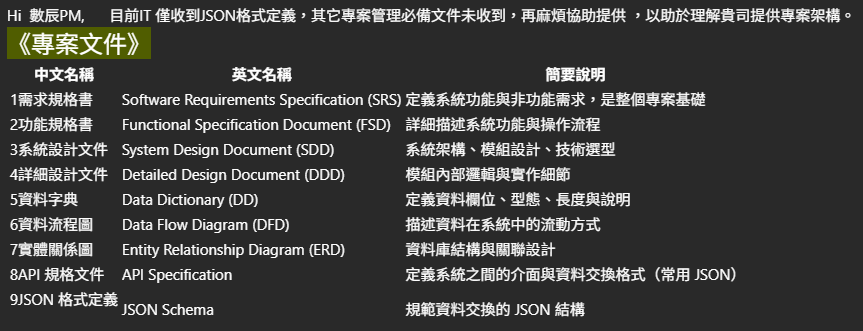
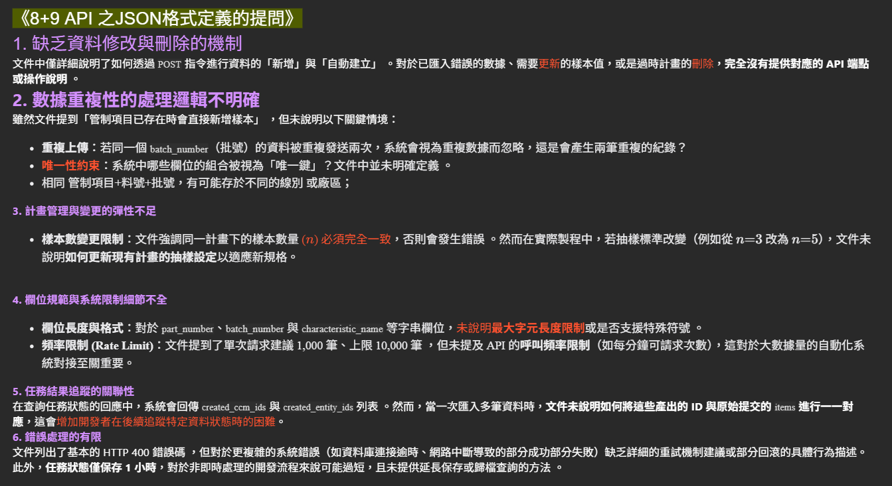

# 客戶問題

## 我的問題:
1. 之前以為只要"匯入excel功能"會用到的相關api說明, 其他都沒寫, 他們可能誤會了, 現在要再補充就好?
2. 客戶是要遷移舊系統資料? 那是通過以下哪種方式?
    - 透過teamsync web(client) --> teamsync api(server)
    - 透過自行寫腳本或程式(client) --> teamsync api(server): 我看email他們似乎是要這樣?
3. 我有寫一個大概的文件架構
我應該就先寫8, 9的文件就好? 還是其他的也要一併補?

## 處理方式

1. 缺乏資料修改與刪除的機制: 有api endpoint了, 我再補上相關說明?
2. 數據重複性的處理邏輯不明確
    - 重複上傳: 目前應該是會產生兩筆重複的紀錄
    - **唯一性約束**: 這可能要麻煩你了🥲
    - **相同 管制項目+料號+批號，有可能存於不同的線別或廠區**: 不太懂🥲
3. 計畫管理與變更的彈性不足: 文件沒寫好...應該是有api endpoint了, 我再補上相關說明?
4. 欄位規範與系統限制細節不全
    - **欄位長度與格式**: 應該是參考(/private/ccm/quantitative/)補? 但category_information似乎沒有?
    - **頻率限制 (Rate Limit)**
        a. 單次請求建議 1,000 筆、上限 10,000 筆: 文件沒寫好, 我改一下 直接都10000, 1000筆太碎了?
        b. API 的呼叫頻率限制: 這能請你評估一下? 不然我去找壓測工具測一下? (但得研究下🥲)
5. **任務結果追蹤的關聯性:**: 我只寫前端的? 不然可能要請你說明了🥲
6. **錯誤處理的有限:** 我只寫前端的? 不然可能要請你說明了🥲