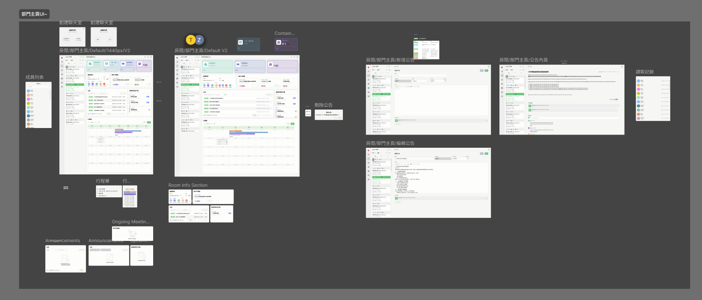
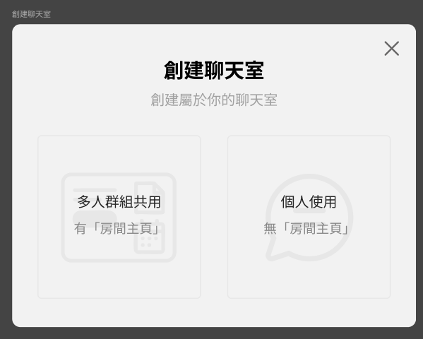
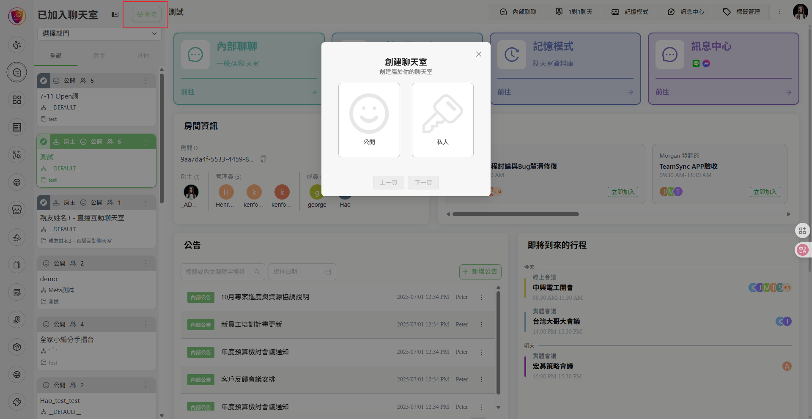
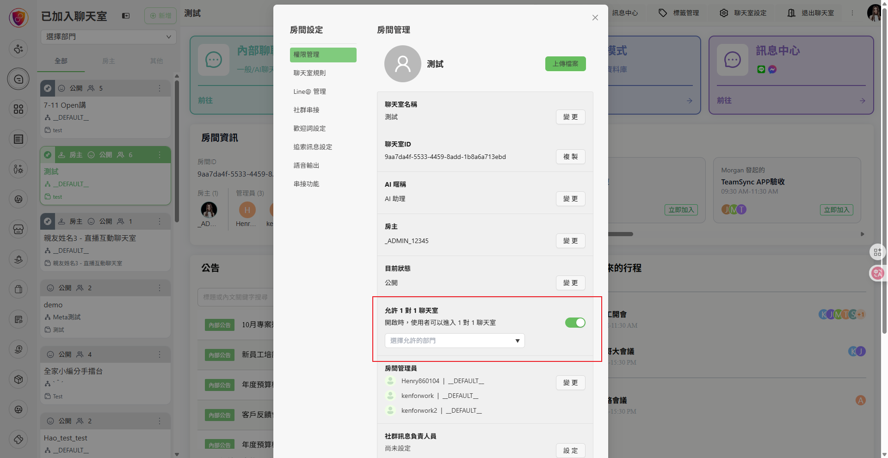
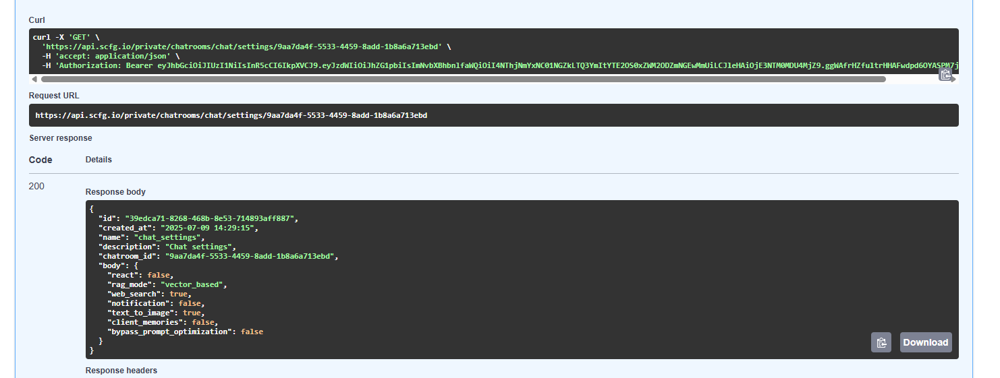
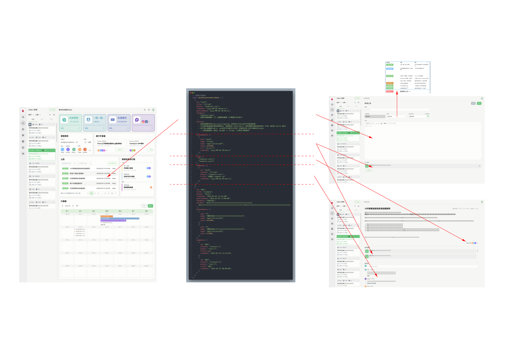

# teamsync api

## link

- ### [figma: 主要看這塊](https://www.figma.com/design/m3r7EOLcNpt9jO3PJurxiM/TeamSync-%E5%A4%A7%E6%94%B9%E7%89%88?node-id=2570-5930&p=f&t=YerqeibDbieVCSJW-0)

  

- ### [figma: 大致流程](https://www.figma.com/board/xq7KtvJn7SWsBMXE0CD2rv/TS%E6%B5%81%E7%A8%8B?node-id=2784-2886&p=f&t=oigjLAfi1fWI56m0-0)

## 目前 api 需求 (不確定實際 api 有沒有)

<details>
  <summary>1. 聊天-創建聊天室: 要可以選擇是否啟用主頁</summary>

- #### ui

  

- #### 參考

  

- #### 聊天設定應該也要有(類似 1 對 1, 但這個應該是前端處理即可, api 同一隻, 做一樣的事)

  

- #### api 位置 (暫定, 依後端實際情況修正)
  

</details>

<details>
  <summary>2. 公告: CRUD</summary>

  - #### 目前資料結構僅為 UI 顯示用途，實際依後端 schema (ex. author 對應 TeamSync 的 User schema)

    ```js
      // 模擬公告數據
      const mockAnnouncementsData = [
        {
          id: "uuid",
          title: "string",
          author: "teamsync.user",
          createAt: "yyyy-MM-dd HH:mm:ss",
          publishDate: "yyyy-MM-dd HH:mm:ss",
          category: `
            - teamsync.tags?
            - 這個可能要擴展一下? 支援顏色選擇 (行事曆也可以用)?
          `,
          content: `
            - 目前前端套件用react-quill(george 之前的markdown似乎也是用這個)
            - 不太確定後端儲存要用甚麼格式, 有稍微查了(ReactQuill 提供兩種主要的資料格式：HTML 格式和 Delta 格式)
            - 底下有ai建議的table, sql純文字可能可以不用? 但就是主頁-公告-搜尋內文input
              - [改前端搜尋] 接api data後 -> format 一份純文字搜尋用?
          `,
          attachments: [
            {
              uid: "uuid",
              name: "sting",
              type: "application/pdf",
              size: 1024000,
              url: "s3.url?",
              createAt: "yyyy-MM-dd HH:mm:ss"
            },
          ],
          read: [
            "teamsync.user1",
            "teamsync.user2"
          ],
          comments: [
            {
              id: "uuid",
              content: "string",
              author: "teamsync.user",
              srcId: "回覆的 comment.id"
              createAt: "yyyy-MM-dd HH:mm:ss",
            },
          ]
        },
        {
          id: "001",
          title: "example",
          author: "Peter",
          createAt: "2025/07/01 12:34:00",
          publishDate: "2025-07-02 15:00:00",
          category: "內部公告",
          content: `內文ＯＯＯＯＯＯＯＯＯＯＯＯＯＯＯＯＯＯＯＯＯＯＯＯＯＯ
            內文ＯＯＯＯＯＯＯＯＯＯＯＯＯＯＯＯＯＯＯＯＯＯＯＯＯＯ內文ＯＯＯＯＯＯＯＯＯＯＯＯＯＯＯＯＯＯＯＯＯＯＯＯＯＯ
          `,
          attachments: [
            {
              uid: "1",
              name: "檔案名稱ＯＯＯＯＯＯＯＯＯＯＯＯＯＯＯＯＯＯ",
              type: "application/pdf",
              size: 1024000,
            },
            {
              uid: "2",
              name: "檔案名稱ＯＯＯＯＯＯＯＯＯＯＯＯＯＯＯＯＯＯ",
              type: "application/pdf",
              size: 512000,
            },
          ],
          comments: [
            {
              id: "001",
              content: "content-1",
              author: "test-1",
              srcId: null
              createAt: "2025-07-24 12:34:56",
            },
            {
              id: "002",
              content: "tcontent-2",
              author: "test-2",
              srcId: "001"
              createAt: "2025-07-25 00:00:00",
            }
          ]
        },
      ];
    ```

  - #### 儲存 react-quill table: ai example

    ```sql
    -- MySQL 資料表結構
    CREATE TABLE announcements (
      id INT PRIMARY KEY AUTO_INCREMENT,
      title VARCHAR(255) NOT NULL,
      category VARCHAR(50),
      -- Delta 格式內容（主要）
      content LONGTEXT,
      -- HTML 格式內容（輔助顯示）
      html_content LONGTEXT,
      -- 純文字內容（搜索用）
      plain_text TEXT,
      publish_date DATETIME,
      created_at TIMESTAMP DEFAULT CURRENT_TIMESTAMP,
      updated_at TIMESTAMP DEFAULT CURRENT_TIMESTAMP ON UPDATE CURRENT_TIMESTAMP
    );
    ```

    

</details>
