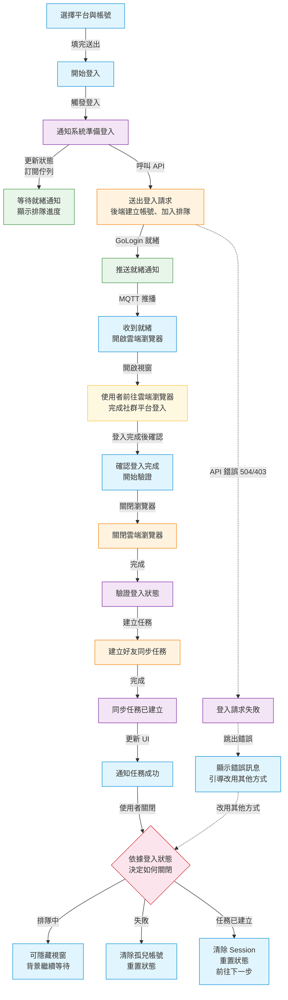

# 登入流程說明 (Login Flow)

## 概覽

社群帳號綁定支援兩種模式：

- **快速登入 (Quick Login)**
  — 只填帳號，由後端透過 GoLogin 開啟雲端瀏覽器，使用者在該瀏覽器手動登入社群平台
- **金鑰登入 (Key Login)** — 填寫帳號 + 密碼 + Secret
  Key，直接由後端代理登入（略過 GoLogin）

---

## 角色與檔案

| 層級         | 檔案                            | 職責                                                              |
| ------------ | ------------------------------- | ----------------------------------------------------------------- |
| UI           | `components/LoginForm.jsx`      | 登入表單、平台選擇、帳號輸入                                      |
| UI           | `components/LoginModals.jsx`    | 登入流程的各狀態 Modal 顯示                                       |
| 頁面         | `pages/SetupPage.jsx`           | 整合 hooks + 表單，編排回調；session 恢復；孤兒帳號清理           |
| 編排         | `hooks/useLogin.js`             | 登入流程核心協調                                                  |
| 驗證         | `hooks/useLoginVerification.js` | 登入驗證 + 觸發爬取                                               |
| Store + MQTT | `hooks/useSocialTendStore.js`   | Zustand 狀態儲存 + **內建背景 MQTT 訂閱管理**                     |
| API          | `hooks/useProject.js`           | TanStack Query mutations (`loginProjectAccount`, `logoutProject`) |

---

## 狀態機

### 狀態定義

| 狀態           | 意義                                    |
| -------------- | --------------------------------------- |
| `idle`         | 初始狀態，無任何登入進行中              |
| `queuing`      | 已發送登入請求，等待 GoLogin 排隊       |
| `ready`        | 雲端瀏覽器已就緒，等待使用者前往操作    |
| `verifying`    | 使用者確認完成登入，正在驗證 + 觸發爬取 |
| `task_created` | 爬取好友任務已建立                      |
| `failed`       | 任何步驟發生錯誤                        |

### 允許的狀態轉移

| 當前狀態       | 可轉移至                 |
| -------------- | ------------------------ |
| `idle`         | `queuing`, `failed`      |
| `queuing`      | `ready`, `failed`        |
| `ready`        | `verifying`, `failed`    |
| `verifying`    | `task_created`, `failed` |
| `task_created` | `idle`（reset）          |
| `failed`       | `idle`（reset）          |

`loginState` 額外包含
`projectId`、`departmentId`、`timestamp`，供內建背景 MQTT 訂閱使用。

---

## MQTT 架構

三層架構：

1. **useMqttStore** (`src/store/useMqttStore.js`)
   - 全域 singleton connection + topic registry
   - 斷線自動重連 + 恢復所有訂閱

2. **useSocialTendStore.initGologinMqtt** (module-level)
   - 模組初始化時執行一次
   - 透過 Zustand `subscribe` 監聽 `loginState.status`
   - `queuing/ready` → 自動 `subscribe(topic, handler)`
   - `idle/task_created/failed` → 自動 `unsubscribe`
   - 不受 SetupPage mount/unmount 影響（切分頁也活著）
   - `message` → 寫入 `loginState` + `gologinSessions`

3. **gologinSessions** (useSocialTendStore 內)
   - 跨 `reset` 存活的 session 持久化區域
   - 用於 SetupPage remount 時恢復 UI

---

## 完整呼叫鏈 (Quick Login)



### 對照表

| 步驟 | 業務名稱                 | 節點 | 檔案                            | 函式                                        | API / MQTT                                                     | 狀態變化                     |
| ---- | ------------------------ | ---- | ------------------------------- | ------------------------------------------- | -------------------------------------------------------------- | ---------------------------- |
| 1    | 選擇平台與帳號           | S1   | `LoginForm.jsx`                 | `handleSubmit()`、`form.validateFields()`   | —                                                              | —                            |
| 2    | 開始登入                 | S2   | `SetupPage.jsx`                 | `handleLoginSubmit()`、`loginState.login()` | —                                                              | `idle` → `queuing`           |
| 3    | 通知系統準備登入         | S3   | `useLogin.js`                   | `setLoginState()`                           | —                                                              | → subscribe MQTT             |
| 4    | 等待就緒通知             | S4   | `useSocialTendStore.js`         | `initGologinMqtt`                           | Topic: `social_tend/{dept}/{proj}/gologin`                     | 訂閱中                       |
| 5    | 送出登入請求             | S5   | `useLogin.js`、後端             | `loginApi.mutateAsync()`                    | `PUT /projects/{id}/login`                                     | `queuing`                    |
| 6    | 推送就緒通知             | S6   | 後端 → RPA → MQTT               | `emit_mqtt_message()`                       | MQTT `{ type:'gologin_session', status:'ready', browser_url }` | —                            |
| 7    | 收到就緒                 | S7   | `useSocialTendStore.js`         | `handleGologinMessage()`                    | —                                                              | `queuing` → `ready`          |
| 8    | 使用者前往雲端瀏覽器登入 | S8   | `LoginModals.jsx`               | `onOpenBrowser()` → `window.open()`         | —                                                              | —                            |
| 9    | 確認登入完成             | S9   | `SetupPage.jsx`                 | `handleConfirmComplete()`                   | —                                                              | —                            |
| 10   | 關閉雲端瀏覽器           | S10  | `useLoginVerification.js`       | `logoutProject.mutateAsync()`               | `PUT /projects/{id}/logout`                                    | `ready` → `verifying`        |
| 11   | 驗證登入狀態             | S11  | `useLoginVerification.js`       | `setLoginState()`                           | —                                                              | `verifying`                  |
| 12   | 建立好友同步任務         | S12  | `useLoginVerification.js`、後端 | `crawlFriends.mutateAsync()`                | `POST /projects/{id}/crawl-friends`                            | `verifying`                  |
| 13   | 同步任務已建立           | S13  | `useLoginVerification.js`       | `setLoginState()`、unsubscribe MQTT         | —                                                              | `verifying` → `task_created` |
| 14   | 通知任務成功             | S14  | `LoginModals.jsx`               | —                                           | —                                                              | —                            |

### 關閉 Modal 決策

| 狀態           | 業務行為                     | 實際動作                                                                            |
| -------------- | ---------------------------- | ----------------------------------------------------------------------------------- |
| `queuing`      | 隱藏視窗，背景繼續等待       | 僅 `setIsModalOpen(false)`，MQTT 訂閱不中斷                                         |
| `failed`       | 清除孤兒帳號，下次可重新嘗試 | `logoutProject`（失敗也繼續）→ `unbindAccount`（從 `project.accounts` 快取）→ reset |
| `task_created` | 清理本次登入狀態，前往下一步 | 清除 session → reset 狀態 → 跳步驟 4（好友分類）                                    |

---

## 孤兒帳號清理機制

### 問題

後端 `/projects/{projectId}/login` 先寫入 CyberAccount +
SocialTendProjectAccount 到 DB，然後才呼叫
`open_gologin_session()`。若 GoLogin 失敗（如 403/504），DB 已存在孤兒帳號。

### 清理時機

使用者角度看到的流程：

1. 點「從 Facebook 登入」→ API 返回錯誤（403/504）
2. Modal 顯示「尚未確認到登入」
3. 使用者點「改用其他登入方式」
4. `handleCloseModal` 偵測 `status === 'failed'`
5. `logoutProject.mutateAsync()` — 關閉 GoLogin session（失敗也繼續）
6. `unbindAccount.mutateAsync()` — 從已快取的 `project.accounts` 找目標帳號解綁
7. DB 孤兒帳號清除，下次可乾淨重試

行為等同「移除帳號」，直接從已快取的 `project.accounts`
找目標帳號，不需要額外 refetch。

---

## 中斷恢復機制

### 切分頁回來

| 階段                      | 發生什麼                                                                                                                          |
| ------------------------- | --------------------------------------------------------------------------------------------------------------------------------- |
| 使用者點登入 → 切到聊天室 | SetupPage unmount，但 `useSocialTendStore` 內建背景訂閱仍活著                                                                     |
| GoLogin ready             | 內建 MQTT handler 收到 `ready` → 寫入 `gologinSessions[projectId]`                                                                |
| 使用者回來                | SetupPage remount → 讀 `gologinSessions[projectId]` → 若在 5 分鐘內有效 → `setLoginState()` + `setIsModalOpen(true)` → Modal 恢復 |

### 關分頁重開

Zustand store 消失，所有 session 遺失。無需特殊處理：

- 下次登入 API 走 `existing` 路徑，只更新 username，不新增
- 若 GoLogin 成功，正常完成流程
- 若又失敗，DB 仍只有一筆帳號，不會累積

---

## 金鑰登入替代路徑 (Key Login)

`loginMode === 'key'` 時，`useLogin.login()` 走不同路徑：

```js
await bindAccount.mutateAsync({
  platform,
  username,
  password,
  two_factor_secret,
});
await verify({ platform, crawlType });
```

### 差異對照

| 面向            | Quick Login (連結登入)                                          | Key Login (金鑰登入)                    |
| --------------- | --------------------------------------------------------------- | --------------------------------------- |
| 需 MQTT         | 是                                                              | 否                                      |
| 需 GoLogin 排隊 | 是                                                              | 否                                      |
| 使用者操作      | 開啟雲端瀏覽器手動登入                                          | 直接填帳號密碼                          |
| API 呼叫鏈      | `loginProjectAccount` → MQTT → `logoutProject` → `crawlFriends` | `bindAccountToProject` → `crawlFriends` |

---

## 已知問題

### Issue: GoLogin 504 Gateway Timeout

**現象**：點「從 Facebook 登入」後出現錯誤。

**原因**：GoLogin API `api.gologin.com/browser/{id}/web` 回 504。

**前端處理**：

| 順序 | 處理                                                            |
| ---- | --------------------------------------------------------------- |
| 1    | API 失敗 → `loginState.status = 'failed'` → Modal 顯示錯誤      |
| 2    | 使用者點「改用其他登入方式」→ logout GoLogin session + 解綁帳號 |
| 3    | 若使用者重試 → API 走 `existing` 路徑更新 username              |

**建議後端修復**：先 call GoLogin 成功後再寫入 DB（避免孤兒帳號問題）。
